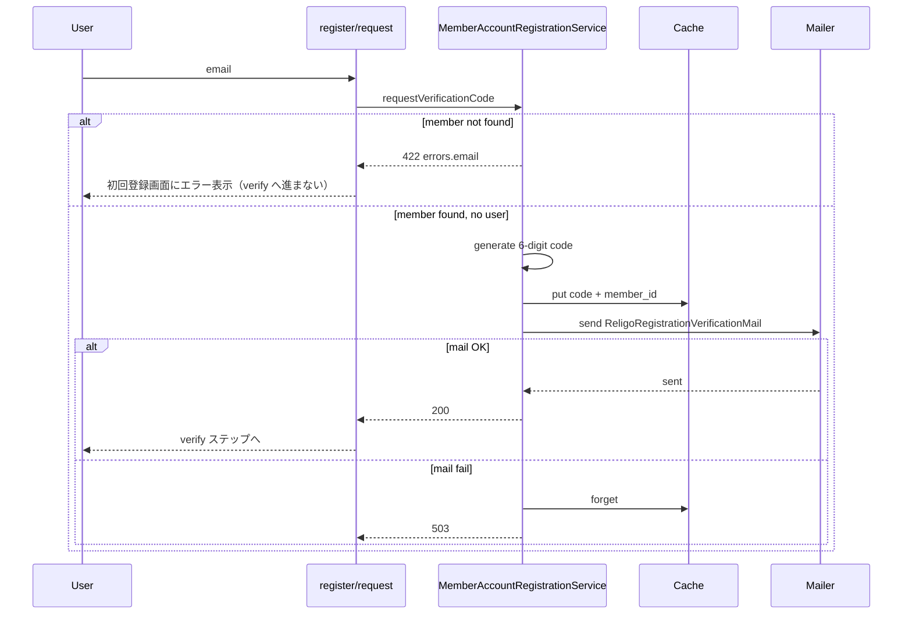

# Religo：初回アカウント登録 — 確認コードメール送信 — 要件 SSOT

| 項目 | 内容 |
|------|------|
| **状態** | **active** — 初回登録メール送信の要件の正。**改訂は変更履歴＋別 Phase**。 |
| **Spec ID** | **SPEC-011**（[SSOT_REGISTRY.md](../02_specifications/SSOT_REGISTRY.md)） |
| **作成** | **2026-05-28 21:53 JST** |
| **関連** | [AUTH_LOGIN_AND_OWNER_BINDING_REQUIREMENTS.md](AUTH_LOGIN_AND_OWNER_BINDING_REQUIREMENTS.md)（**SPEC-010** §7.2 オンボーディング・§8 provisioning）[DATA_MODEL.md](DATA_MODEL.md)（`members.email`・`users.owner_member_id`）[DEPLOYMENT.md](../DEPLOYMENT.md)（本番 `religo_app`・`.env`） |

---

## 1. 背景

- **2026-05-28** 時点で、Religo には **members.email 照合による初回アカウント作成**（`POST /api/auth/register/request` / `complete`）が実装済みである。
- 確認コードは **Cache** に保存され、**ローカル／`RELIGO_REGISTRATION_EXPOSE_DEBUG_CODE=true` 時のみ API レスポンスに `debug_code` を返す**。
- **本番サーバー（`religo_app`）では `.env` にメールサーバー設定済み**のため、確認コードを **実メールで送信**する実装に移行する。
- 本ドキュメントはその **機能要件・非機能要件・セキュリティ・環境差・DoD** を定義する。実装 Phase は **Phase 147（docs）→ 続く implement Phase** とする。

---

## 2. 目的（Goals）

1. **本人確認:** メンバーが登録済み email を入力したとき、**その宛先にのみ** 6 桁確認コードを届ける。
2. **本番運用:** `debug_code` に依存せず、DragonFly メンバーが **自己完結で初回パスワードを設定**できる。
3. **SPEC-010 整合:** 登録完了時に **`users.owner_member_id`・`default_workspace_id`・`religo_role=member` を自動設定**する既存フローを維持する（変更しない）。
4. **入力ミスの早期フィードバック:** `members.email` に一致しないアドレスは **初回登録画面で明示エラー**とし、確認コード入力ステップへ進めない（**2026-05-28 方針変更** — §7.1 参照）。

---

## 3. スコープ

### 3.1 対象（In scope）

| 項目 | 内容 |
|------|------|
| トリガー | `POST /api/auth/register/request` で member が 1 件に特定でき、かつ `users` 未作成のとき |
| 送信内容 | 6 桁確認コード、有効期限、Religo からの送信である旨 |
| 送信方式 | Laravel **Mailable** + 標準 `config/mail.php`（`.env` の `MAIL_*`） |
| 失敗時 | ログ記録・ユーザー向け汎用メッセージ（§6.3） |
| テスト | `Mail::fake()` による Feature テスト |
| 設定 | `config/religo.php` 既存キーの整理（`registration_expose_debug_code` 本番 false 維持） |

### 3.2 非対象（Out of scope — 別 Spec / 別 Phase）

- パスワードリセットメール
- ログイン後の email verified（`email_verified_at`）
- マジックリンクのみの登録（コード入力 UI は現状維持）
- キュー Worker 必須化（初版は **sync 送信**で可。将来 `queue` 化は別 Phase）
- chapter_admin の招待メール
- メールテンプレートの HTML リッチ化（初版は **テキストまたはシンプル Markdown 相当**で可）

---

## 4. 現状実装（As-Is）

| レイヤ | 実装 |
|--------|------|
| API | `AuthRegisterController` → `MemberAccountRegistrationService` |
| コード保存 | `Cache` キー `religo:register:{email_lower}`、TTL `RELIGO_REGISTRATION_CODE_TTL_MINUTES`（既定 30 分） |
| UI | ログイン画面「初回登録」タブ。`debug_code` があるとき黄色 Alert で表示 |
| **member 未一致時** | API **422** + 初回登録画面に **エラー表示**、verify ステップへ進まない（**Phase 150 implement 済**） |
| レート制限 | `throttle:10,1`（register/request・complete 各ルート） |
| 本番 `.env` 例 | `www/.env.religo_app.example` — `MAIL_MAILER=log`（**implement Phase で SMTP 例を追記**） |

---

## 5. 機能要件

### 5.1 送信条件

`requestVerificationCode(email)` において、次 **すべて** を満たすとき **メールを送信**する。

1. `members.email`（大文字小文字無視）が **1 件**に特定できる
2. 同一 email の **`users` 行が存在しない**
3. 6 桁コードを Cache に保存した **直後**

次の場合は **メールを送らない**。

- member 未存在 → **§5.3（422 エラー表示）**
- 同一 email の member が **複数 workspace**（既存 422）
- `users` が既に存在（既存 422「ログインしてください」）

### 5.3 API 応答

| 状況 | HTTP | body（例） | `debug_code` |
|------|------|------------|--------------|
| member あり・未登録・送信成功 | 200 | 登録されているメールアドレスの場合、確認コードを送信しました。 | **なし**（本番） |
| **member なし** | **422** | `errors.email`: **このメールアドレスはメンバー情報に登録されていません。Members で email を登録するか、チャプター管理者にお問い合わせください。** | なし |
| users 既存 | 422 | このメールアドレスは既に登録されています。ログインしてください。 | — |
| member 複数 | 422 | このメールアドレスは複数のチャプターに登録されています。管理者にお問い合わせください。 | — |
| **送信失敗** | **500 または 503** | 送信に失敗しました。しばらくしてから再度お試しください。 | なし |

**member 未一致を 422 にする理由（2026-05-28）:** 本番運用で `tugi@tugilo.com` のように **Members に email 未登録**のまま送信すると、ユーザーは確認コードステップに進むが **メールもコードも届かない**。閉じたチャプター（DragonFly）では **列挙リスクより UX を優先**し、未登録 email を明示する。

**判断:** 送信失敗時は **200 で成功を装しない**。Cache に保存したコードは **ロールバック（Cache::forget）** する。

### 5.2 メール内容（必須要素）

| 要素 | 要件 |
|------|------|
| 件名 | `Religo 確認コード`（または `[Religo] アカウント登録の確認コード`） |
| 宛名 | member.name があれば「{name} 様」 |
| 本文 | **6 桁コード**、**有効期限（分）**、Religo / DragonFly チャプター向けである旨 |
| 注意書き | 心当たりがない場合は無視、コードを他人に教えない |
| From | `MAIL_FROM_ADDRESS` / `MAIL_FROM_NAME`（`.env`） |
| 言語 | **日本語**（`APP_LOCALE=ja` 前提） |

### 5.4 再送

- 同一 email で `register/request` を再実行した場合、**新コードで Cache を上書き**し、**新メールを送信**する（現行 Cache 上書き動作を維持）。
- UI には「確認コードを再送」ボタン（任意・implement Phase）— **初版は email ステップに戻る操作で足りる**。

### 5.5 登録完了（変更なし）

`POST /api/auth/register/complete` の挙動・User 作成項目は **現行実装を変更しない**（SPEC-010 §4 参照）。

---

## 6. 非機能要件

### 6.1 メール設定

本番 `religo_app` の `.env` で設定済みとする Laravel 標準変数を使用する。

| 変数 | 用途 |
|------|------|
| `MAIL_MAILER` | smtp / sendmail 等 |
| `MAIL_HOST` / `MAIL_PORT` / `MAIL_USERNAME` / `MAIL_PASSWORD` | SMTP |
| `MAIL_ENCRYPTION` | tls / ssl（サーバー要件に従う） |
| `MAIL_FROM_ADDRESS` / `MAIL_FROM_NAME` | 送信元 |
| `APP_URL` | メール内リンクを将来載せる場合のベース（初版コードのみなら必須ではない） |

**implement Phase** で `www/.env.religo_app.example` に上記の **コメント付き例**を追記する（秘密値は含めない）。

### 6.2 送信方式

| 環境 | 方針 |
|------|------|
| **local** | `MAIL_MAILER=log` 推奨。`RELIGO_REGISTRATION_EXPOSE_DEBUG_CODE=true`（または `APP_DEBUG=true` 既定）で UI 確認可 |
| **religo_dev** | サーバー `.env` に従う。開発用は log または実 SMTP のどちらでも可 |
| **religo_app（本番）** | **実 SMTP 送信**。`RELIGO_REGISTRATION_EXPOSE_DEBUG_CODE=false` **必須** |

初版は **`QUEUE_CONNECTION=sync`** のまま Mailable を **同期的に `Mail::send`** してよい。タイムアウトが問題になったら別 Phase で queue 化。

### 6.3 ログ・監視

- 送信成功: `info` — email（**コード本体はログに出さない**）、member_id、workspace_id
- 送信失敗: `error` — 例外メッセージ、email（マスク可）、member_id
- 本番で `debug_code` が API に含まれた場合: **設定ミス**として `warning`

### 6.4 パフォーマンス

- 1 リクエストあたり 1 通。`throttle:10,1` 維持。
- SMTP タイムアウトは Laravel / PHP デフォルトに従う（初版で独自 timeout 不要）。

---

## 7. セキュリティ要件

### 7.1 member 未一致の 422 化（2026-05-28 方針）

| 観点 | 内容 |
|------|------|
| **旧方針** | member 不在時も 200 汎用メッセージ（メールアドレス列挙攻撃の抑止） |
| **新方針** | **422 で未登録を明示**（DragonFly は閉じたチャプター・Members 事前整備が前提） |
| **トレードオフ** | 外部者が「登録済み / 未登録」を試行できる。**許容**とし、運用で Members email を整備する |
| **維持** | users 既存・member 複数も 422。コード・`debug_code` の秘匿は従来どおり |

### 7.2 その他

1. **コード秘匿:** 本番 API・ログ・メール以外にコードを露出しない。`debug_code` は **`registration_expose_debug_code` が true のときのみ**。
2. **コード強度:** 6 桁数字、`random_int`（現行維持）。
3. **TTL:** Cache 失効後は complete 不可（現行維持）。
4. **既存 User:** 再登録不可（422）。
5. **HTTPS:** 本番 API は既存 SSL vhost 経由のみ（DEPLOYMENT 準拠）。

---

## 8. UI 要件

| 項目 | 要件 |
|------|------|
| 初回登録タブ | 現行維持 |
| **member 未一致（422）** | **email 入力ステップに留まる**。`errors.email` を **Alert（error）** で表示。**verify ステップへ進めない** |
| **送信成功（200）** | verify ステップへ進み、「メールに届いた 6 桁の確認コードを入力してください」と表示 |
| `debug_code` Alert | **`debug_code` が API に含まれるときのみ**（ローカル／debug 設定時） |
| 送信失敗（5xx） | API エラーメッセージを Alert 表示。email ステップに留まる |
| users 既存（422） | エラー表示。「ログイン」タブへ誘導する文言を **implement Phase で検討可** |

---

## 9. 実装設計（implement Phase への指針）

### 9.1 変更ファイル

**Phase 148（完了）**

| 種別 | パス |
|------|------|
| Mailable | `www/app/Mail/ReligoRegistrationVerificationMail.php` |
| View | `www/resources/views/mail/religo-registration-verification.blade.php` |
| Service | `MemberAccountRegistrationService` — 送信処理 |
| Test | `AuthRegisterTest` — `Mail::fake()` |
| Config 例 | `www/.env.religo_app.example` — MAIL_* コメント |

**Phase 149 implement（予定）**

| 種別 | パス |
|------|------|
| Service | `MemberAccountRegistrationService.php` — member 未存在時 `ValidationException` 422 |
| UI | `ReligoLogin.jsx` — 422 時 verify へ進めない |
| Test | `AuthRegisterTest.php` |

### 9.2 処理フロー（member 未一致 422 化後）

### 9.3 テスト要件（Phase 149 implement 追加分）

| テスト | 内容 |
|--------|------|
| member なし | **422**、`errors.email` あり、**Mail 送信 0**、Cache **なし** |
| member なし（UI） | 422 時 `setStep('verify')` しない（手動 or E2E は任意） |
| member あり | 従来どおり 200 + Mail 送信 |

---

## 10. 運用・前提条件

1. **members.email の整備:** 自己登録可能なのは **email が Members に登録されているメンバーのみ**。チャプター運営で事前入力が必要。
2. **chapter_admin:** 引き続き **手動 bootstrap**（artisan / DB）。本フローは **一般 member 向け**。
3. **本番 `.env`:** ユーザー側でメール設定済み — implement 後 **疎通確認**（テスト用 member email で 1 回 register/request）。
4. **SPF/DKIM:** メール到達率はサーバー/DNS 運用の範囲（本 SSOT 外）。

---

## 11. Definition of Done（implement Phase）

- [x] member 一致時に **Mailable で確認コードメールが送信**される（本番 `.env` で疎通確認済み）
- [x] 本番で **`debug_code` が API に含まれない**
- [x] 送信失敗時 **Cache ロールバック** + 適切な HTTP エラー
- [x] `AuthRegisterTest`（Mail::fake）が green
- [x] `php artisan test` 全体 green（394 passed）
- [x] `npm run build` green（UI 文言変更時）
- [x] SPEC-010 §8 から本 SSOT へリンク
- [x] `docs/DEPLOYMENT.md` または `.env.religo_app.example` に MAIL 設定注記

---

## 12. Definition of Done（Phase 150 — member 未一致エラー表示）

- [x] `MemberAccountRegistrationService` — member 未存在時 **422**（汎用 200 を返さない）
- [x] `ReligoLogin.jsx` — 422 時 **email ステップに留まり** Alert 表示（既存 catch、コード変更なし）
- [x] `AuthRegisterTest::test_request_returns_422_for_unknown_email` — **422 断言**
- [x] `php artisan test` green、`npm run build` green
- [ ] 本番で未登録 email 試行時に verify ステップへ進まないこと

---

## 13. 変更履歴

| 日時 (JST) | 内容 |
|------------|------|
| 2026-05-28 21:53 | 初版（SPEC-011）。本番メール送信 implement 前の要件整理。 |
| 2026-05-28 21:54 | **Phase 148（implement）:** Mailable 送信・503 ロールバック・テスト。§11 DoD 達成。 |
| 2026-05-28 22:05 | **Phase 149（docs）:** member 未一致時は **422 + 初回登録画面エラー**に方針変更（列挙リスクより UX 優先）。§7.1 / §8 / §12 追加。 |
| 2026-05-28 22:07 | **Phase 150（implement）:** member 未一致 **422** 実装・テスト更新。§12 DoD 達成（本番確認除く）。 |
