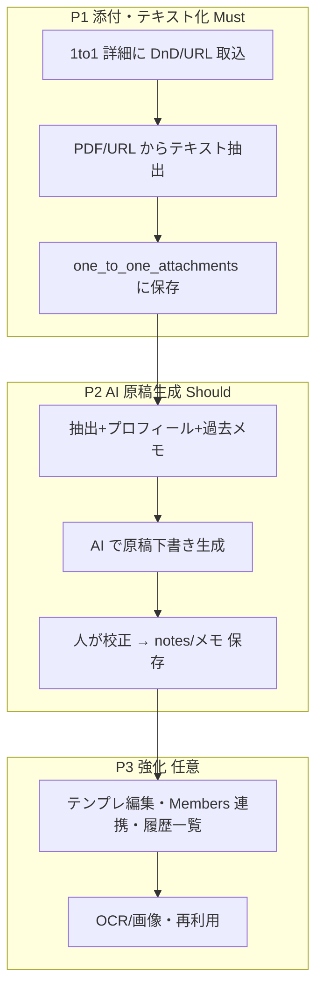

# 1 to 1 事前準備 — 相手プロフィール取込（NCAS URL / PDF）と原稿生成（AI）— 要件整理（ドラフト）

**Spec ID:** SPEC-013（[SSOT_REGISTRY.md](../02_specifications/SSOT_REGISTRY.md) 参照）
**ステータス:** draft（要件整理のみ・実装未着手）
**作成:** 2026-05-30 10:18 JST
**関連 SSOT:** [DATA_MODEL.md](DATA_MODEL.md) §4.12 one_to_ones、[ZOOM_ONETOONE_SYNC_REQUIREMENTS.md](ZOOM_ONETOONE_SYNC_REQUIREMENTS.md)（SPEC-012・1to1 取込）、[ONETOONES_CROSS_CHAPTER_REQUIREMENTS.md](ONETOONES_CROSS_CHAPTER_REQUIREMENTS.md)（SPEC-006・他チャプター相手）
**関連運用:** `docs/meetings/1to1/*.md`（現在ローカルで作成している 1to1 原稿）、`docs/meetings/1to1/_TEMPLATE.md`

> **位置づけ:** 「BNI の 1 to 1 事前準備で交換する相手プロフィール（NCAS プロフィール URL / PDF）を Religo の 1to1 予定に取り込み、いまローカル（md）で作っている **1to1 原稿**を Religo 上で（必要に応じて AI で）作れるようにする」ための要件整理。本書では実装しない。

> **北極星（最終ゴール）:** 現在 **Cursor 上で AI が相手の PDF / NCAS プロフィールを読んで作成している「1to1 事前準備ドキュメント」**（`docs/meetings/1to1/<slug>.md` 相当：基本プロフィール・サマリー・GAINS・共通点・紹介発想・台本・戦略・メモ）を、**Religo サーバ上で同等に生成・保存・蓄積**できるようにする。ローカル（Cursor）に依存せず、Religo の 1to1 レコードから事前準備が完結する状態を目指す。

---

## 1. 背景（As-Is）

- BNI では 1 to 1 の前に **互いの自己紹介シートを交換する文化**がある。
  - **東京 NE リージョン:** **NCAS** というシステムの**プロフィール URL** を共有し合う。
    例: `https://ne001.ncas.jp/bni_meibo/viewsheets.php?id=...&chapter=...`（氏名・GAINS・ONE to ONE シート・直近顧客リスト・リファーラル方針などリッチな情報）。
  - **他リージョン:** **PDF** で共有（**決まったフォーマットは無い**）。例: GAINS ワークシート／メンバー略歴シート／リファーラルシート（[サンプル PDF](../../../../Downloads/TF古屋周治1to1(静岡)携帯回線事業.pdf) 相当）。
- 次廣はこれらを読み込み、**1to1 原稿（台本・共通点・紹介発想・質問・アクション）**を **ローカルの Markdown**（`docs/meetings/1to1/<slug>.md`）で手作りしている。
- 現状、Religo の `one_to_ones`（1to1 予定/履歴）には **相手プロフィールの添付も原稿生成機能も無い**。

### 1.1 課題
| 課題 | 内容 |
|------|------|
| **資料が分散** | 相手の NCAS URL / PDF が手元・チャット・ローカルに散在し、1to1 レコードに紐づかない。 |
| **原稿作成が手作業** | プロフィールを読んで台本・共通点・紹介発想を毎回手で起こす（ローカル md）。 |
| **再利用しにくい** | 過去の準備内容・相手情報が Religo 上で振り返れない。 |

---

## 2. 目的（To-Be）

| 目的 | 説明 |
|------|------|
| **資料の集約** | 相手プロフィール（**PDF をドラッグ&ドロップ** / **NCAS URL を貼付**）を **1to1 予定（`one_to_ones`）に添付**し、レコードと一体管理する。 |
| **テキスト化** | 添付からテキストを抽出し、検索・原稿生成の素材にする（PDF→テキスト、URL→本文抽出）。 |
| **原稿生成** | 抽出情報＋自分/相手プロフィール＋過去メモから、**1to1 原稿（下書き）**を Religo 上で生成する。**AI（API 経由）利用可**。 |
| **校正・蓄積** | 生成原稿は**下書き**として人が校正し、`one_to_ones` / メモに保存して振り返れるようにする。 |

### 2.1 非目標（今回スコープ外）
- NCAS へのログイン代行・書き込み・スクレイピングの常時自動化（**取得は手動トリガ・best-effort**）。
- 原稿の自動確定・自動送信（必ず人が校正）。
- 相手プロフィールからの **members 自動作成**（紐付けは人の確認。SPEC-006/008 準拠）。
- フォーマット統一の強制（PDF は不定形のまま受け入れる）。

---

## 3. 要件サマリ

| # | 要件 | 区分 |
|---|------|------|
| R1 | 1to1 予定の画面で **PDF をドラッグ&ドロップ添付**できる | Must |
| R2 | **NCAS プロフィール URL を貼り付けて取り込み**できる（HTML 本文抽出・best-effort） | Should |
| R3 | 添付から**テキスト抽出**し保存（PDF=既存パーサ流用、URL=HTML 抽出） | Must |
| R4 | 抽出情報をもとに **1to1 原稿（台本/共通点/紹介発想/質問/アクション）を AI 生成**（下書き） | Should |
| R5 | 添付・原稿を `one_to_ones` に紐づけて保存・一覧・再表示 | Must |
| R6 | 生成は**下書き**で、人が校正して `notes` 等に確定 | Must |
| R7 | アクセスは**認証済みユーザー単位**（自分の 1to1 のみ・SPEC-012 と整合） | Must |
| R8 | 個人情報（家族・生年月日等）を含むため**取扱注意**（private 保存・AI 送信方針の明示） | Must |
| R9 | **AI 利用はユーザーが任意で選択（ON/OFF）**。利用する場合は **プロバイダ（OpenAI / Claude / Gemini 等）を自分で選び**、自分の契約 API キーを登録（BYO key・暗号化・コストは各自に帰属）。AI OFF でも添付・テキスト化・手動原稿は使える | Must |

---

## 4. 入力ソース

### 4.1 PDF（R1・R3）
- GAINS / 略歴 / リファーラルシート等。**フォーマット不定**・複数ページ。
- 既存の **`smalot/pdfparser`** と **`PdfParticipantParseService::extractText()`** でテキスト抽出可能（実証済みの基盤）。
- 保存は既存の **`Storage::disk('local')`（storage/app/private）** パターン（参加者 PDF 取込と同様）。

### 4.2 NCAS プロフィール URL（R2・R3）
- `viewsheets.php?id=...&chapter=...` のトークン付き URL。**HTML をサーバから取得（`Http::get`）→ 本文抽出**。
- **リスク:** NCAS のセッション/ログイン依存・HTML 構造変更・利用規約。**best-effort** とし、取得失敗時は「PDF か手入力で」フォールバック。常時クロールはしない（手動トリガのみ）。
- 取得した本文は添付（type=url）としてテキスト保存。

### 4.3 将来（任意）
- 画像（名刺・スクショ）OCR、手入力テキスト貼付。本書では設計フックのみ。

---

## 5. データモデル（案・実装 Phase で確定）

### 5.1 添付: `one_to_one_attachments`（新規・案）
| カラム | 用途 |
|--------|------|
| id | PK |
| one_to_one_id (FK) | 紐づく 1to1（nullOnDelete 検討） |
| target_member_id (FK, nullable) | 相手（横断検索用・複製） |
| uploaded_by_user_id (FK) | 取込ユーザー |
| source_type | `pdf` / `url` / `text` |
| file_path (nullable) | PDF 等の保存先（private disk） |
| source_url (nullable) | NCAS 等の URL |
| original_name (nullable) | 元ファイル名 |
| extracted_text (longtext, nullable) | 抽出テキスト |
| parsed_profile (json, nullable) | 構造化（氏名/GAINS/カテゴリ等・AI or ルールで） |
| timestamps | |

### 5.1.1 ユーザー AI 資格情報: `user_ai_credentials`（新規・案・R9）

AI は**ユーザーごとに自分の契約**を使う（BYO key）。Zoom（共有アプリ＋ユーザートークン）とは異なり、**API キー自体がユーザー単位**。

| カラム | 用途 |
|--------|------|
| id | PK |
| user_id (FK, unique) | 所有ユーザー |
| ai_enabled (bool) | **AI を使うか（ユーザーの ON/OFF）**。既定 false |
| provider | `openai` / `anthropic`（Claude）/ `google`（Gemini）/ その他（ユーザー選択） |
| api_key (text, **encrypted**) | ユーザーの AI API キー（Crypt キャスト・APP_KEY 由来） |
| model (nullable) | 既定モデル（各社のモデル名・任意で上書き） |
| is_active (bool) | 有効/無効 |
| timestamps | |

- `ai_enabled = false`（既定）の間は原稿生成ボタンを出さない／無効化し、**添付・テキスト化・手動原稿のみ**で運用できる。

- **保管:** `api_key` は Eloquent `encrypted` キャスト（`zoom_accounts.access_token` と同方式）。API には平文を返さない（設定済み/未設定のみ）。
- **解決順:** 原稿生成時は **acting user の `user_ai_credentials`** を使用。未設定なら「AI キー未登録」エラー（生成不可）。
  - **任意:** 運用で共有既定キー（`.env` の `config/services` フォールバック）を許すかは実装 Phase で判断（既定は **per-user 必須**）。
- **UI:** 設定画面（`/settings` 系）で provider・API キー・model を登録/更新/削除（自分のみ）。

### 5.2 原稿の保存先（いずれか・実装 Phase で確定）
- **案A:** `one_to_ones.notes` に下書き追記（最小・既存 UI で見える）。
- **案B:** 専用カラム `prep_script`（下書き専用・notes と分離）。
- **案C:** `contact_memos`（memo_type=`one_to_one_prep`）に履歴として残す。
- 推奨: まず **案A or C**（スキーマ追加最小）。テンプレ構造は `docs/meetings/1to1/_TEMPLATE.md` に準拠。

---

## 6. 解析・原稿生成

### 6.1 テキスト抽出（R3）
- PDF: `PdfParticipantParseService::extractText()` 流用。
- URL: `Http::get(url)` → HTML から本文抽出（タグ除去・主要テキスト抽出）。
- 抽出テキストは `extracted_text` に保存し、原稿生成の素材にする。

### 6.2 AI 原稿生成（R4・新規）
- **AI 連携は未実装**。新規に AI クライアントを追加する。
  - **資格情報はユーザーごと（R9・`user_ai_credentials`）**。原稿生成時は **acting user の API キー・provider・model** を復号して使用する。共有 `.env` キーは（採用する場合のみ）フォールバック扱いで、既定は per-user 必須。
  - **プロバイダ抽象化:** provider（**OpenAI / Anthropic(Claude) / Google(Gemini)** 等）ごとにアダプタを用意し、**ユーザーの選択に応じて切替**。新規プロバイダはアダプタ追加で対応。
  - **AI OFF のユーザー:** 生成機能は提供せず、添付・テキスト化・手動原稿のみ（エラーにしない）。
  - キーはコード・ログに出さない。失敗時はユーザーに分かるエラー（キー未登録/無効/レート超過）を返す。
- **入力:** 相手の抽出テキスト＋相手 member 情報（カテゴリ・チャプター）＋自分（Owner）のプロフィール/事業＋過去 1to1 メモ。
- **出力（Cursor で作っている md と同等。`docs/meetings/1to1/_TEMPLATE.md` のセクションに対応）:**
  - **基本プロフィール（固定情報）**：氏名/読み・会社/屋号・カテゴリ・チャプター・連絡先・GAINS 要点
  - **サマリー（最新状況）**：事業の三本柱・強み・温度感
  - **共通点・接点**：地元・業界・人脈・コミュニティ（例: 守成クラブ等）
  - **リファーラル戦略（BNI 特化）**：誰を紹介できそうか／誰に紹介してほしいか・質の高い/不適切なリファーラルの線引き
  - **1to1 台本・質問リスト**：当日深掘りする問い・切り出し方
  - **tugilo としての戦略 / 次アクション案**
  - **メモ（人物・温度感）**
- 生成物は **Cursor 出力の構造に揃える**ことで、ローカル md と Religo を相互に行き来しても違和感がないようにする。
- **出力は下書き**。人が校正して保存（R6）。

### 6.4 Cursor ワークフローとの対応（パリティ）

| 現状（Cursor / ローカル） | Religo サーバ上（本要件） |
|---------------------------|---------------------------|
| PDF / NCAS URL を AI（Cursor）に読ませる | 1to1 詳細に添付（D&D / URL）→ テキスト抽出（§4） |
| AI が `docs/meetings/1to1/<slug>.md` を生成 | AI 原稿生成（§6.2）で同等セクションを出力 |
| 人が md を校正・追記し時系列管理 | 生成下書きを `notes` / `contact_memos` に校正保存（§5.2・R6） |
| ローカルに依存 | Religo の 1to1 レコードから完結（サーバ常駐・他ユーザーも各自で） |

### 6.3 プロンプト/品質
- プロンプトはテンプレ化（編集可能）。出力言語は日本語。
- ハルシネーション対策: 「抽出テキストに無い事実は断定しない」指示。生成物に **AI 下書き表記**を付す。

---

## 7. UI（案）

- **1to1 詳細（OneToOnesEdit 等）に「事前準備」ブロック**を追加。
  - **ドラッグ&ドロップ領域**（PDF アップロード・R1）＋ **URL 入力**（NCAS・R2）。
  - 添付一覧（種別・ファイル名/URL・取込日時・抽出済みバッジ）。
  - 「**原稿を生成**」ボタン（R4・**AI を ON にしているユーザーのみ表示**）→ 生成結果をプレビュー → 「**メモ/原稿に保存**」（R6）。
- 既存の参加者 PDF 取込 UI（M7 系）の操作感を踏襲。
- **設定画面（`/settings` 系）に「AI 設定」**：AI 利用 ON/OFF・プロバイダ選択（OpenAI / Claude / Gemini …）・API キー・モデルを自分で登録/更新/削除。未設定/OFF なら原稿生成 UI は出さない。

---

## 8. 権限・セキュリティ・プライバシー（R7・R8）

| 項目 | 方針 |
|------|------|
| **アクセス** | 認証済みユーザー単位（`auth:sanctum`）。自分が関与する 1to1 のみ。SPEC-012 と整合。 |
| **保存** | 添付ファイルは **private disk**（storage/app/private）。URL 取得本文も DB 内。公開しない。 |
| **個人情報** | プロフィールは家族・生年月日・連絡先等を含む。**取扱注意**。AI へ送信する場合は **送信範囲を明示**し、必要に応じてマスキング/同意方針を定める（実装 Phase）。 |
| **AI 資格情報** | **ユーザーごと（`user_ai_credentials`・暗号化）**。各自が自分の契約キーを登録し、自分のコストで利用。他ユーザーのキーは参照不可。API は平文キーを返さない。共有 `.env` キーは任意フォールバックのみ。 |
| **NCAS** | 規約順守・手動トリガのみ・常時クロールしない。取得失敗は PDF/手入力にフォールバック。 |

---

## 9. 段階・優先順位

| 段階 | 内容 | 区分 |
|------|------|------|
| **P1** | 添付（PDF DnD / NCAS URL）＋テキスト抽出＋保存＋一覧 | Must（R1・R3・R5・R7・R8） |
| **P2** | AI 原稿生成（下書き）＋校正保存 | Should（R2 含む・R4・R6） |
| **P3** | テンプレ編集・Members 連携・履歴・OCR 等 | 任意 |

---

## 10. リスク・確認事項

| 項目 | 内容 |
|------|------|
| **NCAS 取得** | ログイン/セッション依存で URL 直取得が失敗し得る。best-effort・PDF/手入力フォールバック。 |
| **PDF 不定形** | レイアウト差でテキスト抽出が乱れる。原稿生成は抽出テキストの素直な要約に留め、欠損は人が補う。 |
| **AI コスト/レート/PII** | API 課金・レート制限・個人情報送信。送信範囲・モデル・上限を実装 Phase で決定。 |
| **スキーマ追加** | `one_to_one_attachments`（＋必要なら `prep_script`）の migration と DATA_MODEL 追記が必要。 |
| **保存容量** | PDF 蓄積。保持方針（期限・削除）を検討。 |

---

## 11. 既存資産の流用 / 新規

| 区分 | 内容 |
|------|------|
| **流用** | PDF テキスト抽出（`smalot/pdfparser`・`PdfParticipantParseService`）、ファイル保存（`Storage::disk('local')`・参加者 PDF 取込パターン）、1to1 レコード（`one_to_ones`）、原稿テンプレ（`docs/meetings/1to1/_TEMPLATE.md`）、認証（`auth:sanctum`） |
| **新規** | `one_to_one_attachments` テーブル、**`user_ai_credentials` テーブル（ユーザー別 AI キー・暗号化）**、URL 本文抽出、**AI クライアント（プロバイダ抽象化・ユーザーキー利用）**、原稿生成サービス、1to1 詳細の事前準備 UI、設定画面での AI キー登録 UI |

---

## 12. DoD（本要件ドキュメントとして）

- [x] 入力ソース（NCAS URL / PDF）と現行ローカル原稿運用を整理した。
- [x] 添付・テキスト化・AI 原稿生成・保存の要件（R1〜R8）を定義した。
- [x] データモデル案・UI 案・段階・リスク・流用/新規を整理した。
- [x] **AI はユーザーごとの契約キー（BYO・`user_ai_credentials`・暗号化）で利用**する方針を定義した（R9）。
- [ ] （実装 Phase で）対応 AI プロバイダ（anthropic/openai 等）・モデル・PII 送信方針・コスト上限を確定。
- [ ] （実装 Phase で）`one_to_one_attachments` 等の migration と DATA_MODEL 追記。
- [ ] （実装 Phase で）NCAS URL 取得の実検証（成功/失敗時挙動）。

---

## 13. 変更履歴

| 日付 | 内容 |
|------|------|
| 2026-05-30 10:18 JST | 初版。NCAS URL / PDF の 1to1 添付・テキスト化・AI 原稿生成の要件整理。 |
| 2026-05-30 10:20 JST | 北極星（Cursor の 1to1 事前準備ドキュメント作成を Religo サーバ上で再現）を明記。出力構成を `_TEMPLATE.md` セクションに対応づけ、§6.4 Cursor ワークフロー・パリティ表を追加。 |
| 2026-05-30 10:22 JST | R9 追加。**AI はユーザーごとの契約キー（BYO key・`user_ai_credentials` 暗号化保存・provider/model をユーザー選択）**で利用。共有 `.env` キーは任意フォールバックのみ。§5.1.1・§6.2・§8 を更新。 |
| 2026-05-30 10:24 JST | R9 拡張。**AI 利用はユーザー任意（ON/OFF）**・プロバイダを **OpenAI / Claude / Gemini 等から選択**。`user_ai_credentials.ai_enabled` 追加・provider に google(Gemini)・設定画面 AI 設定・AI OFF 時は手動運用、を明記。 |
