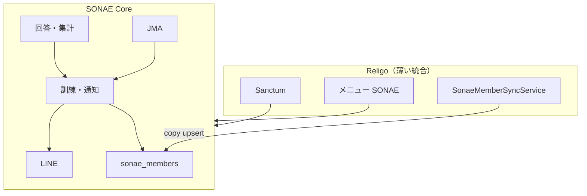

# SONAE 実装ロードマップ（tugilo Phase 分割）

**Spec ID:** SPEC-017 実装計画（要件本体は [SONAE_REQUIREMENTS.md](SONAE_REQUIREMENTS.md)）  
**作成日時:** 2026-06-24 21:09 JST  
**ステータス:** active（Phase 244 着手前に確定）  
**前提:** Phase 242（DB基盤）完了、Phase 243（壁打ち SSOT 反映）完了

---

## 1. 目的

SONAE PoC を **Religo と疎結合**に保ちながら、tugilo DevOS の **1 Phase = 1 merge** で実装可能な粒度に分割する。  
完了条件は SSOT §5.3 の **L1（手動訓練）** → **L2（JMA 自動発報）** の2段階とする。

---

## 2. 疎結合アーキテクチャ

### 2.1 レイヤ

| レイヤ | 責務 | Religo 依存 |
|--------|------|-------------|
| **SONAE Core** | 名簿・通知・回答・集計・JMA・`sonae_*` テーブル | なし（実行時） |
| **Religo Adapter** | `members` → `sonae_members` 同期、bootstrap、chapter 解決 | あり（供給のみ） |
| **Religo Shell** | Sanctum 認証、管理画面メニュー `/sonae` リンク | 薄い統合 |

### 2.2 守るルール

1. 通知・回答・集計は **`sonae_members` のみ**参照する（実行時に Religo `members` を読まない）。
2. Religo 連携は **一方向コピー同期**（`source_system` + `external_id`）。
3. Religo `members` に LINE userId・活動地域を載せない。
4. コード: `App\Models\Sonae\*`, `App\Services\Sonae\*`, `App\Http\Controllers\Sonae\*`。
5. API: `/api/sonae/*` を Religo API と分離。
6. 公開 URL: `/sonae/line/webhook/{chapter_key}`, `/sonae/respond/{token}` は Religo セッション不要。
7. **CSV 登録パス**を常に維持し、Religo なしでも L1 テスト可能にする。

### 2.3 依存関係図



---

## 3. Phase 一覧

| Phase | 名称 | Type | 主な成果 | 完了目安 |
|-------|------|------|----------|----------|
| 242 | DB 基盤 | implement | `sonae_*` migration、bootstrap、sync | ✅ 完了 |
| 243 | 壁打ち SSOT 反映 | docs | 要件確定・Member Roster・L1/L2 | ✅ 完了 |
| **244** | **Roster Core** | implement | 名簿 API、CSV、閾値マスタ、sync 修正 | L1 準備 |
| 245 | LINE 連携 | implement | 設定、Webhook、紐付け、Push | L1 準備 |
| 246 | 訓練・回答・集計 | implement | 手動訓練、回答 URL、集計、履歴 | **L1 達成** |
| 247 | 管理画面 UI | implement | `/sonae/*` React 画面 | L1 運用可 |
| 248 | Religo Shell 統合 | implement | chapter 解決、sync UI、middleware | DragonFly 運用パス |
| 249 | JMA 取得基盤 | implement | 定期/手動取得、ログ | L2 準備 |
| 250 | JMA Normalizer 9種 | implement | AlertEvent 正規化 | L2 準備 |
| 251 | 発報条件 + 自動発報 | implement | 閾値 UI、自動 LINE 発報 | **L2 達成** |
| 252 | PoC 伴走 | docs/implement | 初回訓練、改善、Runbook 実行 | PoC 完了 |

### 3.1 L1 最速パス

```
244 → 245 → 246 → 247 → 248
```

JMA なしで手動訓練まで到達可能。

### 3.2 L2 パス（L1 と並行可）

```
244 → 249 → 250 → 251
```

245（LINE Push）完了後に 251 で自動発報の E2E が通る。

---

## 4. 機能マップ（SSOT §4 → Phase）

| # | 機能 | Phase |
|---|------|-------|
| 1–3 | チャプター・メンバー・CSV | 242, **244** |
| 4–5, 12 | LINE 設定・紐付け・通知 | **245** |
| 11, 13–17 | 訓練・回答・集計・履歴 | **246**, 247 |
| 6–10 | JMA・発報条件・自動発報 | 249, 250, **251** |
| 18 | エラーログ | 245–251 で段階追加 |
| — | Religo sync UI | **248** |

---

## 5. Phase 244 以降の概要（詳細は各 PLAN）

### Phase 244 — Roster Core

- `sonae_alert_threshold_options` migration + seeder
- `type=member` フィルタ（sync 修正）
- `SonaeNotificationTargetResolver`（紐付け済みのみ）
- メンバー CRUD API、CSV 取込、未紐付け一覧

### Phase 245 — LINE 連携

- LINE アカウント設定 API（暗号化）
- Webhook、`SonaeLinePushService`
- 友だち紐付けフロー（招待トークン）

### Phase 246 — 訓練・回答・集計（L1）

- 手動訓練発報、回答トークン URL、集計、訓練履歴・前回比

### Phase 247 — 管理画面 UI

- ダッシュボード、メンバー、LINE、訓練、集計（React `/sonae/*`）

### Phase 248 — Religo Shell 統合

- workspace → chapter 解決、sync ボタン、`sonae.chapter` middleware

### Phase 249–251 — JMA / L2

- 1 取得ジョブ + 9 Normalizer + 発報条件 UI + 自動発報

### Phase 252 — PoC 伴走

- SSOT §5.6 Runbook 実行、BCP フィードバック、SPEC-017 active 化判断

---

## 6. 既知ギャップ（Phase 244 で解消予定）

| 項目 | SSOT | Phase 242 現状 | 解消 Phase |
|------|------|----------------|------------|
| `type=member` のみ sync | §2.6 | 全 members 対象 | **244** |
| `alert_threshold_options` テーブル | §9.6, §11 | migration なし | **244** |
| 通知対象 Resolver | §5.5 | 未実装 | **244** |

---

## 7. 関連ドキュメント

- [SONAE_REQUIREMENTS.md](SONAE_REQUIREMENTS.md) — 機能・DB・API 要件
- [SONAE_WALL_BOUNCE_DECISIONS.md](SONAE_WALL_BOUNCE_DECISIONS.md) — 壁打ち合意
- [PHASE_244_sonae_roster_core_PLAN.md](../process/phases/PHASE_244_sonae_roster_core_PLAN.md) — 次 Phase 詳細

---

## 8. 更新履歴

| 日時 | 内容 |
|------|------|
| 2026-06-24 21:09 JST | 初版。Phase 244–252 ロードマップ確定 |
