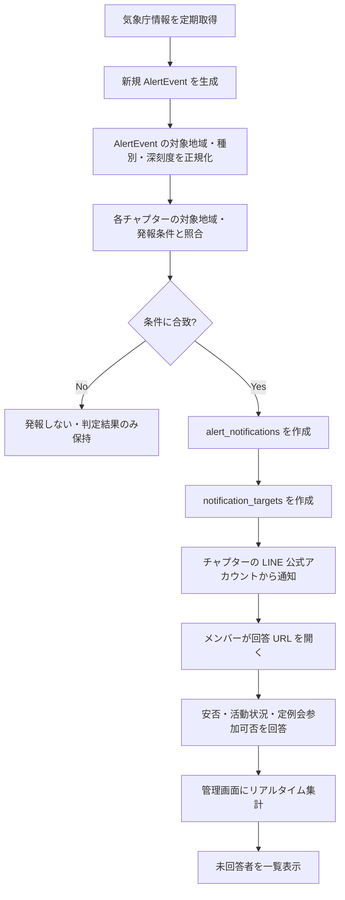
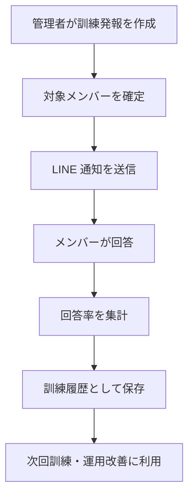
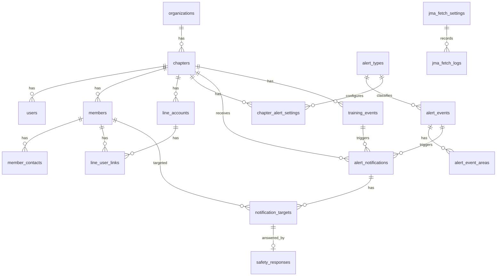

# SONAE 要件定義書

**Spec ID:** SPEC-017（[SSOT_REGISTRY.md](../02_specifications/SSOT_REGISTRY.md) 参照）  
**ステータス:** draft（DragonFly 共創トライアル / Community 展開 要件定義）  
**作成:** 2026-06-18 18:00 JST  
**更新:** 2026-06-23 16:37 JST  
**対象サービス:** SONAE  
**コンセプト:** つながる備え。  
**位置づけ:** Religo 拡張モジュールとして始めつつ、Religo 未利用の小規模コミュニティ・家族・仲間・団体でも単体利用できる災害安否確認 / 緊急連絡サービス。  
**初期対象:** BNI DragonFly チャプター BCP（共創トライアル）  
**初期費用方針:** DragonFly から開発費をいただく前提ではなく、BCP担当者の負担軽減と tugilo のサービス化実証を目的に、使いながら育てる。

---

## 1. 目的

SONAE は、災害発生時に気象庁の防災情報をもとにチャプター内へ LINE 通知を行い、メンバーがスマホから安否・活動可否・定例会参加可否を簡単に回答できるようにするサービスである。

BCP 委員・役員は、誰が回答済みか、誰が未回答か、被害や活動困難がどの程度あるか、次回定例会の開催に影響があるかをリアルタイムに把握できる。

初期は DragonFly BCP メンバーに実際に使ってもらいながら改善する **共創トライアル** として開始する。DragonFly 専用の作り込みにはせず、BNI 他チャプター、小規模コミュニティ、遠隔地で離れて暮らす家族、仲間内でも使える形へ育てる。

DragonFly では開発費を前提にせず、Givers Gain の精神に沿って、BCP担当者の負担軽減と tugilo のサービス実証を両立させる。

---

## 2. サービス方針

### 2.1 プロダクト名

| 項目 | 内容 |
|------|------|
| サービス名 | SONAE |
| コンセプト | つながる備え。 |
| 対象 | BNI チャプター、小規模コミュニティ、家族、仲間、チーム、PTA、小規模団体 |
| 初期導入先 | DragonFly |
| 将来展開 | SONAE for Community として横展開 |

### 2.2 Religo との関係

SONAE は Religo の拡張モジュールとして提供する。ただし、Religo を利用していないチャプターにも提供できるよう、認証・メンバー情報・チャプター情報の参照元を切り替え可能にする。

| 利用形態 | 認証 | チャプター情報 | メンバー情報 | メニュー |
|----------|------|----------------|--------------|----------|
| Religo 利用チャプター | Religo ログイン | Religo のチャプター情報を利用 | Religo のメンバー情報を利用 | Religo 管理画面に「SONAE」を追加 |
| SONAE 単体利用チャプター | SONAE 専用ログイン | SONAE 側で保持 | SONAE 側で保持、CSV 登録 | SONAE 管理画面のみ |

実装上は SONAE のコアテーブルに `source_system` と `external_id` を持たせ、Religo 側の `organizations` / `chapters` / `members` 相当と接続できるようにする。Religo の現行実装で `workspace` をチャプター相当として扱う箇所は、SONAE 側では `chapter` 概念へ正規化する。

### 2.3 MVP の思想

- DragonFly で実際に訓練・本番運用できることを最優先にする。
- DragonFly は「発注元」ではなく、最初の実証・共創コミュニティとして位置づける。
- 災害時の回答体験は迷わないことを優先し、入力項目を増やしすぎない。
- 管理画面は BCP 委員・役員が状況確認と訓練を回せる範囲に絞る。
- メール、SMS、自動再送、課金、複雑な権限管理は MVP では扱わない。
- 将来拡張に必要なデータ境界、通知境界、テナント境界は MVP から保持する。

### 2.4 一般サービス化の方向

SONAE は、家族向け防災アプリや企業向け高額BCP SaaSの正面競合ではなく、**小さなコミュニティの安否確認・緊急連絡・訓練運用サービス** として展開する。

主な対象:

- BNI チャプター
- BCP委員会・運営チーム
- PTA
- スポーツチーム
- マンション管理組合
- サロン・教室・スクール
- 小規模事業者
- 離れて暮らす家族
- 仲間内のグループ

SONAE の価値は、単に通知を送ることではなく、**誰が回答済みか、誰が未回答か、どこにフォローが必要かが見えていること** にある。

### 2.5 LINE公式アカウントの運用モデル

災害時の一斉プッシュ通知は、登録メンバーが多くなるほど LINE の送信通数が増える。そのため、SONAE の主力モデルは **各コミュニティ・団体ごとの LINE 公式アカウント接続** とする。

| モデル | 想定用途 | LINE費用負担 | 位置づけ |
|--------|----------|--------------|----------|
| 独自LINE公式アカウント接続 | BNIチャプター、PTA、チーム、小規模事業者、団体 | 各団体側 | 主力モデル |
| 共通SONAE公式LINE | 家族、仲間内、お試し、小人数グループ | SONAE側（プラン内上限で制御） | 入口・低頻度利用 |

共通SONAE公式LINE一本にすべてのグループを載せると、通数コスト・通数制限・アカウント停止時の影響がSONAE側に集中する。そのため、規模のある団体では、各団体の公式LINEから通知する形を標準とする。

---

## 3. 利用者

| 利用者 | 主な責務 | 主な利用画面 |
|--------|----------|--------------|
| システム管理者 | 全チャプター管理、気象庁取得設定、エラー確認 | チャプター管理、気象庁連携設定、エラーログ |
| チャプター管理者 | 自チャプターのメンバー・LINE・発報条件・訓練管理 | ダッシュボード、メンバー管理、LINE設定、発報条件、訓練発報、集計 |
| 閲覧者 | 集計状況の確認 | ダッシュボード、回答集計、未回答者一覧 |
| メンバー | LINE 通知から安否回答 | 回答画面 |

---

## 4. 機能一覧

| No. | 機能 | 概要 | MVP |
|-----|------|------|-----|
| 1 | チャプター管理 | 利用チャプター、対象地域、利用形態を管理する | 対象 |
| 2 | メンバー管理 | 安否確認対象メンバーを管理する | 対象 |
| 3 | メンバー CSV 取込 | 単体利用チャプター向けに CSV で一括登録する | 対象 |
| 4 | LINE 公式アカウント連携 | チャプターごとの LINE 公式アカウント設定を保持する | 対象 |
| 5 | LINE 友だち登録・紐付け | LINE ユーザー ID とメンバーを紐付ける | 対象 |
| 6 | 気象庁情報取得 | システム全体で防災情報を定期取得する | 対象 |
| 7 | API 取得間隔設定 | 1〜60分の取得間隔を管理画面で変更する | 対象 |
| 8 | アラート種別管理 | 地震、津波、大雨等の種別を管理する | 対象 |
| 9 | 発報条件設定 | チャプターごとに対象地域・閾値を設定する | 対象 |
| 10 | 自動発報 | AlertEvent と発報条件が合致した場合に通知する | 対象 |
| 11 | 手動訓練発報 | 管理者が訓練通知を作成・送信する | 対象 |
| 12 | LINE 通知 | チャプターの公式 LINE からメンバーへ通知する | 対象 |
| 13 | 回答画面 | メンバーが安否・活動・定例会参加可否を回答する | 対象 |
| 14 | 回答集計画面 | 回答率、被害あり、活動困難等を集計表示する | 対象 |
| 15 | 未回答者一覧 | 未回答者を一覧表示する | 対象 |
| 16 | 発報履歴 | 災害発報の履歴と結果を保持する | 対象 |
| 17 | 訓練履歴 | 訓練発報の履歴と結果を保持する | 対象 |
| 18 | エラーログ | 取得・通知・Webhook の失敗を確認する | 対象 |
| 19 | メール通知 | LINE 以外の通知経路 | 後回し |
| 20 | SMS 通知 | 電話番号向け通知 | 後回し |
| 21 | 自動再送 | 未回答者への自動リマインド | 後回し |
| 22 | 課金・請求 | Stripe、請求管理、契約管理 | 後回し |

---

## 5. MVP 範囲

### 5.1 MVP に含める機能

- チャプター管理
- メンバー CSV 取込
- LINE 公式アカウント連携
- LINE 友だち登録・メンバー紐付け
- 気象庁情報取得
- API 取得間隔設定
- アラート種別管理
- チャプターごとの発報条件設定
- 自動発報
- 手動訓練発報
- LINE 通知
- 回答画面
- 回答集計画面
- 未回答者一覧
- 発報履歴
- 訓練履歴
- エラーログ

### 5.2 MVP では後回しにする機能

- メール通知
- SMS 通知
- 自動再送
- GPS 位置情報
- Stripe 課金
- 請求管理
- 複雑な権限管理
- SaaS 契約管理
- 一般企業向け機能
- Jアラート
- 停電情報
- 避難指示

### 5.3 MVP の完了条件

- DragonFly のメンバーを CSV または Religo 連携で登録できる。
- DragonFly 公式 LINE アカウントの設定を登録できる。
- メンバーが LINE 友だち登録後、自分のメンバー情報と紐付けられる。
- 気象庁情報の手動取得・定期取得ができる。
- 取得した防災情報から `AlertEvent` を生成できる。
- DragonFly の対象地域・発報条件に合致した場合、自動で LINE 発報できる。
- 管理者が手動訓練発報できる。
- メンバーがスマホで回答できる。
- 回答率、未回答者、被害あり、活動困難、定例会参加困難を確認できる。
- 発報履歴・訓練履歴・エラーログを確認できる。

---

## 6. 画面一覧

### 6.1 管理画面

| No. | 画面 | 主な表示・操作 |
|-----|------|----------------|
| 1 | ダッシュボード | 最新発報、回答率、回答済み人数、未回答人数、被害あり人数、活動困難人数、定例会参加困難人数、アラート種別、発報日時、対象地域 |
| 2 | チャプター管理 | チャプター作成・編集、対象地域、利用形態、ステータス |
| 3 | メンバー管理 | メンバー一覧、登録、編集、無効化、LINE 紐付け状態 |
| 4 | CSV 取込 | CSV アップロード、プレビュー、登録結果、エラー表示 |
| 5 | LINE 設定 | Channel ID、Channel Secret、Access Token、Webhook URL、友だち追加 URL |
| 6 | 気象庁連携設定 | API 取得間隔、監視 ON/OFF、最終取得日時、次回取得予定、手動取得、エラー履歴 |
| 7 | 発報条件設定 | アラート種別、対象地域、閾値、ON/OFF |
| 8 | 安否確認発報履歴 | 発報一覧、対象チャプター、対象地域、通知件数、回答率 |
| 9 | 回答集計画面 | 回答分類別集計、コメント一覧、対象通知の詳細 |
| 10 | 未回答者一覧 | 未回答メンバー、LINE 紐付け状態、最終通知日時 |
| 11 | 訓練発報 | 訓練名、対象者、通知文面、発報実行 |
| 12 | 訓練履歴 | 訓練一覧、回答率、未回答者、改善メモ |
| 13 | エラーログ | 気象庁取得、LINE 送信、Webhook、システムエラー |

### 6.2 メンバー向け画面

| No. | 画面 | 主な表示・操作 |
|-----|------|----------------|
| 1 | LINE 友だち登録後の紐付け画面 | メンバー選択または招待トークン確認、LINE ユーザー ID 紐付け |
| 2 | 安否回答画面 | 安否、活動状況、定例会参加可否、自由コメント |
| 3 | 回答完了画面 | 回答内容、再回答リンク、チャプターからの案内 |

### 6.3 ダッシュボード表示項目

- 最新発報
- 回答率
- 回答済み人数
- 未回答人数
- 被害あり人数
- 活動困難人数
- 定例会参加困難人数
- アラート種別
- 発報日時
- 対象地域

---

## 7. メンバー回答項目

### 7.1 安否

| 値 | 表示 |
|----|------|
| `safe` | 無事 |
| `minor_injury` | 軽傷 |
| `serious_injury` | 重傷 |
| `evacuating` | 避難中 |
| `hard_to_answer` | 回答不可に近い状況 |

### 7.2 活動状況

| 値 | 表示 |
|----|------|
| `normal` | 通常活動可能 |
| `partially_affected` | 一部影響あり |
| `difficult` | 活動困難 |

### 7.3 定例会参加可否

| 値 | 表示 |
|----|------|
| `can_attend` | 参加可能 |
| `cannot_attend` | 参加困難 |
| `undecided` | 未定 |

### 7.4 自由コメント

- 1000文字以内。
- 管理画面の回答集計詳細に表示する。
- 災害時に個人情報・位置情報を過度に求めない。MVP では GPS 取得はしない。

---

## 8. 通知フロー

### 8.1 自動発報フロー



### 8.2 手動訓練フロー



### 8.3 重複発報防止

- `alert_events.source_event_key` を気象庁由来の一意キーとして保持する。
- `alert_events.payload_hash` を保持し、同一内容の再取込を抑止する。
- `alert_notifications` は `chapter_id + alert_event_id` を一意にする。
- 訓練発報は `training_event_id` を持ち、災害発報とは別履歴で扱う。

---

## 9. 気象庁連携仕様

### 9.1 基本方針

気象庁情報はチャプターごとには取得しない。システム全体で一度取得し、生成された `AlertEvent` を各チャプターの設定条件に照らして発報判定する。

MVP では、気象庁が公開する防災情報から取得可能な範囲を対象にする。実装時には利用可能なデータ形式と更新頻度を確認し、JMA 取得アダプタで `AlertEvent` に正規化する。

### 9.2 管理画面設定項目

| 項目 | 内容 |
|------|------|
| API 取得間隔 | 1分、3分、5分、10分、15分、30分、60分 |
| 監視対象 ON/OFF | 気象庁取得ジョブの有効・無効 |
| 最終取得日時 | 最後に取得を試みた日時 |
| 次回取得予定日時 | 次回ジョブ予定日時 |
| 手動取得ボタン | 管理者が即時取得を実行 |
| エラー履歴 | 取得失敗、解析失敗、タイムアウト等 |

### 9.3 対象アラート

| 種別 | コード例 | MVP 対象 |
|------|----------|----------|
| 地震 | `earthquake` | 対象 |
| 津波 | `tsunami` | 対象 |
| 大雨 | `heavy_rain` | 対象 |
| 洪水 | `flood` | 対象 |
| 土砂災害 | `landslide` | 対象 |
| 台風 | `typhoon` | 対象 |
| 大雪 | `heavy_snow` | 対象 |
| 火山 | `volcano` | 対象 |
| 南海トラフ地震関連情報 | `nankai_trough` | 対象 |

### 9.4 発報条件

チャプターごとに、対象地域、アラート種別、閾値、ON/OFF を設定できる。

| 種別 | 設定可能条件 |
|------|--------------|
| 地震 | 震度4以上、震度5弱以上、震度5強以上、震度6弱以上、震度6強以上、震度7 |
| 津波 | 津波注意報以上、津波警報以上、大津波警報のみ |
| 大雨 | 大雨警報、大雨特別警報 |
| 洪水 | 洪水警報 |
| 土砂災害 | 土砂災害警戒情報 |
| 台風 | 暴風警報、台風接近情報 |
| 大雪 | 大雪警報、大雪特別警報 |
| 火山 | 噴火警報、噴火速報 |
| 南海トラフ | 調査中、巨大地震注意、巨大地震警戒 |

### 9.5 取得ログ

`jma_fetch_logs` に以下を記録する。

- 開始日時
- 終了日時
- 実行種別（定期 / 手動）
- 結果（成功 / 失敗 / 一部失敗）
- 取得件数
- 新規 AlertEvent 件数
- 重複スキップ件数
- エラーメッセージ
- レスポンス概要または保存先

---

## 10. LINE 連携仕様

### 10.1 基本方針

団体・チャプター・コミュニティ向けの主力モデルでは、LINE 公式アカウントは利用団体ごとに用意してもらう。SONAE 側では団体ごとの LINE 公式アカウント情報を設定し、その公式アカウントから通知を送信する。

例:

- DragonFly → DragonFly 公式 LINE
- Tifonet → Tifonet 公式 LINE
- PTA A → PTA A 公式 LINE
- スポーツチーム B → チーム B 公式 LINE

家族・仲間内・お試し用途では、共通SONAE公式LINEを入口として利用できる余地を残す。ただし、共通SONAE公式LINEは少人数・低頻度利用に限定し、通知回数や人数上限をプランで制御する。

### 10.1.1 LINE通数と費用の考え方

LINE公式アカウントからのプッシュ通知は、原則として **送信対象人数 × 発報回数** に応じて通数が増える。

例:

| グループ | 人数 | 月1回訓練 | 通数 |
|----------|------|-----------|------|
| 家族 | 5人 | 1回 | 5通 |
| チーム | 20人 | 1回 | 20通 |
| BNIチャプター | 60人 | 1回 | 60通 |
| 50人グループが20団体 | 1,000人 | 1回 | 1,000通 |

共通SONAE公式LINEに全グループを集約すると、通数コストと通数制限リスクがSONAE側に集中する。独自LINE公式アカウント接続モデルでは、LINE公式アカウントの契約・通数費用は各団体側で管理し、SONAEは通知・回答・集計を支える仕組みとして提供する。

LINE公式アカウントの料金・無料通数・仕様は変更される可能性があるため、SONAE の料金設計には通知通数上限または外部費用別扱いの注記を入れる。

### 10.2 設定項目

| 項目 | 内容 | 保存方針 |
|------|------|----------|
| LINE Channel ID | LINE Developers の Channel ID | 平文可 |
| LINE Channel Secret | 署名検証用 Secret | 暗号化 |
| LINE Messaging API Access Token | Push Message 用トークン | 暗号化 |
| Webhook URL | SONAE が受ける Webhook URL | 自動生成または表示 |
| LINE 友だち追加 URL | メンバー案内用 URL | 平文可 |

### 10.3 Webhook URL

MVP の URL 案:

```text
/sonae/line/webhook/{chapter_key}
```

要件:

- `chapter_key` から対象チャプターを解決できること。
- `Channel Secret` で署名検証すること。
- `follow` / `unfollow` / `message` / `postback` をログ保存できること。
- MVP では回答は LINE 内の入力ではなく、通知内の回答 URL から Web 画面で行う。

### 10.4 友だち登録・メンバー紐付け

推奨フロー:

1. 管理者がメンバーに友だち追加 URL を案内する。
2. メンバーが LINE 公式アカウントを友だち追加する。
3. LINE から紐付け URL またはリッチメニュー経由で SONAE の紐付け画面を開く。
4. メンバー本人を選択、または個別招待トークンで本人確認する。
5. `line_user_links` に `member_id` と `line_user_id` を保存する。

MVP では本人確認を重くしすぎない。ただし誤紐付け防止のため、CSV 取込時に個別招待トークンを発行し、可能な限りトークン方式を使う。

### 10.5 通知メッセージ

災害発報メッセージ例:

```text
【SONAE 安否確認】
{チャプター名} の皆さまへ
{アラート種別} が発表されました。

以下から現在の状況を回答してください。
{回答URL}

回答項目:
・安否
・活動状況
・定例会参加可否
・コメント
```

訓練発報メッセージ例:

```text
【SONAE 訓練】
これは {チャプター名} の安否確認訓練です。
以下から回答してください。
{回答URL}
```

### 10.6 回答 URL

- 通知対象ごとに署名付きトークンを発行する。
- ログイン不要で回答できることを優先する。
- `notification_targets.response_token` をハッシュ化して保存する。
- トークンから対象通知と対象メンバーを特定する。
- 同じメンバーが再回答した場合は最新回答で上書きし、更新履歴は `safety_responses.updated_at` で確認する。

---

## 11. データベース設計案

### 11.1 ER 図



### 11.2 テーブル一覧

#### organizations

チャプターを束ねる組織。Religo 利用時は Religo 側 organization と接続し、単体利用時は SONAE 側で保持する。

| カラム | 型案 | 内容 |
|--------|------|------|
| id | bigint | 主キー |
| name | string | 組織名 |
| source_system | enum | `religo` / `sonae` |
| external_id | string nullable | Religo 側 ID |
| status | enum | `active` / `inactive` |
| created_at / updated_at | timestamp | 作成・更新日時 |

#### chapters

BNI チャプター。通知・発報条件・LINE アカウントの単位。

| カラム | 型案 | 内容 |
|--------|------|------|
| id | bigint | 主キー |
| organization_id | bigint | organizations 外部キー |
| name | string | チャプター名 |
| code | string | 識別コード |
| source_system | enum | `religo` / `sonae` |
| external_id | string nullable | Religo 側 chapter/workspace ID |
| prefecture | string nullable | 主対象都道府県 |
| municipalities | json nullable | 主対象市区町村 |
| status | enum | `active` / `inactive` |
| created_at / updated_at | timestamp | 作成・更新日時 |

#### users

管理画面利用者。Religo 利用時は Religo ログインと接続する。

| カラム | 型案 | 内容 |
|--------|------|------|
| id | bigint | 主キー |
| chapter_id | bigint nullable | 所属チャプター。システム管理者は null 可 |
| name | string | 氏名 |
| email | string | ログインメール |
| password_hash | string nullable | SONAE 単体ログイン用 |
| source_system | enum | `religo` / `sonae` |
| external_id | string nullable | Religo 側 user ID |
| role | enum | `system_admin` / `chapter_admin` / `viewer` |
| status | enum | `active` / `inactive` |
| created_at / updated_at | timestamp | 作成・更新日時 |

#### members

安否確認対象者。Religo 利用時は Religo の members と接続し、単体利用時は SONAE 側で保持する。

| カラム | 型案 | 内容 |
|--------|------|------|
| id | bigint | 主キー |
| chapter_id | bigint | chapters 外部キー |
| name | string | 氏名 |
| name_kana | string nullable | かな |
| email | string nullable | メール |
| phone | string nullable | 電話番号 |
| category | string nullable | BNI カテゴリー |
| role_label | string nullable | 役職・委員会等 |
| source_system | enum | `religo` / `sonae` |
| external_id | string nullable | Religo 側 member ID |
| invite_token_hash | string nullable | LINE 紐付け用招待トークン |
| status | enum | `active` / `inactive` |
| created_at / updated_at | timestamp | 作成・更新日時 |

#### member_contacts

通知先候補。MVP では LINE が中心だが、メール・SMS 拡張に備える。

| カラム | 型案 | 内容 |
|--------|------|------|
| id | bigint | 主キー |
| member_id | bigint | members 外部キー |
| contact_type | enum | `line` / `email` / `sms` |
| value | string | 連絡先 |
| is_primary | boolean | 優先連絡先 |
| verified_at | timestamp nullable | 確認日時 |
| created_at / updated_at | timestamp | 作成・更新日時 |

#### line_accounts

チャプターごとの LINE 公式アカウント設定。

| カラム | 型案 | 内容 |
|--------|------|------|
| id | bigint | 主キー |
| chapter_id | bigint | chapters 外部キー |
| channel_id | string | LINE Channel ID |
| channel_secret_encrypted | text | Channel Secret |
| messaging_api_access_token_encrypted | text | Messaging API Access Token |
| webhook_url | string | Webhook URL |
| friend_add_url | string | 友だち追加 URL |
| status | enum | `active` / `inactive` |
| created_at / updated_at | timestamp | 作成・更新日時 |

#### line_user_links

LINE ユーザーとメンバーの紐付け。

| カラム | 型案 | 内容 |
|--------|------|------|
| id | bigint | 主キー |
| line_account_id | bigint | line_accounts 外部キー |
| member_id | bigint | members 外部キー |
| line_user_id | string | LINE userId |
| linked_at | timestamp | 紐付け日時 |
| unlinked_at | timestamp nullable | 解除日時 |
| status | enum | `active` / `blocked` / `unlinked` |
| created_at / updated_at | timestamp | 作成・更新日時 |

制約:

- `line_account_id + line_user_id` は一意。
- `member_id + line_account_id + status=active` は実質一意。

#### alert_types

アラート種別マスタ。

| カラム | 型案 | 内容 |
|--------|------|------|
| id | bigint | 主キー |
| code | string | `earthquake` 等 |
| name | string | 表示名 |
| sort_order | integer | 表示順 |
| is_active | boolean | 有効フラグ |
| created_at / updated_at | timestamp | 作成・更新日時 |

#### alert_events

気象庁情報から正規化したイベント。

| カラム | 型案 | 内容 |
|--------|------|------|
| id | bigint | 主キー |
| alert_type_id | bigint | alert_types 外部キー |
| source | string | `jma` |
| source_event_key | string | 取得元での一意キー |
| payload_hash | string | 重複検知用ハッシュ |
| title | string | タイトル |
| severity | string nullable | 正規化した深刻度 |
| occurred_at | timestamp nullable | 発生日時 |
| announced_at | timestamp nullable | 発表日時 |
| raw_payload | json nullable | 取得元データ |
| created_at / updated_at | timestamp | 作成・更新日時 |

#### alert_event_areas

AlertEvent の対象地域。

| カラム | 型案 | 内容 |
|--------|------|------|
| id | bigint | 主キー |
| alert_event_id | bigint | alert_events 外部キー |
| prefecture | string nullable | 都道府県 |
| municipality | string nullable | 市区町村 |
| area_code | string nullable | 地域コード |
| intensity | string nullable | 地震の震度等 |
| warning_level | string nullable | 警報レベル |
| created_at / updated_at | timestamp | 作成・更新日時 |

#### chapter_alert_settings

チャプターごとの発報条件。

| カラム | 型案 | 内容 |
|--------|------|------|
| id | bigint | 主キー |
| chapter_id | bigint | chapters 外部キー |
| alert_type_id | bigint | alert_types 外部キー |
| is_enabled | boolean | 有効フラグ |
| target_prefectures | json | 対象都道府県 |
| target_municipalities | json nullable | 対象市区町村 |
| threshold_code | string | `intensity_5_lower_or_more` 等 |
| created_at / updated_at | timestamp | 作成・更新日時 |

#### alert_notifications

災害発報または訓練発報の単位。

| カラム | 型案 | 内容 |
|--------|------|------|
| id | bigint | 主キー |
| chapter_id | bigint | chapters 外部キー |
| alert_event_id | bigint nullable | 災害発報時の AlertEvent |
| training_event_id | bigint nullable | 訓練発報時の TrainingEvent |
| notification_type | enum | `alert` / `training` |
| title | string | 発報タイトル |
| body | text | 通知本文 |
| status | enum | `draft` / `sending` / `sent` / `failed` / `cancelled` |
| sent_at | timestamp nullable | 発報日時 |
| created_by_user_id | bigint nullable | 作成者 |
| created_at / updated_at | timestamp | 作成・更新日時 |

#### notification_targets

通知対象者ごとの送信・回答状態。

| カラム | 型案 | 内容 |
|--------|------|------|
| id | bigint | 主キー |
| alert_notification_id | bigint | alert_notifications 外部キー |
| member_id | bigint | members 外部キー |
| line_user_link_id | bigint nullable | LINE 紐付け |
| response_token_hash | string | 回答 URL トークン |
| send_status | enum | `pending` / `sent` / `failed` / `skipped` |
| sent_at | timestamp nullable | 送信日時 |
| responded_at | timestamp nullable | 回答日時 |
| error_message | text nullable | 送信失敗理由 |
| created_at / updated_at | timestamp | 作成・更新日時 |

#### safety_responses

メンバー回答。

| カラム | 型案 | 内容 |
|--------|------|------|
| id | bigint | 主キー |
| notification_target_id | bigint | notification_targets 外部キー |
| member_id | bigint | members 外部キー |
| safety_status | enum | 安否 |
| activity_status | enum | 活動状況 |
| meeting_attendance_status | enum | 定例会参加可否 |
| comment | text nullable | 1000文字以内 |
| submitted_at | timestamp | 回答日時 |
| created_at / updated_at | timestamp | 作成・更新日時 |

#### training_events

訓練発報の定義。

| カラム | 型案 | 内容 |
|--------|------|------|
| id | bigint | 主キー |
| chapter_id | bigint | chapters 外部キー |
| name | string | 訓練名 |
| scenario | text nullable | 訓練シナリオ |
| scheduled_at | timestamp nullable | 予定日時 |
| executed_at | timestamp nullable | 実施日時 |
| created_by_user_id | bigint | 作成者 |
| created_at / updated_at | timestamp | 作成・更新日時 |

#### jma_fetch_settings

気象庁取得設定。システム全体で原則 1 行。

| カラム | 型案 | 内容 |
|--------|------|------|
| id | bigint | 主キー |
| is_enabled | boolean | 監視 ON/OFF |
| interval_minutes | integer | 1, 3, 5, 10, 15, 30, 60 |
| last_fetched_at | timestamp nullable | 最終取得日時 |
| next_fetch_at | timestamp nullable | 次回取得予定日時 |
| created_at / updated_at | timestamp | 作成・更新日時 |

#### jma_fetch_logs

気象庁取得ログ。

| カラム | 型案 | 内容 |
|--------|------|------|
| id | bigint | 主キー |
| jma_fetch_setting_id | bigint | jma_fetch_settings 外部キー |
| fetch_type | enum | `scheduled` / `manual` |
| status | enum | `success` / `failed` / `partial` |
| started_at | timestamp | 開始日時 |
| finished_at | timestamp nullable | 終了日時 |
| fetched_count | integer | 取得件数 |
| created_event_count | integer | 新規イベント件数 |
| skipped_duplicate_count | integer | 重複スキップ件数 |
| error_message | text nullable | エラー |
| created_at / updated_at | timestamp | 作成・更新日時 |

#### error_logs

システムエラーログ。

| カラム | 型案 | 内容 |
|--------|------|------|
| id | bigint | 主キー |
| chapter_id | bigint nullable | 関連チャプター |
| category | enum | `jma_fetch` / `line_send` / `line_webhook` / `system` |
| severity | enum | `info` / `warning` / `error` |
| message | text | メッセージ |
| context | json nullable | 追加情報 |
| occurred_at | timestamp | 発生日時 |
| created_at / updated_at | timestamp | 作成日時 |

---

## 12. 権限設計

MVP では簡易権限でよい。

| 権限 | できること | 制限 |
|------|------------|------|
| システム管理者 | 全チャプター管理、気象庁取得設定、エラーログ確認 | なし |
| チャプター管理者 | 自チャプターのみ管理、メンバー管理、LINE設定、発報条件設定、訓練実施、集計確認 | 他チャプターは閲覧・編集不可 |
| 閲覧者 | 集計確認のみ | メンバー編集、LINE設定、発報、訓練は不可 |

Religo 利用チャプターでは、Religo のログインユーザーと SONAE 権限をマッピングする。SONAE 単体利用では `users.role` を正とする。

---

## 13. 非機能要件

| 分類 | 要件 |
|------|------|
| 回答 UI | スマホで回答しやすいこと。ワンタップで回答画面へ到達できること |
| 管理 UI | PC 中心。BCP 委員・役員が集計を素早く見られること |
| 災害時 UX | 災害時でも迷わないシンプルな回答画面にすること |
| マルチテナント | チャプター追加が容易な構造にすること |
| ログ | 気象庁 API 取得失敗、LINE 送信失敗、Webhook エラーを保存すること |
| 重複防止 | 同一アラートの重複発報を防止すること |
| 環境 | 本番・テスト環境を分けること |
| 拡張性 | メール通知、自動再送、課金、請求へ拡張できる設計にすること |
| 秘匿情報 | LINE Channel Secret と Access Token は暗号化保存すること |
| 可用性 | MVP では高可用構成までは求めないが、ジョブ失敗時に再実行できること |

---

## 14. 今後の拡張案

| 拡張 | 内容 |
|------|------|
| メール通知 | LINE 未利用メンバー向けにメール通知を追加 |
| SMS 通知 | 緊急性の高い通知経路として SMS を追加 |
| 自動再送 | 未回答者へ一定時間後に自動再送 |
| 再送管理 | 管理者が未回答者へ手動再送 |
| GPS 位置情報 | 任意同意のうえで現在地共有 |
| 家族・社員向け展開 | BNI チャプター以外の中小企業・団体へ展開 |
| 課金 | Stripe 課金、請求書、契約管理 |
| SaaS 管理 | プラン、利用上限、契約ステータス管理 |
| 訓練レポート | 月次訓練レポート、回答率推移、改善メモ |
| BCP 資料出力 | 訓練履歴・回答率を BCP 活動証跡として出力 |
| 通知テンプレート | チャプターごとの文面テンプレート |
| アラート追加 | 停電情報、避難指示、Jアラート等 |

---

## 15. DragonFly 共創トライアルと事業化方針

### 15.1 DragonFly 共創トライアルの前提

DragonFly 向け初期版は、開発費をいただく前提ではなく、BCP担当者の負担軽減と tugilo のサービス化実証を目的とした **共創トライアル** として進める。

DragonFly BCPメンバーには、実際に使ってもらい、訓練を回しながら、案出し・改善フィードバックに協力してもらう。tugilo はその実績をもとに、SONAE を他チャプター・小規模コミュニティ・家族/仲間向けサービスとして育てる。

この方針は、Givers Gain の精神に沿う。DragonFly の困りごとを tugilo の技術で仕組みに変え、その成果をチャプター内外へ示す。

### 15.2 共創トライアルに含める作業

| 領域 | 内容 |
|------|------|
| 要件・設計 | SONAE MVP 要件整理、DB 設計、画面構成整理 |
| 基本 DB | コミュニティ、メンバー、LINE 設定、AlertEvent、通知、回答、訓練、ログ |
| 管理画面 | ダッシュボード、メンバー管理、CSV 取込、LINE 設定、気象庁設定、発報条件、履歴、集計 |
| メンバー画面 | LINE 紐付け、安否回答、回答完了 |
| LINE 連携 | DragonFly公式LINE接続、Push 通知、Webhook 受信、回答 URL |
| 気象庁連携 | 定期取得、手動取得、AlertEvent 生成、発報判定 |
| 訓練機能 | 手動訓練発報、訓練履歴、回答率集計 |
| 初回運用支援 | DragonFly 初期設定、メンバー登録、LINE 設定補助、初回訓練伴走 |

### 15.3 共創トライアルで扱わない作業

- LINE公式アカウントの開設代行費、認証済アカウント申請代行
- LINE公式アカウント側で発生する通数費用・プラン費用
- メール通知、SMS通知、自動再送
- 高度な監視・冗長化・障害対応 SLA
- Stripe課金、請求管理、SaaS契約管理
- 他チャプターへの個別導入作業
- 一般企業向けの就業規則・部門・拠点管理
- GPS、避難所、家族情報管理
- 防災情報ソースの追加開発
- デザインの大幅な作り込み

### 15.4 将来の課金モデル案

一般サービス化時は、家族・仲間・小規模コミュニティが導入しやすい料金体系を検討する。

基本方針:

- 1ユーザー課金よりも、**1グループ / 1コミュニティ単位** の課金を優先する。
- 人数上限・通知回数上限・管理者数・独自LINE接続の有無でプランを分ける。
- 共通SONAE公式LINEモデルでは、LINE通数コストをSONAE側が負担するため、通知回数上限を必須にする。
- 独自LINE公式アカウント接続モデルでは、LINE通数費用は各団体側で管理し、SONAEはシステム利用料を受け取る。

プラン例:

| プラン | 想定 | 料金案 | LINEモデル |
|--------|------|--------|------------|
| Free / Trial | 家族・お試し | 0円 | 共通SONAE公式LINE、人数/通知回数制限あり |
| Family | 家族・仲間 | 月額300〜500円程度 | 共通SONAE公式LINE、少人数・低頻度 |
| Team | チーム・小規模団体 | 月額980〜1,500円程度 | 共通SONAEまたは独自LINE接続 |
| Community | PTA・BNIチャプター・団体 | 月額2,980〜4,980円程度 | 独自LINE公式アカウント接続推奨 |
| Pro | 複数グループ・法人寄り | 月額9,800円〜 | 独自LINE公式アカウント接続 |

料金は現時点の仮説であり、DragonFly共創トライアルの運用実績、LINE公式アカウントの料金体系、利用頻度を見て調整する。

### 15.5 推奨フェーズ

| フェーズ | 内容 | 目安 |
|----------|------|------|
| P0 | 要件確定、LINE 公式アカウント準備、対象地域・発報条件決定 | 事前準備 |
| P1 | DB・管理画面・CSV・LINE 紐付け | MVP 前半 |
| P2 | 気象庁取得・AlertEvent・発報条件・自動発報 | MVP 中盤 |
| P3 | 回答画面・集計・未回答者・訓練発報 | MVP 後半 |
| P4 | DragonFly 初回訓練、改善反映、他チャプター展開メモ | MVP 後 |

---

## 16. リスクと確認事項

| リスク / 確認事項 | 対応方針 |
|--------------------|----------|
| 気象庁データの取得形式・更新頻度が対象種別ごとに異なる | 実装前に対象データソースを確定し、JMA アダプタで正規化する |
| LINE 友だち未登録メンバーに通知できない | MVP では未登録者一覧を可視化し、訓練前に登録率を上げる |
| 災害時に回答 URL を開けないメンバーがいる | MVP では代替回答登録を管理者が手動入力できる拡張余地を残す |
| 誤発報 | 発報条件と対象地域を明確化し、重複防止と履歴確認を実装する |
| 共創トライアルの範囲が膨らむ | 通知・回答・集計・訓練に集中し、課金や複雑な権限は後回しにする |
| 共通SONAE公式LINEの通数コストが膨らむ | 共通LINEは少人数・低頻度に限定し、団体向けは独自LINE公式アカウント接続を主力にする |
| LINE公式アカウントの料金・仕様変更 | 通知上限と料金を見直せる前提でプラン設計する |
| Religo と単体利用の分岐が複雑化 | `source_system` と `external_id` で参照元を分離し、SONAE コアは共通化する |

---

## 17. 実装時の基本方針

- SONAE コア機能は Religo に依存しすぎない。
- Religo 利用時は認証・チャプター・メンバー情報を参照し、SONAE 側では通知・回答・発報履歴を保持する。
- SONAE 単体利用時は SONAE 側でチャプター・メンバー・ログインを保持する。
- 初期 UI は実運用優先で簡潔にし、訓練後の改善を前提にする。
- 災害時の本番運用に関わるため、発報履歴、送信ログ、回答ログは必ず残す。
