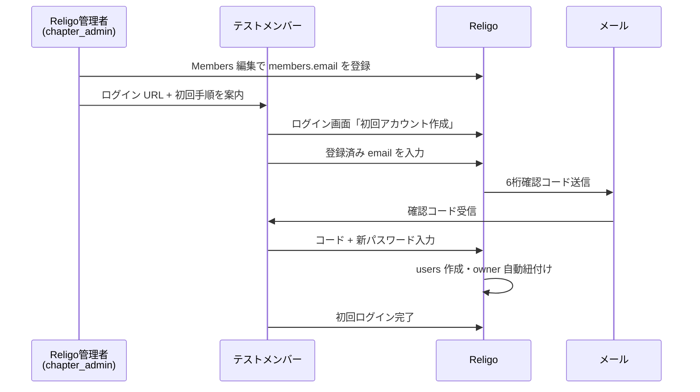

# Religo テストユーザー追加 — 運用フロー & 要件

**作成:** 2026-06-27 12:42 JST  
**状態:** active（DragonFly PoC 試験配布の運用正）  
**関連 SSOT:** SPEC-010（AUTH_LOGIN_AND_OWNER_BINDING）、SPEC-011（AUTH_REGISTRATION_EMAIL）、[ONBOARDING_AND_ACCOUNT_PROVISIONING.md](ONBOARDING_AND_ACCOUNT_PROVISIONING.md)（Phase E）、SPEC-020 §11.6 順位 9  
**対象:** Religo 管理者（`chapter_admin`）が DragonFly メンバーへ試験利用を案内する際の手順

---

## 1. 目的

DragonFly メンバーに Religo を**小規模テスト配布**する際、次廣（管理者）が行う作業と、メンバー本人が行う初回ログインまでの流れを一本化する。

- 管理者が **利用してもらいたいメンバーのメールアドレスを事前登録**する。
- メンバーに **ログイン画面 URL** を案内する。
- メンバーが **メール経由で本人確認 → 初回パスワード作成 → ログイン**する。
- ログイン後は **自分の Owner に固定**され、他人の 1to1・接触履歴は見えない（Phase 263〜268 で担保済み）。

---

## 2. 望ましい運用フロー（To-Be）

管理者・メンバー双方の視点で整理する。

### 2.1 管理者（次廣）の作業

| # | 作業 | 詳細 |
|---|------|------|
| 1 | パイロット対象の選定 | 試験利用してもらうメンバーを決める（例: 5〜10 名） |
| 2 | `members.email` 登録 | Members → 対象メンバー → **編集**（`chapter_admin` のみ）で正しいメールを入力・保存 |
| 3 | 案内文の送付 | ログイン URL・初回手順・問い合わせ先を共有（§6 テンプレート参照） |
| 4 | 登録完了の確認 | 対象者がログインできたか、自分のデータのみ見えるかを確認 |

### 2.2 メンバー本人の作業

| # | 作業 | 詳細 |
|---|------|------|
| 1 | ログイン画面を開く | `/admin`（本番は Religo の URL） |
| 2 | 「初回アカウント作成」タブを選択 | ログインタブではなく登録フローへ |
| 3 | Members に登録済みの email を入力 | 管理者が登録したアドレスと**完全一致**が必要 |
| 4 | 確認コードメールを受信 | 6 桁コード（有効期限: 既定 30 分） |
| 5 | コード + パスワード（8 文字以上）を入力 | 確認用パスワードも入力 |
| 6 | 自動ログイン | アカウント作成後、そのままログインされる |

---

## 3. 現状実装（As-Is）の確認

**2026-06-27 時点のコードベース調査結果。**

### 3.1 管理者がメンバーごとのメールを設定できるか

**結論: はい。`chapter_admin` のみ可能。**

| 層 | 実装 | 備考 |
|----|------|------|
| **UI** | `MemberEdit.jsx` の `email` 欄（ラベル: メール（連絡先）） | `app.jsx` で `edit={isAdmin ? MemberEdit : undefined}`。一般 member は編集画面に遷移不可 |
| **API** | `PUT /api/dragonfly/members/{id}` | `religo.chapter_admin` middleware 配下（Phase 264） |
| **バリデーション** | 同一 `workspace_id` 内で `members.email` は **重複不可** | `DragonFlyMemberController::nullableMemberEmailRules` |
| **テスト** | `DragonFlyMemberEmailTest` | email 更新の Feature test 済み |

**操作手順（管理者）**

1. `chapter_admin` で Religo にログイン
2. 左メニュー **Members** → 対象メンバーを開く → **編集**
3. **メール（連絡先）** に利用者のメールアドレスを入力して保存

> **注意:** Members 一覧のドロワー（詳細パネル）では Nキャス URL のみ編集可能。**email は Member 編集画面でのみ設定**できる。

### 3.2 初回アカウント作成（自己登録）

**実装済み（SPEC-011）。**

| API | 役割 |
|-----|------|
| `POST /api/auth/register/request` | `members.email` 一致時に 6 桁確認コードをメール送信 |
| `POST /api/auth/register/complete` | コード + パスワードで `users` 作成 |

**登録完了時の自動設定（`MemberAccountRegistrationService`）**

- `users.email` = `members.email`
- `users.owner_member_id` = `members.id`
- `users.default_workspace_id` = `members.workspace_id`
- `users.religo_role` = `member`

**UI:** `ReligoLogin.jsx` — タブ「初回アカウント作成」（email → 確認コード → パスワード）

### 3.3 パスワード再発行（リセット）

**未実装。**

| 項目 | 状況 |
|------|------|
| `POST /api/auth/password/forgot` 等 | **なし** |
| ログイン画面の「パスワードを忘れた」リンク | **なし** |
| `password_reset_tokens` テーブル | Laravel 標準マイグレーションで存在するが、Religo フロー未接続 |
| SPEC-011 §3.2 | パスワードリセットメールは **Out of scope（別 Phase）** と明記 |

**初回利用者向けの解釈**

- アカウントが**まだ存在しない**メンバー → **「初回アカウント作成」** を使う（パスワード再発行ではない）。
- 案内文では「パスワード再発行」ではなく **「初回パスワード設定（確認コードメール）」** と表現するのが正確。

**既存ユーザーがパスワードを忘れた場合**

- 現状は管理者による手動対応（DB / tinker 等）か、将来の Password Reset Phase が必要。

---

## 4. Fit & Gap（望ましい流れとの差分）

| 望ましいステップ | 現状 | 判定 |
|------------------|------|------|
| 管理者が `members.email` を登録 | Member 編集で可能（admin 限定） | **OK** |
| ログイン画面を案内 | `/admin` + `ReligoLogin` | **OK** |
| メールで本人確認 | 確認コードメール（register/request） | **OK**（初回登録用） |
| パスワード作成 | register/complete で新規パスワード設定 | **OK**（初回のみ） |
| **パスワード再発行** | 未実装 | **Gap** — 別 Phase |
| 初回ログイン | 登録完了後に自動ログイン | **OK** |
| owner 自動紐付け | 登録時に自動設定 | **OK** |
| 他人データの非表示 | Phase 263 owner 強制 | **OK** |

---

## 5. 前提条件・制約

### 5.1 データ前提

- `members.email` が **未登録** のメンバーは自己登録できない（422: メンバー情報に未登録）。
- 現状 DB では **180 名中ごく一部のみ** email 整備済み（SPEC-020 B9）。テスト配布前に対象者分は必ず登録する。
- 同一 email が複数 workspace に存在する場合は 422（管理者が解消する）。

### 5.2 権限

| ロール | Members email 編集 | 初回自己登録 |
|--------|-------------------|--------------|
| `chapter_admin` | 可 | 可（自分用） |
| `member` | 不可 | 可（自分用） |

### 5.3 メール送信

- 本番: `.env` の `MAIL_*` 設定が必要。送信失敗時は API 503。
- ローカル検証: `RELIGO_REGISTRATION_EXPOSE_DEBUG_CODE=true` で画面に `debug_code` 表示可。

### 5.4 セキュリティ

- 未登録 email は **422 で明示**（列挙リスクより UX 優先 — SPEC-011）。
- 既に `users` が存在する email は「ログインしてください」エラー（再登録不可）。

---

## 6. 管理者向けチェックリスト

テストユーザー 1 名あたりの作業。

- [ ] 対象メンバーの **正式なメールアドレス** を確認した
- [ ] Members **編集** で `email` を登録・保存した（チャプター内重複なし）
- [ ] 対象者に **案内文**（§7）を送った
- [ ] 本番メール送信設定を確認した（またはローカルで debug_code 検証）
- [ ] 対象者が **初回アカウント作成** を完了したことを確認した
- [ ] 対象者ログイン後、**自分の 1to1 / 接触のみ**表示されることを確認した
- [ ] 管理メニュー（Member merge / SONAE / Categories 等）が **非表示** であることを確認した（一般 member）

---

## 7. メンバー向け案内文テンプレート

管理者がそのまま送れる文案（URL は環境に合わせて差し替え）。

---

**件名:** Religo テスト利用のご案内（DragonFly）

お疲れさまです。BNI DragonFly 向けツール **Religo** のテスト利用にご協力いただきたく、ご連絡します。

**■ ログイン画面**  
https://（本番URL）/admin

**■ 初回のみ（アカウント作成）**

1. 上記 URL を開く  
2. **「初回アカウント作成」** タブを選ぶ  
3. **事前に登録したメールアドレス**（○○@example.com）を入力し、「確認コードを送信」  
4. 届いたメールの **6 桁コード** を入力  
5. **パスワード（8 文字以上）** を設定  
6. 自動的にログインされます  

※ すでにアカウントをお持ちの方は「ログイン」タブからメールとパスワードで入ってください。  
※ パスワードを忘れた場合は、現時点では管理者（次廣）までご連絡ください。

**■ テストでお願いしたいこと**

- 1to1 の実施後、要約をコピペして自分の 1to1 記録に保存できるか  
- 他メンバーの 1to1 記録が見えないこと  

ご不明点は次廣までお願いします。

---

## 8. エラー時の対応

| 症状 | 原因 | 対応 |
|------|------|------|
| 「メンバー情報に登録されていません」 | `members.email` 未登録 or 入力ミス | 管理者が Member 編集で email を登録・確認 |
| 「既に登録されています」 | `users` 行が既に存在 | 「ログイン」タブを案内。パスワード不明なら管理者対応（リセット未実装） |
| 「複数のチャプターに登録」 | email が複数 workspace に重複 | 管理者が名簿を整理 |
| 確認コードが届かない | メール設定・迷惑メール | SMTP 確認、再送（email ステップからやり直し） |
| ログイン後にデータが空 | owner 未紐付け（登録失敗） | 管理者が `users.owner_member_id` を確認 |

---

## 9. 将来拡張（別 Phase）

| Phase 候補 | 内容 | 優先度 |
|------------|------|--------|
| **Password Reset** | ログイン画面「パスワードを忘れた」→ メールリンク/コード → 新パスワード | Should（既存ユーザー増加後） |
| **管理者仮発行** | admin が仮パスワード付き `users` を発行 | Could（メール不可メンバー向け） |
| **招待リンク** | トークン付き URL で登録 | Could（自己登録で代替可） |
| **Members 一覧から email 編集** | ドロワー or インライン編集 | Could（現状は編集画面で足りる） |

---

## 10. 関連実装参照

| 種別 | パス |
|------|------|
| 登録 UI | `www/resources/js/admin/pages/ReligoLogin.jsx` |
| 登録 API | `www/app/Http/Controllers/Api/AuthRegisterController.php` |
| 登録サービス | `www/app/Services/Religo/MemberAccountRegistrationService.php` |
| Member email 編集 UI | `www/resources/js/admin/pages/MemberEdit.jsx` |
| Member 更新 API | `www/app/Http/Controllers/Api/DragonFlyMemberController.php` |
| ルート（admin 限定 PUT） | `www/routes/api.php` — `religo.chapter_admin` group |

---

## 変更履歴

| 日時 (JST) | 内容 |
|------------|------|
| 2026-06-27 12:42 | 初版。テストユーザー追加の運用フロー・管理者 email 設定可否・パスワード再発行 Gap を整理 |
