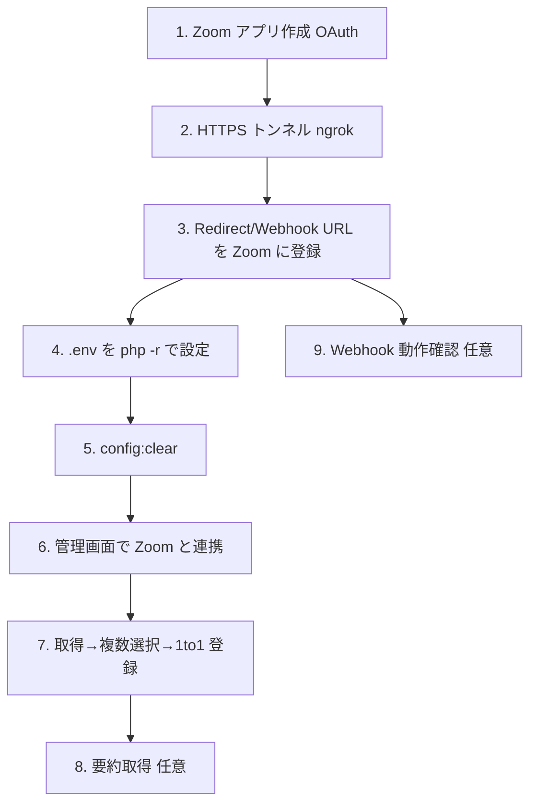

# Zoom 連携 セットアップ・運用手順（Runbook）

**関連:** [ZOOM_ONETOONE_SYNC_REQUIREMENTS.md](ZOOM_ONETOONE_SYNC_REQUIREMENTS.md)（SPEC-012・要件/実装）
**対象:** Zoom 連携（Phase 152 で実装）を **実際に動かすための運用手順**。コードは実装済みで、本書は **コード外の設定作業**（Zoom アプリ作成・`.env`・HTTPS トンネル・操作・確認）をまとめる。
**作成:** 2026-05-30 09:19 JST（Phase 153 / docs）

> 重要原則（[.cursorrules](../../.cursorrules) 準拠）
> - `.env` は **手動編集しない**。`php -r`（`preg_replace`）で安全に書き換える（sed 禁止）。
> - API キー等のアプリ資格情報は `.env`（`config/services.zoom`）で管理し、コード・リポジトリに **ハードコードしない**。

---

## 0. 全体の流れ



---

## 1. Zoom Marketplace で OAuth アプリを作成

1. [Zoom App Marketplace](https://marketplace.zoom.us/) → **Develop → Build App**。
2. アプリ種別の選択（"What kind of app are you creating"）で **General App** を選ぶ。
   - **General App** = OAuth 2.0 で認可ユーザーのデータにアクセスする汎用アプリ。今回の実装（authorization code + `redirect_uri` のユーザー OAuth）はこれ。Webhook も同じアプリ内で設定する。旧称「User-managed OAuth app」に相当。
   - **Server to Server OAuth App** は使わない（redirect 無しのトークン直取得方式で、今回のコードと不一致）。
   - **Webhook Only App** は使わない（通知受信のみで API 読み取り不可）。
   - 作成後、認証情報の **User-managed**（ユーザーごとに連携）を選び、必要なら開発中は自分のアカウントのみで動作確認する。
3. **OAuth 情報（Client ID / Client Secret）** を控える（General App の "App Credentials" / "Basic Information"）。
4. **Redirect URL for OAuth** と **OAuth allow list** に、手順 2 で決めるトンネル URL + `/api/zoom/callback` を登録（例: `https://<your-subdomain>.ngrok-free.app/api/zoom/callback`）。**Zoom 側とアプリの値は完全一致が必須**。
5. **Scopes**（取得系のみ・最小権限）。Zoom は粒度別スコープに移行しているため、最新名は Marketplace の表示に合わせる。目安:
   - 予定/実施一覧・詳細: `meeting:read:list_meetings`, `meeting:read:meeting`, `meeting:read:list_past_instances`, `meeting:read:past_meeting`
   - 過去参加者: `meeting:read:list_past_participants`
   - 自分の情報: `user:read:user`（`/users/me`）
   - 要約（任意・段階C）: ミーティングサマリー読み取り（AI Companion 有効時に表示されるスコープ）
   - 文字起こし（任意・段階C）: `cloud_recording:read:list_recording_files` 等
6. **Event Subscriptions（Webhook・任意・段階D）**:
   - Event notification endpoint URL: `https://<tunnel>/api/zoom/webhook`
   - **Secret Token** を控える（`ZOOM_WEBHOOK_SECRET_TOKEN`）。
   - 購読イベント: `meeting.ended`、（要約反映する場合）`recording.completed` / `meeting.summary_completed`。

---

## 2. ローカル用 HTTPS トンネル

Zoom の OAuth Redirect / Webhook は **HTTPS 必須**。ローカル（`http://localhost`）には ngrok 等でトンネルを張る。

```bash
# nginx は 80 番（http://localhost）。これをトンネルする。
ngrok http 80
# 例: https://ab12cd34.ngrok-free.app が払い出される
```

- 払い出された `https://<tunnel>` を、手順 1-4 の Redirect URL（`/api/zoom/callback`）と 1-6 の Webhook URL（`/api/zoom/webhook`）に設定する。
- 本番では固定ドメイン（公開 HTTPS）を使う。

---

## 3. `.env` を設定（php -r・手動編集禁止）

実値を入れて、app コンテナ内で `.env` を安全に書き換える。`<...>` を実際の値に置換すること。**APP_URL もトンネル URL に合わせる**と OAuth 後のリダイレクト（`/admin#/zoom-import`）が正しく戻る。

```bash
docker compose -f infra/compose/docker-compose.yml --env-file project.env exec app php -r '
$f = "/var/www/.env";
$env = file_get_contents($f);
$kv = [
  "ZOOM_CLIENT_ID" => "<your-client-id>",
  "ZOOM_CLIENT_SECRET" => "<your-client-secret>",
  "ZOOM_REDIRECT_URI" => "https://<tunnel>/api/zoom/callback",
  "ZOOM_WEBHOOK_SECRET_TOKEN" => "<your-webhook-secret>",
  "APP_URL" => "https://<tunnel>",
];
foreach ($kv as $k => $v) {
  if (preg_match("/^".$k."=.*/m", $env)) {
    $env = preg_replace("/^".$k."=.*/m", $k."=".$v, $env);
  } else {
    $env .= "\n".$k."=".$v;
  }
}
file_put_contents($f, $env);
echo "updated .env\n";
'
```

> 値にスペースや記号が含まれる場合は `"..."` で囲う（例: `ZOOM_CLIENT_SECRET="abc/def+ghi"`）。
> Secret はチャットやコミットに残さない。

---

## 4. 設定キャッシュをクリア

```bash
docker compose -f infra/compose/docker-compose.yml --env-file project.env exec app php artisan config:clear
```

確認:

```bash
docker compose -f infra/compose/docker-compose.yml --env-file project.env exec app php artisan tinker --execute="echo config('services.zoom.client_id') ? 'configured' : 'EMPTY';"
```

---

## 5. 管理画面で Zoom と連携

1. 管理画面 `http://localhost/admin`（または APP_URL のトンネル）にログイン。**`chapter_admin` ロールのユーザー**であること（連携 API は admin ゲート）。
2. 左メニュー **「🎥 Zoom 取り込み」**（`/zoom-import`）を開く。
3. **「Zoom と連携」**をクリック → Zoom の認可画面 → 許可 → `/zoom-import?zoom_connected=1` に戻る。
4. 「連携中: <自分の Zoom メール>」が表示されれば成功。

トークンは `zoom_accounts` に **暗号化保存**され、期限切れ時に自動更新される（手動操作不要）。

---

## 6. 取得 → 複数選択 → 1 to 1 登録（中核操作）

1. 期間「過去（日）」「今後（日）」を指定（既定 30 / 14）。
2. **「Zoom から取得」**をクリック。予定（scheduled）・実施（past）が一覧に出る。
   - 1to1 候補は **自信度バッジ**付きで既定選択。**BNI 以外（定例会・チーム・社内・私用）は既定で未選択**。
   - 既に登録済みのものは**グレーアウト**（二重登録されない）。
3. 各行で **相手（members）** を確認・修正:
   - 自動マッチ済みはそのまま。
   - 未登録（`new`）は Autocomplete で既存メンバーを選ぶ。確定できなければ未選択のまま（= 後述の「保留」になる）。
4. ヘッダーの **「全選択 / 候補のみ選択 / 全解除」**で選択を調整。
5. **「選択を Religo に登録」**をクリック。
   - 実施（past）→ `completed`（実開始・終了時刻入り）。
   - 予定（scheduled）→ `planned`。
   - **相手未確定・owner 未設定 → 「保留」**（`one_to_ones` には作らずステージングに残る）。
   - 結果サマリ「登録 N / 保留 M / スキップ K」が表示される。

> 相手が `members` にいない場合は、先に Members 画面で登録するか、Member マージ（重複時）で整理してから再度マッチする（SPEC-008）。

---

## 7. 要約・文字起こしの取得（任意・段階C・プラン依存）

- 取り込み済み（past）行の **「要約取得」**ボタンで、Zoom の **AI Companion 要約** または **クラウド録画の文字起こし（TRANSCRIPT）** を取得し、その 1to1 の `notes` に下書きとして追記する。
- **Zoom プラン・録画/AI Companion 設定が無効だと取得できない**。その場合は「取得できませんでした」と表示され、従来どおり **手動で議事録を記録**する。
- 取得文は **下書き**。必ず人が校正する。

---

## 8. Webhook 動作確認（任意・段階D）

1. Zoom アプリの Event Subscriptions で **Validate**（URL 検証）を実行 → 200 と検証トークン応答が返れば OK（`ZoomWebhookController` が `endpoint.url_validation` に応答）。
2. 署名不一致や Secret 未設定時は 401 / 503 を返す（誤公開防止）。
3. 1to1 を Zoom で実施・終了すると `meeting.ended` で**候補が自動生成**される（自動で `one_to_ones` は作らない＝人の確認は維持）。
4. ジョブ実行にはワーカーが必要:

```bash
docker compose -f infra/compose/docker-compose.yml --env-file project.env exec app php artisan queue:work --stop-when-empty
```

（`QUEUE_CONNECTION=database`。常駐させる場合は `queue:work` を別プロセスで起動。）

---

## 9. 運用上の注意

| 項目 | 内容 |
|------|------|
| **対面・非 Zoom の 1to1** | Zoom に存在しないため取り込めない。従来どおり **手入力フォーム**で登録する。 |
| **相手 email** | プラン/設定で空のことがある。氏名のみのマッチは誤りやすいので**必ず人が確認**。 |
| **レート制限** | 大量取得時は 429。クライアントが Retry-After/バックオフで再試行。期間を分けると安全。 |
| **タイムゾーン** | Zoom は UTC。保存時に JST へ変換済み。 |
| **トークン** | `zoom_accounts` に暗号化保存・自動更新。連携解除は UI の「連携解除」。 |
| **権限** | 連携・取り込み API は `chapter_admin` のみ。 |

---

## 10. トラブルシューティング

| 症状 | 対処 |
|------|------|
| 「Zoom 連携が未設定です」 | 手順 3-4 の `.env` 設定と `config:clear` を確認。 |
| 連携ボタン後に `reason=token_exchange_failed` | Client ID/Secret、Redirect URL（Zoom 側とアプリ完全一致）を確認。 |
| `reason=invalid_state` | 認可に時間がかかり state 期限切れ（10分）。やり直す。 |
| 取得が 0 件 | 期間・Zoom 側の予定/実施有無・スコープ付与を確認。 |
| 要約が取れない | Zoom プラン/録画/AI Companion 設定（段階C・プラン依存）。手動記録で代替。 |
| Webhook 401 | `ZOOM_WEBHOOK_SECRET_TOKEN` が Zoom 側 Secret と一致しているか。 |

確認用コマンド:

```bash
# Zoom 関連ルート
docker compose -f infra/compose/docker-compose.yml --env-file project.env exec app php artisan route:list | grep zoom
# 連携状態（DB）
docker compose -f infra/compose/docker-compose.yml --env-file project.env exec app php artisan tinker --execute="echo \App\Models\ZoomAccount::count();"
```

---

## 11. 変更履歴

| 日付 | 内容 |
|------|------|
| 2026-05-30 09:19 JST | 初版（Phase 153 / docs）。Zoom 連携の Marketplace 設定・トンネル・`.env`・連携/取り込み/要約/Webhook 操作・運用注意・トラブルシュートを整理。 |
