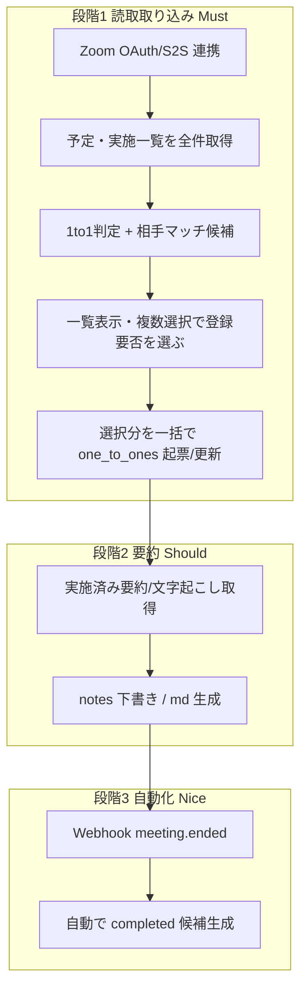

# Zoom 連携による 1 to 1 予定・実施・要約取り込み — 要件整理（ドラフト）

**Spec ID:** SPEC-012（[SSOT_REGISTRY.md](../02_specifications/SSOT_REGISTRY.md) 参照）
**ステータス:** active（主要コード実装済み・Phase A〜D / 記録: Phase 152）
**作成:** 2026-05-30 05:29 JST（Phase 151 / docs）・実装: 2026-05-30 06:29 JST（Phase 152 / implement）
**関連 SSOT:** [DATA_MODEL.md](DATA_MODEL.md)（§4.12 one_to_ones）、[ONETOONES_CROSS_CHAPTER_REQUIREMENTS.md](ONETOONES_CROSS_CHAPTER_REQUIREMENTS.md)（SPEC-006・相手が他チャプター/未登録）、[MEMBERS_DEDUPLICATION_RUNBOOK.md](MEMBERS_DEDUPLICATION_RUNBOOK.md)（SPEC-008・正規化/重複）、[MEMBERS_VISITOR_GUEST_PROXY_CONNECTIONS_POLICY.md](MEMBERS_VISITOR_GUEST_PROXY_CONNECTIONS_POLICY.md)（SPEC-007・guest/visitor）

> **位置づけ:** 本書は「Zoom と Religo の 1 to 1 を連携して二重入力を減らす」ための **要件整理（As-Is / To-Be / 必須機能 / 優先順位 / 段階）**。本書だけでは実装しない。実装は別 Phase で PLAN を切り、本書の決定事項を SSOT として参照する。

---

## 1. 背景（As-Is）

現状、1 to 1 の運用は次のようになっている。

- **調整・実施:** 多くがオンライン＝ **Zoom**。一部は対面・電話・LINE。
- **記録:** 実施後、ユーザー提供の **Zoom 文字起こし要約** を手作業で `docs/meetings/1to1/<slug>.md` に貼り付け・校正している（例: 鈴木健介・木村秀継・南方優馬ほか多数）。
- **DB 登録:** その後、別作業で `one_to_ones` に手入力で登録している（Phase 120/131/137 等）。
- **時刻:** 多くの議事録で **開始・終了時刻が `TODO`**。「カレンダー／Zoom 録画メタで確認」と書いたまま埋まっていない行が多い。

### 1.1 課題

| 課題 | 内容 |
|------|------|
| **二重・三重入力** | Zoom で実施 → md に要約 → `one_to_ones` に手入力、と同じ情報を複数回扱う。 |
| **時刻の欠落** | `scheduled_at` / `started_at` / `ended_at` が TODO のまま放置されやすい。実績時刻は Zoom 側に存在するのに転記されていない。 |
| **予定の未登録** | これから実施する 1 to 1 が Religo に `planned` として入っていないことがある。 |
| **相手特定の手間** | 要約・予定の「相手」を `members` のどの行に紐付けるか毎回人手で判断している。 |

---

## 2. 目的（To-Be）

Zoom を **正の情報源**として、1 to 1 の **予定・実施時刻・要約** を Religo に半自動で取り込み、手入力と時刻 TODO を削減する。

| 目的 | 説明 |
|------|------|
| **予定の自動起票** | Zoom の今後のミーティングから、1 to 1 の `planned` レコードを Religo に作る。 |
| **実施時刻の確定** | 実施済みミーティングの実際の開始・終了を `started_at` / `ended_at` に反映し、TODO を解消する。 |
| **要約の取り込み** | 実施済み 1 to 1 の Zoom 要約／文字起こしを取得し、`notes`（または議事録 md）の下書きにする。 |
| **相手の正規化** | Zoom 側の相手が `members` 未登録・表記ゆれの場合に、**登録・紐付けを人が確認してから**取り込む導線を用意する。 |

### 2.1 非目標（今回スコープ外）

- iCal / Google カレンダーとの同期（**当面採用しない**。理由は §11）。
- Religo から Zoom ミーティングを作成する逆方向連携（将来検討）。
- 定例会・チーム MTG の自動取り込み（本書は **1 to 1 のみ**。定例会は別途）。
- 要約の自動 AI 生成（Zoom 側 AI Companion / 外部要約の利用可否は §6 で整理するが、本書では「取得」までを範囲とする）。
- 完全自動・無人での `members` 新規作成（**必ず人の確認を挟む**。§5）。

---

## 3. 要件サマリ（ユーザー提示の 3 点 + 補強）

| # | 要件 | 区分 | 対応 |
|---|------|------|------|
| R1 | **Zoom の今後の予定を取得して Religo の 1 to 1 の予定（planned）が作られる** | Must | §4.1 |
| R2 | **実施済みの 1 to 1 の Zoom 要約を取得できる** | Must | §4.2 |
| R3 | **Zoom 側 1 to 1 の相手が Religo 未登録の場合があるため、登録前に手動で正規化が必要な可能性** | Must | §5 |
| R4 | 実施済みミーティングの実際の開始・終了時刻を `started_at` / `ended_at` に反映 | Should | §4.3 |
| R5 | 1 to 1 と「定例会・チーム MTG・営業など Zoom の他ミーティング」を区別し、誤取り込みを防ぐ | Must | §4.4 |
| R6 | 同一ミーティングの重複取り込み防止（再実行しても二重登録しない） | Must | §7 |
| R7 | 取り込みは **候補提示 → 人が確認 → 確定** の半自動フロー | Must | §5・§8 |
| R8 | Owner（自分）単位の連携（誰の Zoom アカウントか） | Must | §6・§8 |
| R9 | **Zoom には BNI 以外（社内・営業・私用等）のミーティングも含まれるため、取得一覧から Religo に登録するものを人が選ぶ UI。複数選択で一括登録できる。** | Must | §4.4・§8 |

---

## 4. 機能要件

### 4.1 今後の予定 → `planned` 起票（R1）

- Owner の Zoom アカウントから **今後一定期間（例: 今後14日）の Scheduled Meetings** を取得する。
- 1 to 1 と判定したミーティングについて、Religo に **`one_to_ones`（`status = planned`）** の候補を作る。
  - `scheduled_at` ← Zoom の開始予定時刻（JST 変換）。
  - `owner_member_id` ← 連携した Owner。
  - `target_member_id` ← §5 の正規化で確定（未確定なら候補状態で保留）。
  - `workspace_id` ← Owner 所属チャプター（[WORKSPACE_RESOLUTION_POLICY.md](WORKSPACE_RESOLUTION_POLICY.md) に従う）。
- 既に同一 Zoom ミーティングから起票済みなら作らない（§7）。

### 4.2 実施済み要約の取得（R2）

- Owner の Zoom アカウントから **過去一定期間（例: 過去30日）の実施済みミーティング**を取得する。
- 1 to 1 と判定したものについて、**要約／文字起こし**を取得する（取得方式は §6）。
- 取得した要約は次のいずれかに反映する（実装 Phase で確定）。
  - **案 A:** `one_to_ones.notes` に下書きとして格納（人が校正）。
  - **案 B:** `docs/meetings/1to1/<slug>.md` の下書き生成（現運用に寄せる）。
  - **案 C:** 両方（DB に要点、md に詳細）。
- 要約は **下書き**であり、確定・校正は人が行う（自動上書きしない）。

### 4.3 実績時刻の確定（R4）

- 実施済みミーティングの **実際の開始・終了**を取得し、対応する `one_to_ones` に反映する。
  - `started_at` ← 実開始、`ended_at` ← 実終了、`status` → `completed`。
- これにより、議事録 md に多数残る **時刻 TODO** を Zoom 実績で埋められる。
- 既存行（`planned`）があれば更新、なければ新規作成（§7 の突合キー）。

### 4.4 1 to 1 判定・他ミーティング除外・登録要否の選択（R5・R9）

Zoom には 1 to 1 だけでなく **定例会・チーム MTG・営業・社内会議・私用** も混在する。Religo に登録するのは **BNI の 1 to 1 のみ**であり、それ以外は取り込まない。

- **判定はあくまで「候補・自信度」** であり、**最終的に Religo に登録するかは人が選ぶ**（自動登録しない）。
- **1 to 1 候補の判定シグナル**（実装 Phase で精緻化）:
  - **参加人数:** ホスト + 1 名（= 2 名）を基本の 1 to 1 シグナルとする。
  - **件名パターン:** 「1to1」「1on1」「121」「調整用」「◯◯さん」等の語を含む（既存 md の Zoom タイトル例: `合同会社スタジオ鈴 鈴木健介さん：1to1調整用`、`木村秀継ミーティング` など揺れが大きい点に注意）。
- **除外（登録対象外）の例:** 定例会（DragonFly 火曜枠・繰り返し・多人数）、チーム MTG（スリーバイス等）、社内・営業会議、私用。これらは一覧に出しても **既定で未選択**とし、誤登録を防ぐ。
- **取得一覧は「全件表示」した上で、登録するものを人が選ぶ**（§8）。1 to 1 候補と判定したものだけを出すのではなく、**全件を出して候補をハイライト／既定選択**する方式とし、判定漏れ（候補にならなかった本物の 1 to 1）も人が拾えるようにする。

---

## 5. 相手の正規化フロー（R3・最重要）

Zoom 側の相手は **Religo `members` に登録されていない／表記がゆれている**ことがある。**取り込み前に人が確認・正規化する**ことを必須とする。

### 5.1 マッチング段階

| 段階 | 内容 |
|------|------|
| **自動候補** | Zoom の相手名・メール（取得できれば）から `members` をあいまい一致で検索し、候補を提示する。 |
| **確認** | 人が「この候補で正しい / 別の人 / 新規登録 / 取り込まない」を選ぶ。 |
| **確定** | 選択結果に基づき `target_member_id` を確定して `one_to_ones` を作る。 |

### 5.2 相手が未登録の場合の選択肢

1. **既存 `members` に紐付け**（同一人物の表記ゆれ・別チャネル登録）。
2. **新規 `members` を作成して紐付け**（人の承認後）。
   - 他チャプター所属の可能性が高いため、`workspace_id`・`type`（member / visitor / guest）は人が指定する（SPEC-006・SPEC-007 準拠）。
3. **保留**（相手未確定のまま `planned` 候補だけ残す。`target_member_id` は確定後に付与）。
4. **取り込まない**（1 to 1 でない・対象外）。

### 5.3 既存資産の再利用

- メンバー照合・あいまい一致・候補提示・手動マッチングは、**Meetings 参加者 CSV 取込（M7/M8 系）で実装済みのパターン**（`MeetingCsvMemberResolver`・resolutions・suggestions API・手動マッチング UI）を踏襲する。Zoom 用に新設するのではなく、可能な限り既存の解決器・UI を流用する。
- 重複・統合は [MEMBERS_DEDUPLICATION_RUNBOOK.md](MEMBERS_DEDUPLICATION_RUNBOOK.md)（SPEC-008・`MemberMergeService`）に従う。**自動同一人物判定はしない。**

### 5.4 注意

- **氏名のみのマッチは誤りやすい**（同名・屋号ゆれ）。Zoom からメールが取れる場合は `members.email`（SPEC-010 / Phase 127）と突合する。
- 新規作成を安易に行うと **重複 members** が増える。新規は人の明示操作のみ。

---

## 6. Zoom API・認証（技術前提）

> 具体的なエンドポイント・スコープ・プラン要件は実装 Phase で確定する。本節は方針のみ。

| 項目 | 方針 |
|------|------|
| **認証方式** | Owner 単位の **OAuth**、または運用が単一管理なら **Server-to-Server OAuth**。どちらにするかは利用者数・運用で決める。 |
| **必要スコープ（想定）** | ミーティング読み取り（予定・実施一覧）、録画・要約読み取り（要約取得時）。 |
| **予定取得** | Scheduled Meetings 系 API。 |
| **実施取得** | Past Meetings / Meeting Instances 系 API（実開始・終了）。 |
| **要約・文字起こし** | Cloud Recording / Meeting Summary 系。**Zoom プラン・録画設定・AI Companion 有無に依存**するため、取得可否を実装前に検証する。取得できない環境では R2 は「手動要約の貼り付け継続」にフォールバック。 |
| **認証情報（API キー等）の保管** | **アプリ資格情報（Client ID / Client Secret / Server-to-Server Account ID / Webhook Secret 等）は `.env` に置き、`config/services.php`（例: `config('services.zoom.*')`）経由で参照する。コード・リポジトリにハードコードしない。** `.env.example` にキー名のみ（値は空）を追加する。値は環境ごとに設定する。 |
| **トークン保管** | **`.env` に入れるのはアプリ資格情報まで**。ユーザーごとに動的発行される **アクセス／リフレッシュトークンは `.env` ではなく DB に暗号化保存**（`.env` は静的設定のため動的トークンの保管先にしない）。private リポ前提でも本番は別途方針（§10）。 |
| **取り込みトリガ** | 当面は **手動「Zoom から取り込み」操作**（バッチ/ボタン）。将来 Webhook（`meeting.ended` / `recording.completed`）で自動化を検討（§9 段階 3）。 |

> **設定運用の注意（プロジェクトルール）:** `.env` は **手動編集しない**。必要な追記は **PHP スクリプト**で行う。キー名はコードで参照する `config/services.php` の定義と一致させる。バージョン番号等の直書きはしない（[.cursorrules](../../.cursorrules) 準拠）。
>
> **想定キー名（実装 Phase で確定）:** `ZOOM_CLIENT_ID` / `ZOOM_CLIENT_SECRET` / `ZOOM_ACCOUNT_ID`（S2S 時）/ `ZOOM_WEBHOOK_SECRET_TOKEN`（Webhook 採用時）。

### 6.1 公式ドキュメント精査 — 実際に可能なこと（2026-05-30 時点）

出典: [Zoom Developer Docs — API Reference](https://developers.zoom.us/docs/api/)。エンドポイント名・スコープは Zoom 側で改訂されるため、**実装 Phase で最新ドキュメントを再確認**する。本節は「何ができるか」を日本語で整理したもの。

#### 6.1.1 共通仕様（確認済み）

| 項目 | 内容 |
|------|------|
| **ベース URL** | `https://api.zoom.us/v2/`。`Authorization: Bearer <access_token>` ヘッダーで呼ぶ。 |
| **認証** | **OAuth 2.0**（ユーザー同意・認可コード → アクセストークン）または **Server-to-Server OAuth**（アプリ資格情報で直接トークン取得）。**アクセストークンは 1 時間有効**。OAuth はリフレッシュトークンで更新、S2S は都度再取得。→ §6 の方針（資格情報は `.env`、トークンは DB 暗号化保存）と整合。 |
| **ページネーション** | `page_size` 指定 + `next_page_token` で次ページ取得。一覧取得時は全ページを巡回する実装が必要。 |
| **レート制限** | 超過時 **HTTP 429**。QPS（秒間）と Daily（日次）があり、**アカウントプランで上限が変わる**。`Retry-After` ヘッダーに従う。取り込みは一括ではなくレート配慮（バックオフ）が必要。 |
| **エラー** | 2xx 成功、4xx/5xx はボディに `code` / `message`。 |

#### 6.1.2 本要件で使える主な API（マッピング）

| 本要件 | 用途 | 想定エンドポイント（要実装時確認） | 可否 |
|--------|------|-----------------------------------|------|
| **R1 予定取得** | 今後のミーティング一覧 | `GET /users/{userId}/meetings`（`type=scheduled` / `upcoming` / `upcoming_meetings`）。`page_size` + `next_page_token`。 | **可** |
| **R4 実施時刻** | 過去ミーティングの実績 | `GET /past_meetings/{meetingId}/instances`（繰り返し各回の `uuid` 一覧）→ `GET /past_meetings/{meetingUUID}`（`start_time` / `end_time` / `duration` / `participants_count`） | **可** |
| **R3/R5 相手特定** | 実参加者の取得 | `GET /past_meetings/{meetingUUID}/participants`（参加者名・参加者の `user_email` 取得可。**プラン・設定により email が空のことあり**） | **条件付き可** |
| **R2 要約** | AI 要約 | **Meeting Summary（AI Companion）API**。`meeting.summary_completed` Webhook で生成検知 → 要約取得。**AI Companion 有効＋対応プランが前提**。 | **環境依存** |
| **R2 文字起こし** | 文字起こし全文 | **Cloud Recording**（`GET /users/{userId}/recordings` / ミーティング録画ファイル一覧）の **`recording_type = TRANSCRIPT`（.vtt）** を取得。**クラウド録画＋文字起こし設定が前提**（ローカル録画は不可）。 | **環境依存** |

#### 6.1.3 リアルタイム連携（Webhook／段階3）

- `meeting.started` / `meeting.ended` … 開始・終了の即時検知（`object` に `id` / `uuid` / `start_time` / `topic` / `host_id` 等）。
- `recording.completed` … クラウド録画の完了（文字起こしファイル取得の起点）。
- `meeting.summary_completed`（AI Companion）… 要約生成の完了検知。
- **要件:** HTTPS エンドポイントで **3 秒以内に 200/204 応答**。Webhook 署名（`ZOOM_WEBHOOK_SECRET_TOKEN`）で正当性検証。WebSocket 受信（ベータ）も選択肢。

#### 6.1.4 想定スコープ（最小権限・要確認）

- 予定/実施一覧・詳細: ミーティング読み取り（例: `meeting:read`、現行は粒度別スコープ `meeting:read:list_meetings` 等に分割傾向）。
- 過去参加者: 過去ミーティング読み取り系。
- 要約: AI Companion／ミーティングサマリー読み取り系。
- 文字起こし: クラウド録画読み取り系（`cloud_recording:read` 系）。
- **方針:** 取得系のみ（read）。作成・変更系スコープは要求しない（Religo→Zoom 逆方向は非目標）。

#### 6.1.5 重要な制約・落とし穴

- **UUID の扱い:** ミーティング `uuid` に `/` や `+` が含まれると、パスに入れる際 **二重 URL エンコード**が必要（Zoom 仕様）。突合キー（§7 `zoom_meeting_uuid`）の保存・照合で注意。
- **要約・文字起こしはプラン依存:** AI Companion／クラウド録画／文字起こしが無効・無料プランだと **R2 は取得不可**。その場合は **手動要約の貼り付け継続**にフォールバック（§2.1・§10）。実装前に **実アカウントで取得可否を検証**（DoD）。
- **参加者 email が取れない場合がある:** 設定・プラン・ゲスト参加で空になり得る。氏名のみのマッチは誤りやすいため、§5 の人手確認は必須のまま。
- **レート制限・ページネーション:** 取り込みは期間を区切り、429 時はバックオフ。全ページ巡回を前提に設計。
- **タイムゾーン:** API は基本 UTC（`start_time` は `...Z`）。Religo 保存時は **JST 変換**（既存運用は JST 明示）。
- **取得は連携ユーザー単位・ホスト側が基本対象:** OAuth トークンは**そのユーザーの**データにアクセスする。`/users/me/meetings` は基本**そのユーザーが主催/作成**した会議を返すため、**相手がホストした 1to1（自分は参加者のみ）は一覧に出ないことがある**。運用上は「自分がホストした回は自分側で、相手ホスト回は相手側で取り込む」形になり得る。
- **対面・非 Zoom は対象外:** Zoom に存在しない 1 to 1 は取得できない。手入力フォームは残す。

---

## 7. 重複防止・突合キー（R6）

再取り込みしても二重登録しないため、Zoom 側 ID を Religo に保持する。

- **保持する外部キー（実装 Phase で追加想定）:**
  - `one_to_ones.zoom_meeting_id`（数値 ID）
  - `one_to_ones.zoom_meeting_uuid`（インスタンス単位の一意 ID。繰り返し回ごとに異なる）
  - `one_to_ones.external_source`（`zoom` / `manual` / 既定 `manual`）
- **突合ルール:**
  - 予定（§4.1）→ `zoom_meeting_id` で既存 `planned` を検索、無ければ作成。
  - 実施（§4.3）→ `zoom_meeting_uuid` で既存行を検索、`planned` があれば `completed` に更新、無ければ新規作成。
- DATA_MODEL §4.12 に上記カラムを追記するかは実装 Phase で決定（**SSOT 更新が必要**）。

---

## 8. 取り込み UI（半自動・複数選択・R7/R8/R9）

Zoom には BNI 以外のミーティングも含まれるため、**取得した Zoom ミーティング一覧を表示し、Religo に登録するものを人が複数選択して一括登録**できる UI とする。これが本機能の中核 UX。

### 8.1 取り込み画面の流れ

1. **Owner を選ぶ**（誰の Zoom アカウントか・R8）。
2. **期間を指定して「Zoom から取得」**（例: 過去30日・今後14日）。
3. Zoom API から取得した **ミーティング一覧を全件表示**（§4.4。1 to 1 候補をハイライト・既定選択、BNI 以外は既定で未選択）。
4. 各行で **登録要否（チェックボックス）** と **相手の正規化**を行う。
5. **「選択した N 件を Religo に登録」** で一括反映。

### 8.2 一覧（複数選択リスト）の各行

| 列 | 内容 |
|----|------|
| **選択** | チェックボックス（複数選択）。ヘッダーに「全選択／候補のみ選択／全解除」。 |
| **件名 / 日時** | Zoom 件名・開始日時（JST）・予定 or 実績の区別。 |
| **参加者** | 人数・相手名（取得できればメール）。 |
| **1to1 判定** | 候補バッジ・自信度（高/中/低）。BNI 以外と推定される行は「対象外候補」表示。 |
| **相手マッチ** | `members` のマッチ候補（§5）。確定／新規登録／保留／（相手不明）を選べる。 |
| **登録区分** | 予定 `planned` / 実施 `completed`（実績時刻があれば completed 既定）。 |
| **状態** | 既登録（`zoom_meeting_id`/`uuid` 突合済み＝§7）は「登録済み」表示でグレーアウトし、重複登録させない。 |

### 8.3 一括操作・確定

- **複数選択**して一括で「登録対象に含める／除外する」。
- **相手未確定の行を含めて一括登録**しようとした場合は、未確定行を **保留（`target_member_id` なし `planned`）** として登録するか、確定を促すかを選べる。
- **確定:** チェックした行だけ `one_to_ones` に反映。既登録分はスキップ。要約取得分は `notes` 下書き or md 生成（§4.2）。
- 登録後、結果サマリ（登録 N 件 / 保留 M 件 / スキップ K 件）を表示。

### 8.4 監査・再実行

- 取り込み実行ログを残す（誰がいつ・対象期間・登録/保留/スキップ件数）。M7 系の `*_apply_logs` パターンを参考にする。
- 再取得しても §7 の突合キーで **既登録は「登録済み」表示**になり、二重登録しない。

---

## 9. 段階・優先順位

| 段階 | 内容 | 区分 | 主な対象要件 |
|------|------|------|--------------|
| **1** | Zoom 連携 + 予定/実施の読取取り込み + **一覧表示・複数選択での登録要否 UI** + 相手正規化 + 重複防止 | Must | R1・R3・R4・R5・R6・R7・R8・R9 |
| **2** | 実施済み要約／文字起こしの取得と下書き反映 | Should | R2 |
| **3** | Webhook による終了時自動候補生成 | Nice | （自動化） |

---

## 10. リスク・確認事項

| 項目 | 内容 |
|------|------|
| **Zoom プラン依存** | 要約・文字起こし API はプラン／録画設定に依存。取得不可なら R2 は手動継続にフォールバック。**実装前に実アカウントで検証が必要。** |
| **相手特定の精度** | 件名・氏名のばらつきが大きく、完全自動は不可。誤紐付けは関係データを汚すため **人の確認を必須**にする。 |
| **members 重複増加** | 安易な新規作成は重複を招く（SPEC-008）。新規は人の明示操作のみ。 |
| **対面・非 Zoom の 1 to 1** | Zoom 連携では取れない。**手入力フォームは残す**（廃止しない）。 |
| **個人情報・トークン** | 要約本文・参加者・録画 URL・アクセストークンの保管はセキュリティ方針が必要。**API キー等のアプリ資格情報は `.env`（`config/services.php` 経由）で管理しハードコード禁止**、動的トークンは DB 暗号化保存（§6）。本番運用方針は別途。 |
| **DB スキーマ変更** | `zoom_meeting_id` 等の追加は migration と DATA_MODEL 更新を伴う（SSOT 更新要）。 |
| **タイムゾーン** | Zoom の UTC を **JST** に正しく変換する（既存運用は JST 明示が原則）。 |

---

## 11. カレンダー連携を当面採用しない理由

- 1 to 1 の **オンライン実施はほぼ Zoom** であり、予定・実績時刻・要約は Zoom 側に揃う。
- Google / iCal 連携は OAuth・Webhook・相手特定など Zoom 取り込みと同等の工数がかかるうえ、**実績時刻が取れない**（予定のみ）。
- したがって **優先順位は「Zoom 取り込み ≫ カレンダー連携」**。対面・非 Zoom の例外は **手入力フォーム**で対応する。
- 将来、対面 1 to 1 が増える等の事情が出たら、カレンダー連携を別 Spec で再検討する。

---

## 12. DoD（本要件ドキュメントとして）

- [x] ユーザー提示の 3 要件（R1・R2・R3）を機能要件に展開した。
- [x] 補強要件（実績時刻・1to1 判定・重複防止・半自動フロー・Owner 連携）を追加した。
- [x] **Zoom 一覧の全件表示・複数選択での登録要否 UI（R9）**を定義し、BNI 以外の誤登録を防ぐ既定未選択・既登録スキップを明記した。
- [x] 相手未登録時の **正規化フロー**（既存 M7/M8・SPEC-008 流用）を定義した。
- [x] 段階・優先順位・リスク・カレンダー非採用理由を明記した。
- [x] **API キー等のアプリ資格情報は `.env`（`config/services.php` 経由）で管理しハードコード禁止**、動的トークンは DB 暗号化保存、という方針を明記した（§6）。
- [x] **Zoom 公式ドキュメントを精査**し、各要件（R1/R2/R3/R4/R5）に対応する API・Webhook・スコープ・制約（プラン依存・UUID エンコード・レート制限・TZ）を §6.1 に日本語整理した。
- [ ] （実装 Phase で）Zoom プラン要件・API スコープ・要約取得可否を実アカウントで検証する。
- [ ] （実装 Phase で）DATA_MODEL §4.12 に `zoom_*` カラムを追記する。
- [ ] （実装 Phase で）`.env.example`・`config/services.php` に Zoom キーを追加する（`.env` 追記は PHP スクリプトで実施）。

---

## 12.5 実装（Phase 152・Phase A〜D）

ユーザー OAuth で実装。新規 composer/npm 依存なし。

| 区分 | 主なファイル |
|------|--------------|
| 設定 | `config/services.php`（`zoom`）・`.env.example` |
| DB | `zoom_accounts` / `zoom_meeting_imports` / `zoom_import_apply_logs` / `one_to_ones` に `zoom_meeting_id` `zoom_meeting_uuid` `external_source` |
| Model | `App\Models\ZoomAccount`（encrypted）・`ZoomMeetingImport`・`ZoomImportApplyLog` |
| Zoom API | `App\Services\Zoom\ZoomApiClient`（ページネーション・429 バックオフ・UUID 二重エンコード）・`ZoomTokenService`（OAuth/refresh） |
| 取り込み | `ZoomMeetingSyncService`・`ZoomOneToOneDetector`・`ZoomImportApplyService`・`ZoomSummaryService` |
| API | `ZoomOAuthController`（connect/callback/status/disconnect）・`ZoomImportController`（sync/imports/update/apply/summary）・`ZoomWebhookController`（webhook） |
| 認証/署名 | `auth:sanctum` ゲート（**認証済みユーザー単位**・各自が自分の Zoom を連携/取り込み）・`zoom.webhook`（`VerifyZoomWebhookSignature`） |
| ジョブ | `App\Jobs\Zoom\ProcessZoomMeetingEndedJob`・`FetchZoomSummaryJob` |
| UI | `resources/js/admin/pages/ZoomImport.jsx`（CustomRoute `/zoom-import`・複数選択・要約取得） |
| テスト | `ZoomOneToOneDetectorTest`・`ZoomImportApplyServiceTest`・`ZoomWebhookTest`（計 12 / green） |

**運用前提（コード外・要対応）:** 具体的な設定・操作手順は [ZOOM_INTEGRATION_SETUP.md](ZOOM_INTEGRATION_SETUP.md)（Runbook・Phase 153）参照。

- Zoom Marketplace で OAuth アプリを作成し、`.env` に `ZOOM_CLIENT_ID` / `ZOOM_CLIENT_SECRET` / `ZOOM_REDIRECT_URI` / `ZOOM_WEBHOOK_SECRET_TOKEN` を設定（`.env` は手動編集せず PHP スクリプト等で）。
- OAuth コールバック・Webhook は **HTTPS 必須**。ローカルは ngrok 等のトンネルで `ZOOM_REDIRECT_URI` と Webhook URL を公開する。
- 段階C（要約/文字起こし）は **AI Companion / クラウド録画＋文字起こし**のプラン・設定に依存。未対応環境では取得不可（手動継続にフォールバック）。実アカウントでの取得可否検証は未実施（要運用確認）。

## 13. 変更履歴

| 日付 | 内容 |
|------|------|
| 2026-05-30 05:29 JST | 初版（Phase 151 / docs）。Zoom 連携による 1 to 1 予定・実施・要約取り込みの要件整理。 |
| 2026-05-30 05:40 JST | R9 追加。BNI 以外のミーティングも含むため、**Zoom 取得一覧を全件表示し複数選択で登録要否を選ぶ UI**（§8 詳細化・§4.4 既定未選択・既登録スキップ）を中核 UX として明記。 |
| 2026-05-30 05:52 JST | §6 に **API キー等のアプリ資格情報は `.env`（`config/services.php` 経由）で管理しハードコード禁止／動的トークンは DB 暗号化保存** の方針を追記。想定キー名・`.env` 手動編集禁止（PHP スクリプト）も明記。§10・DoD 同期。 |
| 2026-05-30 10:10 JST | **アクセス制御をユーザー単位へ（Phase 154）:** Zoom 連携/取り込み API のゲートを `religo.chapter_admin` → **`auth:sanctum`** に変更。認証済みユーザーなら各自が自分の Zoom を連携・自分のミーティングのみ取り込み（他ユーザーの候補は参照/編集不可）。アクセス制御テスト追加。 |
| 2026-05-30 06:29 JST | **実装（Phase 152 / Phase A〜D）:** ユーザー OAuth・取り込みステージング・複数選択 UI・要約取得・Webhook を実装。§12.5 追記、ステータス active。テスト 12 green / 全体 406 green。 |
| 2026-05-30 05:56 JST | **Zoom 公式ドキュメント精査**（[API Reference](https://developers.zoom.us/docs/api/)）を §6.1 に日本語追記。共通仕様（OAuth/S2S・トークン1h・ページネーション・429）、要件マッピング（R1=List meetings／R4=past_meetings instances・details／R3=past participants／R2=Meeting Summary・Cloud Recording TRANSCRIPT）、Webhook（started/ended/recording.completed/summary_completed）、想定スコープ（read のみ）、制約（UUID 二重エンコード・プラン依存・email 欠落・レート制限・UTC→JST）を整理。DoD 同期。 |
