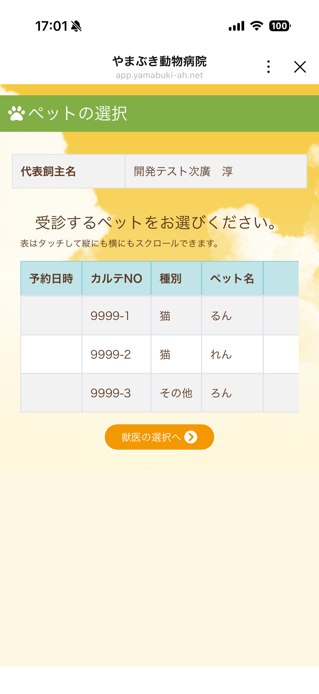
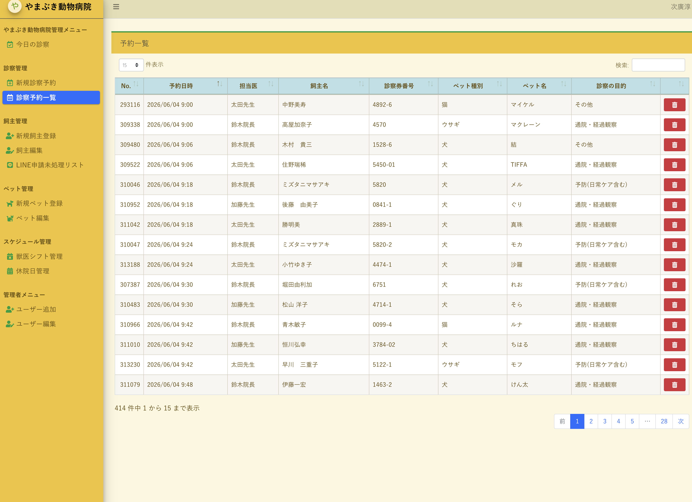
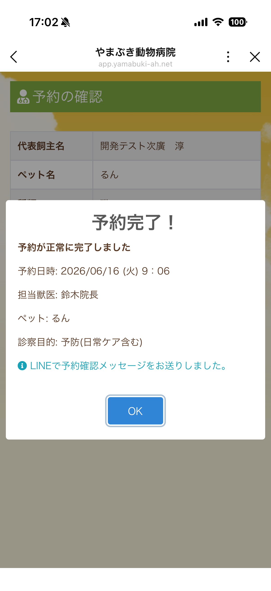
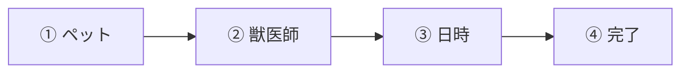
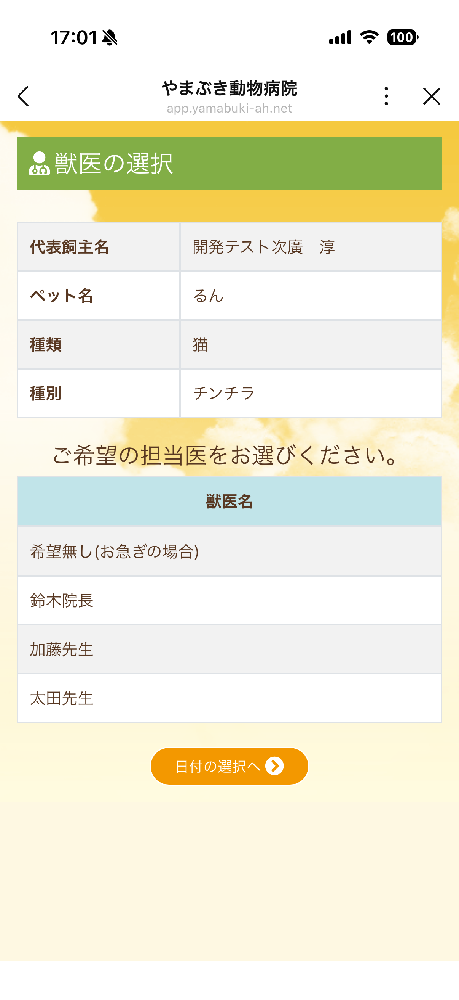
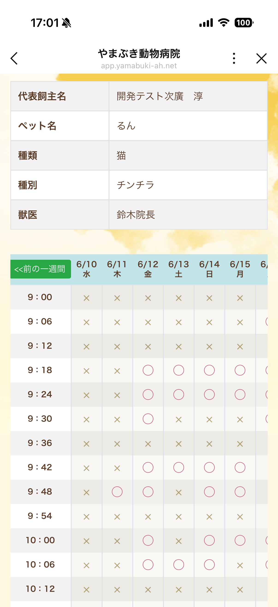
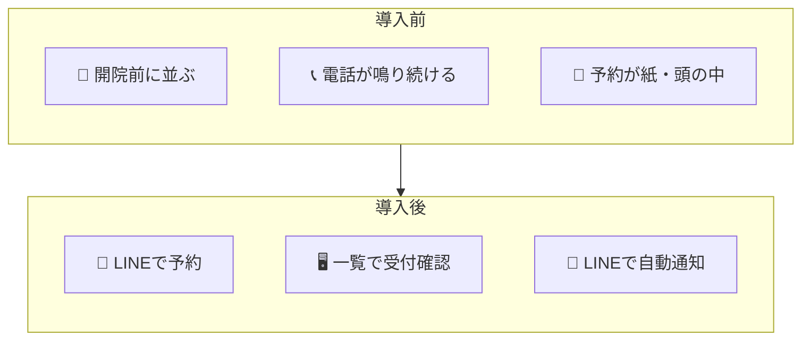

<!-- 印刷: 本文＋画像。配布者向けメモは別ページ -->

# 並びと電話を減らす。LINEで予約。

**飼い主はスマホ　／　受付は一覧　／　診療の質はそのまま**

> カルテ・診療システムはそのまま。**予約の入口** と **受付の見える化** だけ整えます。

---

## 3枚で見る — 飼い主・受付・LINE通知

| ① 飼い主（LINE） | ② 受付（管理画面） | ③ 予約完了（LINE通知） |
|:---:|:---:|:---:|
|  |  |  |
| いつもの **LINE** から ペット・獣医師・日時を選んで予約 | **予約一覧** で 担当医・飼い主・目的を一覧表示 | 予約完了と同時に **LINEで確認メッセージ** |

---

## 飼い主さまの操作 — 4ステップ

| ① ペット | ② 獣医師 | ③ 日時 | ④ 完了 |
|:---:|:---:|:---:|:---:|
|  |  |  |  |

- 空き枠は **○／×** で一目瞭然
- 予約の **変更・キャンセル** も LINE から（前日 **リマインダー** も自動送信）

---

## 導入前 → 導入後

| | 飼い主 | 受付 | 院長 |
|---|:---:|:---:|:---:|
| **前** | 並ぶ・電話 | 電話対応中心 | 混み具合が見えない |
| **後** | LINEで完結 | 一覧＋電話も同画面 | 獣医師別に見える |

---

## スタッフ向け — 診察予約一覧

- 電話予約も **同じ画面** で登録（二重管理しない）
- 担当医・診察目的・飼い主情報を **414件規模** でも検索・一覧管理
- 休診日・獣医師シフトを空き枠に反映

---

## 導入実績（愛知・名古屋）

| | |
|---|---|
| **規模** | 獣医師 **3名** |
| **課題** | 午前午後の並び／電話予約の負担 |
| **内容** | LINE予約 ＋ 管理画面 ＋ 自動リマインド |
| **運用** | **約5年**・他院推奨の意向あり |

> **院長コメント** — 許可後に掲載（調整中）

**向いている病院:** 獣医2〜3名以上・午前午後とも混む・LINEに馴染みがある

---

## 次のステップ

| 1 | 2 | 3 | 4 |
|:-:|:-:|:-:|:-:|
| 山本へ 興味の有無 | 概要説明 （オンライン可） | 画面デモ （藤枝・対面可） | 見積り |

---

## お問い合わせ

**配布・ご相談**  
山本　葉子（出光クレジット）／静岡県獣医師会 賛助会員  
TEL 070-4148-1049 ／ yoko.yamamoto.6200@idemitsu.com

**システム・デモ**  
次廣　淳（次廣／tugilo）— 山本経由または BNI DragonFly 経由

**開発** 静岡県藤枝市｜SE **26年**｜現場の手間を減らす設計

---

---

# 配布者向けメモ（非印刷）

## 30秒台本

> 「名古屋の動物病院さんで **LINE予約** を5年使っていて、並びと電話がかなり楽になった事例があります。カルテは変えず **予約の入口だけ** です。このチラシ、よろしければ。興味があれば次廣さんにつなぎます。」

## つなぎ

- 並び → 「午前午後、並ばれて待つ方、多いですよね」
- 電話 → 「電話予約、負担になっていませんか」
- 渡す → 「実際の画面のスクショ付きです。LINEでこう予約できます」

## 素材ファイル（2026-06-03 取得済み）

| ファイル | 内容 |
|----------|------|
| `01_liff_select_pet.png` | ペット選択 |
| `02_liff_select_doctor.png` | 獣医師選択 |
| `03_liff_select_date.png` | 日時選択（週カレンダー） |
| `04_liff_confirm_line.png` | 予約完了＋LINE通知 |
| `05_admin_reserve_list.png` | 管理画面・予約一覧 |

---

**改版履歴**

| 日付（JST） | 内容 |
|-------------|------|
| 2026-06-03 17:05 | v4。yamabuki 実画面キャプチャ5枚を `images/01〜05` に整理・チラシ参照を接続。4ステップに獣医師選択を反映 |
| 2026-06-03 16:45 | v3。ビジュアル中心に再構成 |
| 2026-06-03 16:32 | v2。やまぶき機能反映 |
| 2026-06-03 | v1 初版 |
