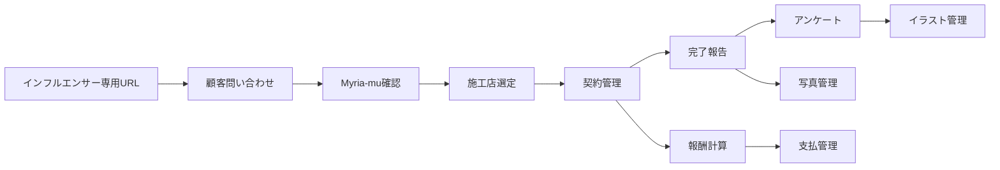

# Myria-mu 外構紹介管理システム 初期導入版提案書

**作成:** 2026-06-14 22:02 JST  
**更新:** 2026-06-14 22:15 JST  
**対象:** 株式会社Myria-mu  
**位置づけ:** 初回提案・概算提示用  
**対象サービス:** YUINIWA（ユイニワ）  
**参考:** [YUINIWA公式サイト](https://yui-niwa.jp/)  
**根拠:** [Myria-mu 外構紹介管理プラットフォーム 要件定義書](../requirements/myria_mu_exterior_referral_system_requirements.md)  
**関連:** [将来構想版提案書](myria_mu_exterior_referral_system_proposal.md)

---

## 1. 提案の要旨

YUINIWA（ユイニワ）は、株式会社Myria-mu様が展開する外構紹介サービスです。Myria-mu様の現在の課題は、YUINIWAの外構工事紹介に関する情報がスプレッドシートや個別連絡に分散していることです。

特に、以下の管理が今後の案件増加に伴って負担になりやすい状態です。

- インフルエンサーごとの流入元管理
- 顧客問い合わせ管理
- 施工店への送客管理
- 契約金額・契約書PDFの管理
- 工事完了報告・完成写真の回収
- 顧客アンケートとイラスト制作状況の管理
- インフルエンサー報酬計算
- 支払予定・支払済の確認

本提案では、まず現在の困りごとを解決するため、**160〜180万円程度の初期導入プラン** として、問い合わせから契約・完了報告・アンケート・写真・イラスト管理・報酬管理までを一つの流れで管理できる状態を目指します。

本提案は、将来的なプラットフォーム構想を見据えつつも、まずは現在の業務課題を解決するための初期導入範囲に絞った提案です。

---

## 2. 提案の視点

今回の提案で一番大事にしたいのは、最初から大きなプラットフォーム構想を売ることではありません。

まずは、西浦さんが今困っている管理を楽にし、「これ欲しかった」と思ってもらえる状態を作ることです。

そのため、本提案では将来的な広がりは持たせつつも、初期導入では以下に絞ります。

- 顧客・施工店・インフルエンサー・案件を一つの流れで見えるようにする
- 施工店への送客、契約、完了報告、写真、アンケートを案件単位で管理する
- インフルエンサー報酬を自動計算し、支払状況を確認できるようにする
- イラスト制作状況まで含め、Myria-mu様の実際の業務フローが途中で切れないようにする

将来的には施工店評価、施工事例集、ランキング、LINE連携なども広げられますが、初回提案ではそこを前面に出しすぎず、まず160〜180万円程度で今の業務課題を解決することを優先します。

---

## 3. 初期導入で解決すること

初期導入では、将来構想をすべて作り込むのではなく、まず日々の運営で必要な管理を一つにまとめます。

初期導入の目的は、Myria-mu様が「誰から問い合わせが入り、どの施工店へ送り、契約し、工事完了後にどこまで対応し、報酬がいくら発生しているか」を確認できる状態にすることです。

---

## 4. 本提案の対象利用者

本システムは以下の3者が利用するWebシステムとして構築します。

- Myria-mu担当者
- 施工店
- インフルエンサー

顧客はログインを行わず、以下のフォームのみ利用します。

- 問い合わせフォーム
- アンケートフォーム

つまり本提案は、Myria-mu担当者向けの管理画面、施工店向けの案件確認・報告画面、インフルエンサー向けの成果確認画面を含む初期導入プランです。

---

## 5. 初期導入プラン

### 5.1 初期導入プラン 160〜180万円程度

現在の業務フローに必要な中核機能に絞った初期導入プランです。

Myria-mu様が話していた、工事完了後のアンケート、写真回収、イラスト制作、顧客へのプレゼントまでを一連の管理対象に含めます。

主な対象:

- 顧客管理
- 施工店管理
- インフルエンサー管理
- インフルエンサー専用URL発行
- 顧客問い合わせ管理
- 施工店候補の確認
- 案件管理
- 案件履歴管理
- 施工店ログイン
- 施工店の担当案件確認
- 施工店による契約登録
- 契約書PDF管理
- 施工店による完了報告
- 完成写真管理
- 顧客アンケート
- NPS相当項目
- イラスト制作ステータス管理
- インフルエンサーログイン
- インフルエンサーの成果確認
- インフルエンサーの報酬確認
- 報酬計算
- 支払予定・支払済管理

---

## 6. 利用者別にできること

### 6.1 Myria-mu担当者

- 顧客問い合わせを確認できる
- 流入元インフルエンサーを確認できる
- 顧客住所から施工店候補を確認できる
- 施工店を手動で選定できる
- 案件ステータスを確認・更新できる
- 契約金額、契約書PDF、支払予定日を確認できる
- 完了報告、完成写真、アンケート回答を確認できる
- イラスト制作ステータスを確認・更新できる
- インフルエンサー報酬額と支払状況を確認できる

### 6.2 施工店

- 自社に送客された案件を確認できる
- 契約日、契約金額、契約書PDFを登録できる
- 工事完了日、報告内容、完成写真を登録できる
- 自社担当案件のみ閲覧・更新できる

### 6.3 インフルエンサー

- 自身の問い合わせ件数を確認できる
- 自身の契約件数を確認できる
- 自身に紐付く契約金額を確認できる
- 報酬額と支払状況を確認できる

---

## 7. 機能一覧

| 機能 | 初期導入プラン 160〜180万円程度 |
|------|------------------------|
| インフルエンサー管理 | ○ |
| 専用URL発行 | ○ |
| 顧客問い合わせ管理 | ○ |
| 施工店管理 | ○ |
| 施工店候補表示 | ○ |
| 案件管理 | ○ |
| 案件履歴 | ○ |
| 契約管理 | ○ |
| 契約書PDF管理 | ○ |
| 完了報告 | ○ |
| 顧客アンケート | ○ |
| NPS相当項目 | ○ |
| 複数完成写真管理 | ○ |
| イラスト制作ステータス | ○ |
| 報酬計算 | ○ |
| 支払予定・支払済管理 | ○ |
| 施工店ログイン | ○ |
| 施工店による契約登録 | ○ |
| 施工店による完了報告 | ○ |
| インフルエンサーログイン | ○ |
| インフルエンサー成果確認 | ○ |

---

## 8. 160〜180万円程度に含めない範囲

160〜180万円程度の初期導入プランでは、現在の管理課題を解決することを優先し、以下は初期範囲に含めない。

- LINE通知
- 公式LINE通知
- LINEログイン
- 施工店評価画面
- ランキング
- 施工事例ページ
- 高度なダッシュボード
- デザイン作り込み
- 自動リマインド
- 複雑な分析
- 会計ソフト連携
- GoogleMap距離計算
- スマホアプリ

上記が必要になった場合は、初期導入後の運用状況を確認したうえで、追加開発として別途見積とする。

CSV出力については、インフルエンサー一覧、案件一覧、報酬一覧など、必要な一覧に対する簡易出力であれば初期導入時に対応可否を確認する。複雑な集計・整形・帳票出力は別途見積とする。

---

## 9. 将来拡張

初期導入では、現在の管理負担を減らすことを優先します。

一方で、将来的には以下のような発展が可能です。これらは初期導入の範囲には含めず、必要性が見えた段階で別途見積とします。

- 施工店評価
- 施工事例集
- ランキング
- LINE連携
- 公式LINE通知
- 顧客満足分析
- SNS投稿素材管理
- インフルエンサーランキング
- 売上分析ダッシュボード
- 施工店紹介ページ

将来構想については、別紙の [将来構想版提案書](myria_mu_exterior_referral_system_proposal.md) に整理しています。

---

## 10. 進め方

商談時は、以下の流れで確認する。

1. 現在の管理課題を確認する
2. 160〜180万円程度の初期導入プラン範囲で進める前提を確認する
3. 契約書管理・完了報告・アンケート運用フローを確認する
4. 支払予定日の運用方法を確認する
5. 将来拡張は別途見積とする前提を確認する
6. 初期範囲を確定し、詳細見積へ進む

---

## 11. まとめ

Myria-mu様の最初の導入では、壮大なプラットフォーム構想を一気に作るよりも、まず現在の管理負担を減らし、問い合わせから契約・完了報告・アンケート・写真・イラスト管理・報酬までを見える化することが重要です。

初回提案では、**160〜180万円程度の初期導入プラン** を本命として提示する方針が適切です。

将来的な施工店評価、施工事例集、ランキング、LINE連携などは、運用開始後に必要性が見えた段階で追加提案します。
