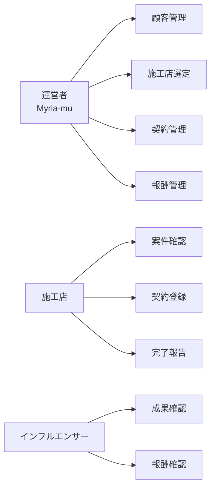
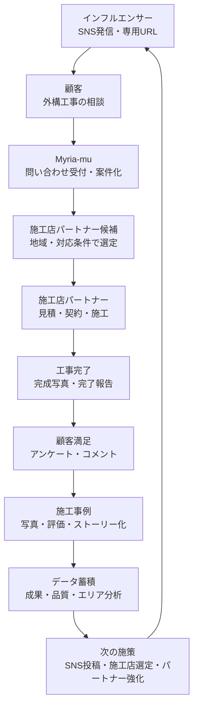
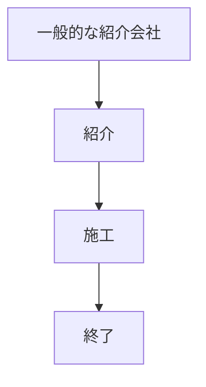
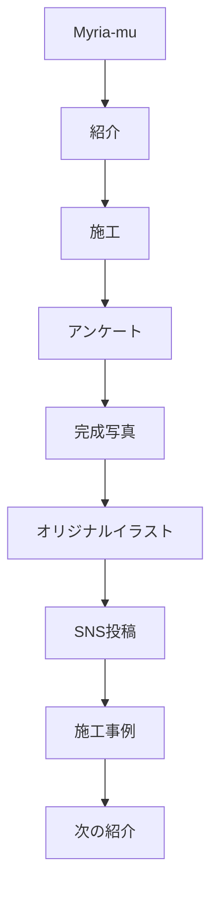
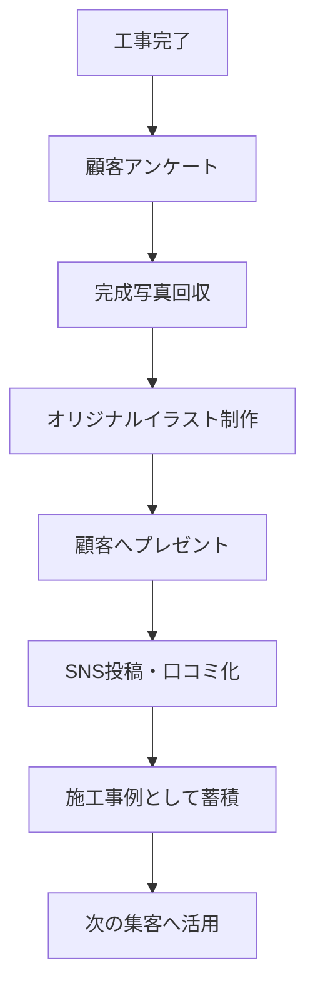

# Myria-mu 外構紹介プラットフォーム構築提案

**サブタイトル:** インフルエンサー・施工店・顧客をつなぐ外構紹介ネットワークの構築  
**作成:** 2026-06-14 21:30 JST  
**対象:** 株式会社Myria-mu  
**位置づけ:** 要件定義書を元にした提案書素案  
**根拠:** [Myria-mu 外構工事紹介・施工店送客・インフルエンサー報酬管理システム 要件定義書](../requirements/myria_mu_exterior_referral_system_requirements.md)

---

## 1. 提案の要旨

Myria-mu様が本当に構築すべきものは、単なる顧客管理システムではありません。

インフルエンサーが見込み顧客を生み、Myria-mu様が最適な施工店へつなぎ、施工店が外構工事を実施し、顧客満足と施工事例が次の集客につながる **外構紹介プラットフォーム** です。

本提案では、Myria-mu様独自の紹介ネットワークを育てるための成長基盤として、以下を実現します。

- インフルエンサーを活用した集客基盤を強化する
- 施工店を単なる送客先ではなく、地域パートナーとして資産化する
- 顧客満足度、完成写真、施工事例を営業資産として蓄積する
- 契約金額と報酬を正確に扱い、成果パートナーとの信頼関係を築く
- 将来的なLINE通知、施工店評価、ランキング、分析、施工事例活用へ拡張できる基盤を作る

初期構築の150万円〜180万円は、単なるシステム開発費ではなく、Myria-mu様が外構紹介ビジネスを拡大するための **外構紹介プラットフォーム基盤構築費** と位置づけます。

本提案は、Myria-mu様の外構紹介事業を成長させるためのプラットフォーム基盤構築として、**概算150万円〜180万円** を想定しています。

---

## 2. 提案の視点

本提案の中心は「管理を楽にすること」ではありません。

もちろん、問い合わせ、施工店送客、契約、完了報告、報酬計算を整理することで、日々の運営負荷は下がります。しかし、それは目的ではなく結果です。

本質的な目的は、Myria-mu様が持つSNS集客力を、外構工事の契約、施工、顧客満足、次の紹介へつなげることです。

つまり、目指すべき姿は以下です。

| 従来の見方 | 本提案での見方 |
|------------|----------------|
| 顧客管理システム | 外構紹介プラットフォーム |
| 施工店への送客 | 地域パートナーへの案件接続 |
| インフルエンサー報酬管理 | 成果パートナーとの長期関係構築 |
| 完了報告 | 顧客満足・施工事例・営業資産の蓄積 |
| スプレッドシート代替 | 紹介ネットワークを成長させる基盤 |

システムは、事業を管理するための道具ではなく、紹介ネットワークを拡大し、データを活用し、将来の成長判断を支えるための土台です。

---

## 3. Phase1で実現できること

Phase1では、外構紹介プラットフォームの基盤として、Myria-mu様、施工店、インフルエンサーがそれぞれ必要な情報を確認・登録できる状態を作ります。

概算150万円〜180万円で目指すのは、すべての将来機能を作り込むことではありません。まずは、紹介から契約・完了・報酬までの中核業務を一つの流れとして使える状態にすることです。

### 3.1 運営者が使えること

- 顧客問い合わせを確認できる
- 流入元インフルエンサーを確認できる
- 顧客住所から施工店候補を確認できる
- 施工店を手動で選定できる
- 案件ステータスを確認・更新できる
- 契約金額、契約書PDF、支払予定日を確認できる
- インフルエンサー報酬額と支払状況を確認できる

### 3.2 施工店が使えること

- 自社に送客された案件を確認できる
- 契約日、契約金額、契約書PDFを登録できる
- 工事完了日、報告内容、完成写真を登録できる
- 自社担当案件のみ閲覧・更新できる

### 3.3 インフルエンサーが使えること

- 自身の問い合わせ件数を確認できる
- 自身の契約件数を確認できる
- 自身に紐付く契約金額を確認できる
- 報酬額と支払状況を確認できる

Phase1の時点で、Myria-mu様は「誰から問い合わせが来て、どの施工店へつなぎ、契約し、報酬がいくら発生しているか」を一つの流れで確認できるようになります。

---

## 4. Myria-mu様が実現したい未来

Myria-mu様の強みは、インフルエンサーによるSNS集客を外構工事の相談につなげられることです。

この強みを一過性の問い合わせで終わらせず、継続的に育つ紹介ネットワークに変えることで、Myria-mu様は「外構工事を直接施工する会社」ではなく、**顧客・施工店・インフルエンサーをつなぐ外構紹介プラットフォーム運営者** として成長できます。

目指す未来像は、次の循環です。

この循環が回り始めると、問い合わせは単発の案件ではなくなります。

顧客の声、完成写真、施工店の対応品質、インフルエンサーの成果が積み上がり、次の集客、次の送客、次の契約につながる営業資産になります。

---

## 5. Myria-mu独自の強み

Myria-mu様の提案で最も差別化できる点は、紹介して終わりではなく、施工後の顧客体験まで含めて次の集客へつなげられることです。

一般的な紹介会社では、顧客を施工店へ紹介し、契約や施工が終わると関係が途切れやすくなります。

一方、Myria-mu様では、施工後の顧客満足、完成写真、オリジナルイラスト、SNS投稿、施工事例活用までを一連の流れとして扱うことができます。

この違いにより、Myria-mu様は単なる紹介会社ではなく、顧客満足と施工事例を蓄積しながら紹介ネットワークを育てるプラットフォームとして展開できます。

完成写真とイラストは、顧客にとっては記念になり、インフルエンサーにとっては投稿しやすい素材になり、Myria-mu様にとっては次の問い合わせにつながる営業資産になります。

---

## 6. 現在の課題

現在の課題は、手作業が多いことだけではありません。

より大きな課題は、外構紹介ビジネスを成長させるための情報が、将来使える形で蓄積されていないことです。

### 6.1 紹介ネットワークの全体像が見えにくい

インフルエンサー、顧客、施工店、契約、施工、顧客満足がそれぞれ別々に管理されると、どの紹介がどの契約につながり、どの施工店がどの顧客満足を生んだのかが追いにくくなります。

外構紹介プラットフォームとして成長するには、この一連の流れを案件単位でつなげて見えるようにする必要があります。

### 6.2 インフルエンサーの成果が見えにくい

インフルエンサーは、単なる流入元ではありません。Myria-mu様にとって、見込み顧客との接点を生み出す成果パートナーです。

問い合わせ件数、契約件数、契約金額、報酬額が見えることで、どのインフルエンサーと長期的に関係を深めるべきか、どの発信が外構工事相談につながりやすいかを判断できます。

### 6.3 施工店をパートナーとして育てにくい

施工店を「送客先」として扱うだけでは、Myria-mu様のネットワーク価値は高まりません。

地域パートナーとして、対応エリア、対応品質、契約率、顧客満足度を蓄積することで、将来的に「どの地域で、どの施工店に、どの案件をつなぐべきか」を判断できるようになります。

### 6.4 顧客満足と施工事例が次の集客に活かしきれていない

外構工事は、完成後の見た目や顧客の満足が次の集客に直結しやすい領域です。

完成写真、顧客アンケート、コメント、施工ストーリーを案件に紐付けて残すことで、SNS投稿、施工事例集、営業資料、施工店紹介ページに活用できます。

### 6.5 将来の分析に必要なデータが分断される

スプレッドシートや個別ファイルでは、当面の管理はできても、将来的なデータ活用には限界があります。

インフルエンサー別成果、エリア別問い合わせ、施工店別契約率、顧客満足度、報酬額、支払状況がつながっていなければ、次の投資判断やパートナー戦略に使いにくくなります。

---

## 7. 外構紹介プラットフォームとしての全体像

本提案で構築する基盤は、以下の関係者をつなぐプラットフォームです。

### 7.1 インフルエンサー

SNSで外構工事に関心のある見込み顧客を生み出す成果パートナーです。

専用URLからの問い合わせを自動で紐付けることで、インフルエンサーごとの成果を可視化できます。

可視化する主な指標:

- 問い合わせ件数
- 契約件数
- 契約金額
- 報酬額
- 支払予定
- 支払済状況

これにより、インフルエンサーは「自分の発信がどの成果につながったか」を確認できます。Myria-mu様も、成果が出ているパートナーとの関係を強化し、キャンペーンや投稿依頼を検討しやすくなります。

### 7.2 顧客

外構工事を検討している相談者です。

顧客は専用URLから問い合わせ、Myria-mu様を通じて対応可能な施工店パートナーにつながります。工事完了後はアンケートやコメントを通じて、顧客満足度データとしてプラットフォームに貢献します。

### 7.3 Myria-mu

紹介ネットワークの中心です。

Myria-mu様は、インフルエンサーから生まれた問い合わせを案件化し、顧客住所や条件に応じて施工店パートナーを選定し、契約・施工・完了・顧客満足までを見届けます。

この役割は、単なる仲介ではありません。顧客と施工店とインフルエンサーの間に入り、信頼できる外構紹介ネットワークを育てるプラットフォーム運営です。

### 7.4 施工店パートナー

施工店は、単なる送客先ではなく、地域パートナーです。

将来的には以下を評価・蓄積できる設計にします。

- 対応エリア
- 見積対応の速さ
- 契約率
- 工事完了報告の丁寧さ
- 顧客満足度
- 完成写真の品質
- 高単価案件への対応実績

この情報が蓄積されることで、Myria-mu様は「どの施工店に送るか」を属人的な判断だけでなく、実績と品質に基づいて判断できるようになります。

---

## 8. 西浦さんの要望を超える提案

西浦さんの当初要望は、顧客管理、施工店送客、契約管理、完了報告、インフルエンサー報酬計算を一元化することでした。

本提案では、その要望を満たしたうえで、Myria-mu様独自の外構紹介プラットフォームとして次の価値を追加します。

### 8.1 成果パートナーとしてのインフルエンサー育成

インフルエンサーを報酬管理対象として扱うだけではなく、成果パートナーとして位置づけます。

問い合わせ件数、契約件数、契約金額、報酬額を可視化することで、インフルエンサー自身が成果を確認でき、Myria-mu様との長期的な関係を築きやすくなります。

成果が見えることで、インフルエンサー側には「継続して紹介したい」という納得感が生まれます。Myria-mu様側には、どのパートナーと強く組むべきかを判断する材料が残ります。

### 8.2 地域パートナーとしての施工店ネットワーク化

施工店は、案件を送る先ではなく、Myria-mu様の価値を顧客に届ける地域パートナーです。

対応品質、契約率、顧客満足度を将来的に評価できる設計にすることで、施工店ネットワークそのものがMyria-mu様の資産になります。

### 8.3 顧客満足を次の集客へつなげる

工事完了後の顧客満足度アンケートは、単なる確認ではありません。

顧客の声は、次の見込み顧客に安心感を与える営業資産です。完成写真と一緒に蓄積することで、施工事例、SNS投稿、営業資料へ展開できます。

### 8.4 完成写真からオリジナルイラストへ

Myria-mu様独自の差別化として、完成写真と顧客アンケートを起点に、オリジナルイラスト制作・プレゼント施策へつなげることを提案します。

流れは以下です。

外構工事は、完成後の見た目や暮らしの変化が伝わりやすい商材です。完成写真をただ保管するのではなく、顧客が喜ぶプレゼント、SNSで紹介しやすいコンテンツ、次の営業資料として活用することで、Myria-mu様独自の紹介体験を作ることができます。

### 8.5 データ活用による将来の経営判断

初期段階では高度な分析機能を作り込みすぎる必要はありません。

ただし、将来分析できる形でデータを蓄積することが重要です。

将来的には以下を判断できるようになります。

- どのインフルエンサーが契約につながる顧客を連れてきているか
- どのSNS施策が問い合わせに結びついているか
- どのエリアで外構工事相談が多いか
- どの施工店の契約率が高いか
- どの施工店の顧客満足度が高いか
- どの施工事例が次の問い合わせにつながっているか

---

## 9. 顧客満足度を起点にした差別化

顧客満足度アンケートは、単なるアンケート管理ではありません。

Myria-mu様の外構紹介プラットフォームにおいて、顧客満足は次の紹介を生み出す重要な資産です。

### 9.1 工事完了後の体験を設計する

一般的な工事紹介では、工事完了後に関係が終わりがちです。

しかしMyria-mu様では、工事完了後に顧客アンケート、完成写真回収、オリジナルイラスト制作、顧客へのプレゼント、SNS投稿・施工事例化までを一連の体験として設計できます。

これにより、顧客は「工事を紹介してもらった」だけでなく、「完成後まで大切に扱ってもらえた」と感じやすくなります。

### 9.2 顧客の声を営業資産に変える

顧客アンケートでは、満足度、コメント、施工店対応、工事後の感想を取得します。

この情報を案件、施工店、完成写真と紐付けることで、将来的に以下へ活用できます。

- SNS投稿
- 施工事例ページ
- インフルエンサー投稿素材
- 施工店紹介ページ
- 営業資料
- 顧客向け信頼材料

### 9.3 Myria-mu独自の世界観を作る

オリジナルイラストのプレゼントは、単なるノベルティではありません。

完成した外構を顧客の思い出として残し、Myria-mu様らしい体験価値を作る施策です。SNSに投稿されやすく、インフルエンサーの発信とも相性がよく、次の集客につながる可能性があります。

---

## 10. 施工事例資産化

新しい章として、施工事例資産化を提案します。

完成写真と顧客評価を案件に紐付けて管理することで、外構工事の成果を将来の営業資産として蓄積できます。

### 10.1 施工事例はプラットフォームの資産

外構工事では、完成後の写真や顧客の声が強い説得力を持ちます。

「どの地域で、どのような外構工事を、どの施工店が担当し、顧客がどう評価したか」を残すことで、Myria-mu様独自の施工事例データベースが育ちます。

### 10.2 将来的な活用先

蓄積した施工事例は、将来的に以下へ活用できます。

- 施工事例集
- SNS投稿素材
- 施工店紹介ページ
- インフルエンサー投稿素材
- 顧客向け営業資料
- 地域別の施工事例ページ
- 高評価施工店の紹介コンテンツ

### 10.3 管理ツールではなく営業資産の蓄積基盤

この仕組みの価値は、情報を保管することではありません。

完成写真、顧客評価、施工店情報、契約情報を紐付けることで、次の顧客に見せられる信頼材料を増やすことです。

つまり本システムは、管理ツールではなく、Myria-mu様の営業資産を蓄積する基盤です。

---

## 11. なぜスプレッドシートではなく専用システムなのか

スプレッドシートは、管理台帳としては非常に便利です。

問い合わせ一覧、施工店一覧、報酬一覧のように、単独の情報を整理するだけであれば、スプレッドシートでも一定の運用は可能です。

しかし、Myria-mu様が目指す外構紹介プラットフォームでは、扱う情報が複雑に紐付きます。

関係する情報:

- インフルエンサー
- 顧客
- 施工店パートナー
- 案件
- 契約
- 完了報告
- 完成写真
- アンケート
- 報酬
- 支払状況
- 施工事例

これらは別々の表ではなく、一つの紹介ネットワークとしてつながる必要があります。

### 11.1 スプレッドシートで起きやすい限界

スプレッドシートでは、情報が増えるほど以下の問題が起きやすくなります。

- 顧客と案件、案件と施工店、案件と報酬の紐付けが崩れやすい
- 契約書PDFや完成写真などのファイル管理が分散しやすい
- インフルエンサー別成果や施工店別評価を集計しにくい
- 顧客満足度と施工事例を後から活用しにくい
- 権限を分けて、施工店やインフルエンサーに必要な情報だけ見せにくい
- 案件数が増えるほど、確認作業と転記作業が増える

### 11.2 P-LINK型の専用システムが向いている理由

今回必要なのは、単なる一覧表ではなく、紹介元、顧客、施工店、契約、施工、満足度、報酬がつながるP-LINK型の専用システムです。

専用システム化することで、以下が実現しやすくなります。

- 専用URLで流入元を自動判定できる
- 顧客と案件を自動で紐付けられる
- 施工店候補を住所情報から表示できる
- 契約金額から報酬を自動計算できる
- 完了報告、完成写真、アンケートを案件に紐付けられる
- 施工店やインフルエンサーごとに見える情報を分けられる
- 将来的にLINE通知、分析、ランキング、施工事例ページへ拡張できる

将来の成長を考えると、最初から外構紹介プラットフォームとして設計する方が、スプレッドシートを後から無理に拡張するよりも長期的な拡張性が高くなります。

---

## 12. 初期構築で実現する範囲

初期構築では、外構紹介プラットフォームの中核となる流れを作ります。

目的は、すべての理想機能を最初から入れることではありません。まず、紹介ネットワークを成長させるために必要な基礎データを正しく蓄積できる状態を作ることです。

初期構築の中心:

- インフルエンサーごとの専用URL発行
- 顧客問い合わせフォーム
- 流入元インフルエンサーの自動記録
- 顧客と案件の紐付け
- 施工店パートナー情報の整理
- 顧客住所に基づく施工店候補表示
- Myria-mu様による施工店選定
- 案件ステータスの可視化
- 契約金額と契約書PDFの案件紐付け
- 完了日、完成写真、報告内容の案件紐付け
- 顧客満足度アンケート
- インフルエンサー報酬の自動計算
- 支払予定・支払済の確認
- インフルエンサー向けマイページ
- 施工店パートナー向け案件確認
- メール通知

初期段階では、公式LINE通知、電子契約、Googleマップ高度連携、売上分析ダッシュボード、ランキング表示は将来拡張として扱います。

---

## 13. 段階導入イメージ

### Phase 1: 外構紹介プラットフォーム基盤の構築

150万円〜180万円の基盤構築費では、紹介ネットワークの土台を作ります。

主な成果:

- インフルエンサー、顧客、施工店、案件、契約、報酬がつながる
- 問い合わせから施工完了までの流れが見える
- 報酬額と支払状況が明確になる
- 完成写真と顧客満足度が案件に残る
- 将来の施工事例活用や分析に必要なデータが蓄積される

### Phase 2: 顧客体験と通知の強化

初期運用で流れが固まった後、顧客体験と関係者への通知を強化します。

候補:

- 公式LINE通知
- 完了報告リマインド
- 顧客アンケート依頼の自動化
- オリジナルイラスト制作フローの連携
- SNS投稿許諾の取得

### Phase 3: パートナー評価と営業資産活用

案件数が増えた段階で、プラットフォームとしての価値を高めます。

候補:

- インフルエンサー別成果ランキング
- 施工店別契約率・顧客満足度
- 地域別問い合わせ分析
- 施工事例集
- 施工店紹介ページ
- SNS投稿素材管理
- 売上分析ダッシュボード

---

## 14. 150万円〜180万円の位置づけ

150万円〜180万円は、単なるシステム開発費ではありません。

Myria-mu様の外構紹介ビジネスを拡大するための **外構紹介プラットフォーム基盤構築費** です。

この初期投資で作るべきものは、見た目の機能数ではなく、次の成長に耐える土台です。

- 紹介ネットワークの関係性を正しく持てること
- インフルエンサー成果を記録できること
- 施工店パートナーの実績を蓄積できること
- 契約・完了・報酬の流れを正確に扱えること
- 顧客満足と施工事例を将来の営業資産にできること
- LINE通知、分析、ランキング、施工事例公開へ拡張できること

初期費用を単なる業務効率化費用として見ると、費用対効果は確認作業の削減に限定されます。

しかし、外構紹介プラットフォームの基盤構築費として見ると、今後のインフルエンサー施策、施工店パートナー拡大、施工事例活用、顧客満足度向上、データ活用に広がる投資になります。

---

## 15. 期待できる効果

### 15.1 Myria-mu独自の紹介ネットワークが育つ

インフルエンサー、顧客、施工店パートナー、契約、施工、顧客満足が一つの流れでつながり、外構紹介プラットフォームとしての土台ができます。

### 15.2 成果パートナーとの関係が強くなる

インフルエンサーごとに問い合わせ件数、契約件数、契約金額、報酬額が見えるため、成果に応じた関係構築がしやすくなります。

### 15.3 施工店パートナーの品質が見える

地域、契約率、対応品質、顧客満足度を将来的に蓄積できるため、Myria-mu様の施工店ネットワークが事業資産になります。

### 15.4 顧客満足が次の集客につながる

アンケート、完成写真、オリジナルイラスト、施工事例活用の流れにより、顧客満足を次のSNS投稿や営業資料へ転換できます。

### 15.5 データ活用で拡張判断がしやすくなる

どのインフルエンサー、どのエリア、どの施工店、どの施工事例が成果につながっているかを将来的に把握できるため、広告・SNS・施工店開拓・報酬設計の判断材料になります。

---

## 16. 提案範囲とスコープ外

初期提案範囲は、要件定義書の「概算見積対象範囲」に準じます。

初期範囲:

- インフルエンサー専用URL
- 問い合わせ受付
- 流入元自動記録
- 顧客・案件の紐付け
- 施工店パートナー情報
- 対応エリアによる施工店候補表示
- Myria-mu様による施工店選定
- 契約情報・契約書PDFの案件紐付け
- 完了報告・完成写真の案件紐付け
- 顧客満足度アンケート
- インフルエンサー報酬計算
- 支払予定・支払済確認
- インフルエンサー向け成果確認
- 施工店パートナー向け案件確認
- メール通知

初期スコープ外:

- 施工店への完全自動送客
- 公式LINE通知の本格自動化
- LINEログイン
- 電子契約連携
- GoogleマップAPIによる高度な距離計算
- 会計ソフト連携
- 高度な売上分析ダッシュボード
- ランキング表示
- 施工事例公開ページの本格構築
- スマートフォンアプリ開発

---

## 17. まとめ

今回提案するものは、顧客管理システムではありません。

Myria-mu様が持つインフルエンサー集客力を、顧客、施工店パートナー、契約、施工、顧客満足、施工事例、次の集客へつなげる **外構紹介プラットフォーム** です。

初期構築では、紹介ネットワークの基礎となるデータを正しく蓄積します。

その基盤ができることで、将来的にはインフルエンサー成果可視化、施工店評価、顧客満足度活用、施工事例資産化、SNS投稿素材化、地域別分析へ拡張できます。

Myria-mu様が今作るべきものは、目の前の管理を楽にするための仕組みではなく、外構紹介ビジネスを大きくするための成長基盤です。
