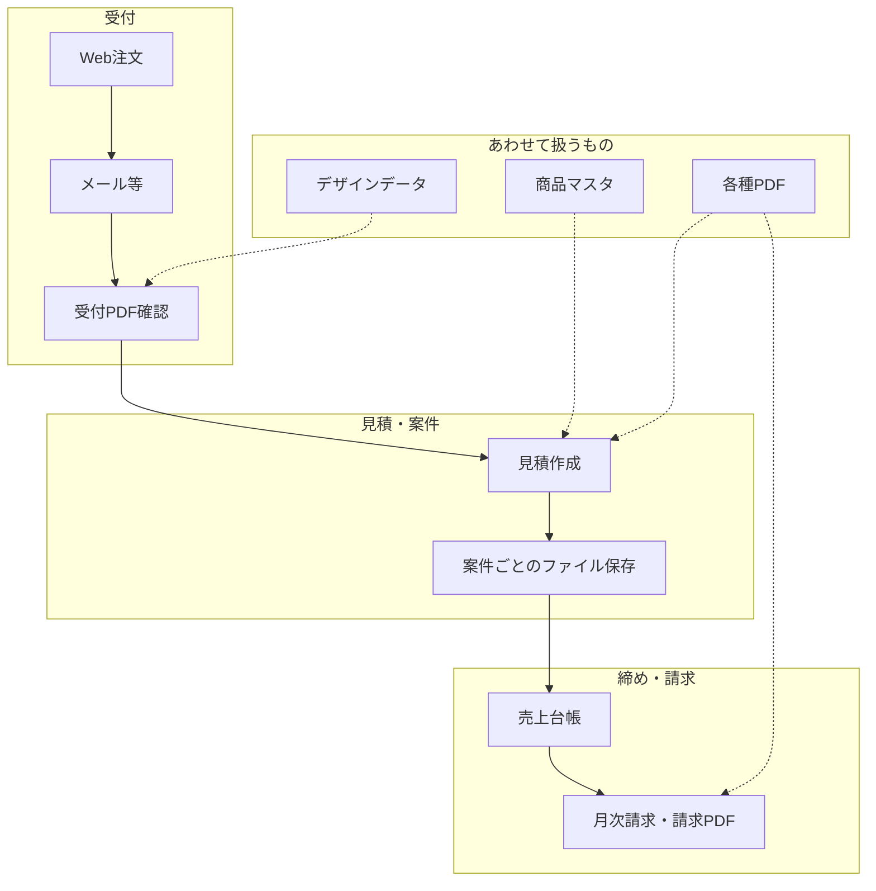

# 印刷業向け 業務改善・システム化整理資料

## 〜受注・見積・請求業務を「つながる仕組み」へ〜

**目的:** 芳賀さん・クライアント・補助金申請担当・経営者・非技術の方へ、**技術説明ではなく業務の全体像**を共有するための整理資料です。  
**位置づけ:** 要件整理・正式な提案書・補助金説明の **中間**（単体で俯瞰できる／薄すぎない／未来が見える）。  
**根拠資料（社内・プロジェクト用）:**  
[`../requirements/printing_order_management_system_requirements_final.md`](../requirements/printing_order_management_system_requirements_final.md) ほか要件・調査メモ。  
**作成:** 2026-05-12 09:25 JST

---

## 1. はじめに

いまの業務は、**かなり整理されています**。受注の入口から、見積・売上台帳・月次請求、帳票のPDF化、商品の一覧（マスタ）まで、**パソコン上の表計算ツールと、それを動かす小さなプログラム**で、長年かけて仕組み化されています。ここまで運用に乗っていること自体が、**大きな強み**です。

一方で、仕事の量が増えたり、ルールが変わったり、担当の方が入れ替わったりすると、「ファイル同士を人がつなぐ」部分の負担が目立ち始めます。  
今回お伝えしたいのは、**今の努力を否定する話ではありません**。**これまで積み上げてきたやり方を活かしつつ、次の段階として「情報が自然につながる土台」が有用になってきている**、という整理です。

---

## 2. 現在の業務について

おおざっな流れは次のとおりです（実際の運用に応じて前後します）。

```text
Web注文
  ↓
メールなどでの受付
  ↓
受付内容・PDFの確認
  ↓
見積の作成（専用の業務用ファイル）
  ↓
案件ごとにファイルを保存・管理
  ↓
売上台帳の作成（フォルダ内のファイルを集める）
  ↓
月次請求の作成・請求書PDF
```

この流れのほかに、並行して次のものが絡みます。

| もの | 役割のイメージ |
|------|----------------|
| **商品マスタ** | 品番・色・サイズ・価格など、商品の土台となる一覧（量も多い） |
| **PDF** | 見積・請求など、取引の記録として配布・保存する紙に近い形 |
| **デザインデータ** | 印刷用のデータ。フォルダやメールなどに分散しやすい |



---

## 3. 現在の良いところ

| 良い点 | 説明 |
|--------|------|
| **Web注文の入口がある** | 顧客からの依頼を、紙や電話だけに比べデジタルで受けやすい。 |
| **見積から請求まで、手順としてつながっている** | 一連の書類・集計を、業務用の仕組みとして実装できている。 |
| **PDFまで一気通貫** | 外に出す形の資料が作れることは、現場と取引の両面で重要。 |
| **商品マスタが整備されている** | 品揃え・価格の管理の下地があり、見積の再現性の根になっている。 |
| **長年の積み重ねの形跡がある** | 「とりあえずの表」ではなく、**現場に合わせて作り込んできた跡**がある。 |

**ここまで仕組み化されていること自体が素晴らしい**、というのが前提です。そのうえで、次章からは「今後ここが負担になりやすいか」を整理します。

---

## 4. 現在起きている課題

技術の話ではなく、**現場で起きやすいこと**として整理します。

| 現在起きていること | 現場で起きやすいこと |
|--------------------|----------------------|
| 同じ内容を、入力・ファイル・集計で**複数回扱う** | 時間がかかる／どちらが正か迷う |
| **ExcelやPDFを探す** | 「どれが最新か」「どの案件のどの版か」がわかりにくい |
| **商品の更新が大変** | 価格改定や品追加のたびに、一覧の反映・確認に手間がかかる |
| **集計のたびに確認作業が必要** | 件数が増えるほど、目視・突合の負荷が増えやすい |
| **特定の担当に依存しやすい** | 休み・異動・多忙時に詰まりやすい |
| **仕組みを直せる人が限られる** | ルール変更や不具合のとき、手が足りなくなる不安 |

これらは「努力が足りない」からではなく、**情報がファイルやフォルダに散らばりやすい構造**で運んできた結果として起きやすいことです。

---

## 5. このまま続けた場合のリスク

経営・管理の視点で、**先に見えやすいリスク**です（不安を煽るためではなく、優先順位を話すための整理です）。

| リスク | イメージ |
|--------|----------|
| **件数増加に伴う負荷** | 「開いて・探して・貼って」の作業が、そのまま増えやすい。 |
| **ミスが増えやすい条件** | 転記やファイル操作の回数が増えるほど、人的ミスの余地が増える。 |
| **属人化** | 「この人しか分からない動線」が残りやすい。 |
| **制度・ルール変更への対応** | 請求書の記載など、制度面の変更があったとき、仕組みの修正が追いつきにくいことがある。 |
| **商品数・メーカー数の増加** | マスタと現場確認の両方に、まとまった時間が必要になりやすい。 |
| **将来の保守への不安** | 外注で作った部分が、説明資料や引き継ぎなく残っていると、改修が難しく感じる。 |

---

## 6. 今回目指したいこと

今回のゴールは、**新しいITを導入すること自体**ではなく、次の働き方に近づけることです。

- **人を増やす前に、構造を整える** … 人手で無理に処理を増やす前に、流れを整理する。  
- **一回入力した情報が、次の作業につながる** … 同じ数字を何度も打たなくてよい状態に近づける。  
- **誰がやっても基本的な流れが回る** … 手順と権限が、画面やルールとして見える。  
- **情報を探す時間を減らす** … 案件や顧客から、関連書類や状態がたどれる。  
- **受注〜見積〜売上〜請求を、一本の流れとして見る** … 経営と現場が、同じ「いまどこ」を共有しやすくする。

---

## 7. システム化後のイメージ

### Before / After（イメージ）

| Before（いま寄り） | After（目指す姿） |
|--------------------|-------------------|
| PDFやファイルを探す | **案件からすぐ辿れる** |
| 表への転記・コピーが多い | **同じ情報を一度入力し、流用** |
| 商品の更新が手作業中心 | **一覧をまとめて更新（例：表ファイルの取り込み）** |
| 月次集計に手作業の確認が多い | **集計がシステム側で一貫** |
| 特定の担当に聞かないと不安 | **誰でも状況確認ができる** |

### 目指す流れ（イメージ）

```text
Web注文
  ↓
案件として管理（いまどこかが見える）
  ↓
見積作成・見積PDF
  ↓
売上に反映
  ↓
月次請求
  ↓
請求書PDF（制度に合わせた記載の土台）
```

---

## 8. どのように改善していくか

「課題 → やること → どう変わるか」を、短く整理します（専門用語に頼らない表現にしています）。

| 課題 | 改善の方向 | どう変わるか |
|------|------------|--------------|
| ファイルがバラバラ | **案件を中心に、情報を一か所で管理** | 履歴・書類がたどりやすい |
| 同じ内容を繰り返し入力 | **一度入れた情報を、見積・売上・請求で使い回す** | 時間短縮・ミス削減 |
| 集計に毎回の確認が必要 | **締め日・月次の単位で、集計を仕組み化** | 確認の負担が減る |
| 商品更新が重い | **商品一覧を、まとめて更新できる導線** | 改定のスピード・抜け漏れの改善 |
| 担当依存 | **手順が画面に出る・権限が分かれる** | 引き継ぎ・代理がしやすい |
| 制度に合わせた請求の不安 | **登録番号など、必要な項目をデータとして持つ** | 説明・監査に強い（項目の詳細は設計で確定） |

---

## 9. 初期段階で実施する内容

**最初から「すべてを自動に」は目指しません。**  
まずは **いまExcelやフォルダに分散している仕事の「核」** を、**つながる形**に載せ替える段階です。

初期の中心になり得る領域：

- **顧客の情報と履歴**  
- **案件の管理**（いまどの段階か）  
- **見積**（内容とPDF）  
- **売上の見える化・月次のまとまり**  
- **請求**（月次請求と請求書PDF、制度対応のための項目の土台）  
- **商品マスタ**（いまの一覧を活かしつつ、更新しやすい形へ）  
- **管理画面**（社内の作業の入口）

「全部やり切る」のではなく、**現場を止めずに、分散を解消する芯**から始める、という位置づけです。

---

## 10. 将来的にできること

以下は **初期に必ず入れる約束ではなく**、土台ができたあとに広げられる **将来の可能性** です。

| 将来の拡張 | イメージ |
|------------|----------|
| **再注文** | 過去案件を元に、同じような内容を素早く作る |
| **顧客向けポータル** | 進捗や書類の確認を、顧客側からしやすくする |
| **AIによる補助** | 資料の読み取りなどを**補助**する（最終判断は人） |
| **会計との連携** | データの受け渡しを整え、二重入力を減らす |
| **在庫の確認の補助** | 在庫が見える化できた段階で、確認フローを軽くする |
| **分析** | 売れ筋・利益の見え方を、経営判断に使いやすくする |

**AIの完全自動**・**在庫のシステムとの自動やりとり**・**完全無人化**のような話は、現場の安心と制度面を踏まえ、**あくまで段階的な展望**として扱います。

---

## 11. 補助金活用について

補助金は制度ごとに目的と対象が決まっており、**説明しやすい題材になりやすい**分野です。例えば次のような観点で整理できます。

| 観点 | 説明のイメージ |
|------|----------------|
| **受発注の電子化** | Webや画面上で、依頼から記録までが途切れにくくなる。 |
| **請求の電子化** | 請求書をデータとセットで管理しやすくなる。 |
| **インボイス（適格請求書）の対応** | 必要な記載を、仕組み側で持ちやすくする。 |
| **業務効率化** | 探す・転記・集計の時間を減らす。 |

**補助金制度は年度や申請のタイミングで条件が変わります。**  
**正式な対象・要件・率は、申請する時点の公募・窓口・専門家の確認が必要**です。本資料は説明のたたき台であり、申請書そのものではありません。

---

## 12. 今回の進め方イメージ

```text
現状整理（いまどう回っているか）
  ↓
要件整理（何を守り、何を変えるか）
  ↓
提案・概算（スコープと投資の目安）
  ↓
補助金の確認（対象・時期・書類）
  ↓
設計（画面・データ・手順の確定）
  ↓
開発（段階的にリリース）
  ↓
段階導入（現場に馴染ませながら広げる）
```

急がず、**確認しながら進める**形が現実的です。

---

## 13. まとめ

今回の取り組みは、**いまの仕組みを否定するものではありません**。これまで積み上げてきた業務の知恵を、**より安全に、わかりやすく、将来も手を入れやすい形**に整理していくものです。

言い換えると、

**「人が頑張ってつなぐ仕組み」から、「情報が自然につながる仕組み」へ**

移していく、というイメージです。現場の負担を減らし、管理しやすくし、ミスが起きにくい条件を、**構造として**そろえていきます。

---

## 参照・更新

| 資料 | 用途 |
|------|------|
| [printing_order_management_system_requirements_final.md](../requirements/printing_order_management_system_requirements_final.md) | 要件の正規版（やや詳細） |
| [printing_excel_vba_fit_gap_report.md](../requirements/printing_excel_vba_fit_gap_report.md) | 既存の業務用ファイルの調査メモ（技術寄り） |
| [printing_order_management_system_requirements.md](../requirements/printing_order_management_system_requirements.md) | 初期ドラフト |

 **改訂:** 初版 2026-05-12 09:25 JST。ヒアリングや補助金条件に応じて、本文の数字・スコープは更新してください。
