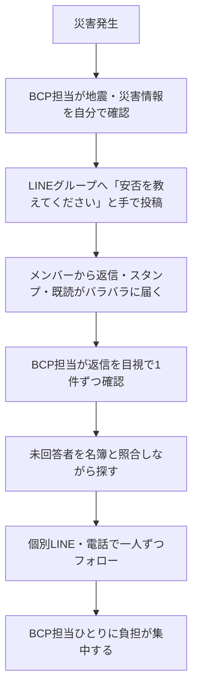
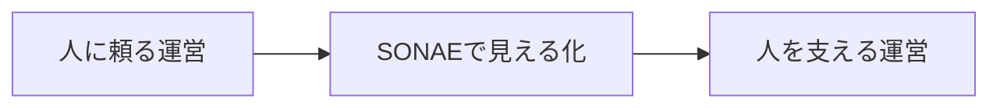
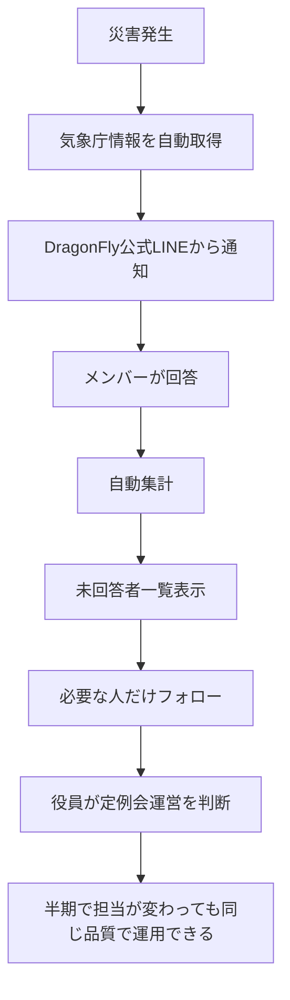
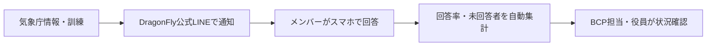

# SONAE 提案書

**作成:** 2026-06-18 18:09 JST  
**更新:** 2026-06-19 10:42 JST  
**宛先:** 飯田 香さん（BNI DragonFly / BCP担当）  
**作成:** tugilo 次廣 淳  
**対象:** BNI DragonFly チャプター  
**根拠:** [SONAE 要件定義書](../SSOT/SONAE_REQUIREMENTS.md)、[飯田香さん 第1回1to1記録](../meetings/1to1/1to1_iida_kaori_libero.md)  
**提案サービス:** SONAE  
**コンセプト:** つながる備え。

---

## 1. 表紙情報

### SONAE

**DragonFly 安否確認・災害通知システム 提案**

つながる備え。

SONAE は、DragonFly の災害時対応を、BCP担当ひとりの頑張りに頼り切る状態から、チャプター全体で同じ品質で運用できる状態へ近づけるための仕組みです。

まずは DragonFly BCP メンバーで実際に使ってもらう **共創MVP（Minimum Viable Product：必要最小限で実運用できる初期版）** として小さく始め、訓練しながら育てていく提案です。

---

## 2. いまの運用

現状の安否確認は、BCP担当の気づきと手作業に大きく依存しています。

災害が起きたとき、実際には次のような流れになりやすいです。

この運用は、担当者の責任感と行動力があるから回っています。  
ただし、災害時ほど担当者本人も落ち着いて動けるとは限りません。

---

## 3. SONAEの本質

SONAE は単なる安否確認システムではありません。

BNI 特有の属人化した運営を、少しずつ仕組みに変えていくための土台です。

BNI は半期ごとに役割が交代します。  
だから「頑張れば回る」ではなく、仕組みで同じ品質を保てる状態を目指します。

### SONAEが担当すること

- 気象庁情報の取得
- 自動発報
- LINE通知の一斉配信
- 回答の受付
- 回答の集計
- 未回答者一覧の表示
- 発報履歴の記録
- 訓練履歴の記録

### 人が集中すること

- 未回答者へのフォロー
- 支援が必要な人への声掛け
- 定例会運営の判断
- メンバーへのサポート

SONAE は、人の役割をなくすものではありません。  
人が本当に見るべきところに集中できるよう、手作業でなくてもよい部分を仕組みに任せる提案です。

---

## 4. なぜ必要か

災害時に大事なのは、「LINEを送ったかどうか」ではありません。

大事なのは、BCP担当・役員が以下の問いに答えられることです。

- 誰が無事か
- 誰がまだ未回答か
- 活動への影響はあるか
- 定例会への影響はあるか

LINEグループに投稿しただけでは、これらの問いに答えられません。

返信はバラバラに届きます。スタンプだけの人もいます。既読だけで返信がない人もいます。  
その状態から、未回答者を探し、支援が必要な人を見つけ、定例会運営を判断するのは大きな負担です。

SONAE では、通知・回答・集計・未回答者確認を1つの流れにします。

---

## 5. いま起こりやすい困りごと

現状の運用では、以下の課題が起きやすくなります。

- BCP担当の人力に頼り切っている
- 災害情報の確認が担当者の気づき頼み
- 未回答者を探すのが、毎回時間と労力を奪う
- 個別連絡の負担が担当者ひとりに集中する
- 半期で交代するため引き継ぎが難しい
- 運用ノウハウが人の中に溜まったままになる
- 人によって対応の品質が変わってしまう

これは、担当者が悪いのではありません。  
仕組みがないために、担当者の善意と頑張りに負担が寄ってしまっている状態です。

---

## 6. SONAEとは

SONAE は、BCP担当の仕事を奪う仕組みではありません。

人がやらなくてもよいことを仕組みに任せ、BCP担当・役員が状況を見ながら判断に集中できる状態を作ります。

SONAE が目指す流れは以下です。

---

## 7. 利用イメージ

SONAE の基本的な流れはシンプルです。

### 平時

月1回程度の訓練で使います。

訓練の目的は、システムを試すことだけではありません。  
メンバーが「通知が来たら回答する」という流れに慣れることです。

### 災害時

気象庁情報や管理者判断をきっかけに、DragonFly公式LINEから安否確認を送ります。

メンバーはスマホで回答し、BCP担当・役員は管理画面で回答状況を確認します。

---

## 8. メンバー体験

メンバーは、LINEに届いた通知から回答画面を開き、選択式で回答します。

| 回答項目 | 選択肢 |
|----------|--------|
| 安否 | 無事、軽傷、重傷、避難中、回答不可に近い状況 |
| 活動状況 | 通常活動可能、一部影響あり、活動困難 |
| 定例会参加可否 | 参加可能、参加困難、未定 |
| コメント | 任意入力。1000文字以内 |

MVPでは、ログインは原則不要にします。

災害時にIDやパスワードを思い出す必要があると、回答率が下がります。  
そのため、LINEからワンタップで回答できる体験を優先します。

---

## 9. BCP担当・役員のメリット

BCP担当・役員は、管理画面で以下を確認できます。

- 最新の発報状況
- 回答率
- 回答済み人数
- 未回答人数
- 被害あり人数
- 活動困難人数
- 定例会参加困難人数
- 未回答者一覧
- コメント一覧
- 発報履歴
- 訓練履歴

特に大事なのは **未回答者一覧** です。

全員へ個別確認するのではなく、未回答者に絞ってフォローできます。  
また、活動困難や定例会参加困難がどれくらいいるかを見て、役員が運営判断しやすくなります。

---

## 10. 訓練で育てる

SONAE は、作って終わりの仕組みではありません。

DragonFly で小さく始め、訓練しながら育てることを前提にします。

訓練で確認すること:

- LINE通知が届くか
- メンバーが迷わず回答できるか
- 回答率がどれくらいか
- 未回答者が誰か分かるか
- BCP担当・役員が集計画面を見られるか
- 次回改善すべき点があるか

訓練と本番は、できるだけ同じ画面・同じ流れにします。

平時に慣れているから、本番でも迷わず動けます。

---

## 11. 気象庁情報による自動発報

SONAE は、気象庁の防災情報を取得し、条件に合う場合に自動で安否確認を発報します。

対象災害:

- 地震
- 津波
- 大雨
- 洪水
- 土砂災害
- 台風
- 大雪
- 火山
- 南海トラフ

発報条件は、災害種別・レベルごとにチャプター単位で設定可能です。

例:

| 災害種別 | 条件例 |
|----------|--------|
| 地震 | 震度5弱以上で発報 |
| 津波 | 津波警報以上で発報 |
| 大雨 | 大雨警報以上で発報 |
| 南海トラフ | 巨大地震注意・警戒で発報 |

自動発報だけでなく、管理者が手動で訓練発報することもできます。

---

## 12. MVP範囲

DragonFly 共創MVPでは、必要最小限で現場で使える初期版に絞ります。

### 通知

- LINE公式アカウント連携
- LINE友だち登録
- 気象庁情報の取得
- 発報条件の設定
- 自動発報
- 手動訓練発報

### 回答

- メンバー登録
- 回答画面
- 安否 / 活動状況 / 定例会の3軸
- 任意コメント欄
- ログイン原則不要

### 集計

- 回答集計
- 回答率 / 未回答人数
- 被害あり / 活動困難の集計
- 未回答者一覧
- BCP担当・役員閲覧画面

### 訓練

- 発報履歴の記録
- 訓練履歴の記録
- 回ごとの回答率比較
- 訓練と本番の同じ画面

---

## 13. 今回は含めない範囲

まずは絞る。広げるのは使ってから決める。

共創初期版では、以下は含めません。

- メール通知
- SMS通知
- 未回答者への自動再送
- GPS位置情報
- 課金・請求管理
- 複雑な権限管理
- Jアラート
- 停電情報
- 独自アプリ化
- デザインの作り込み

最初から大きなSaaSにするのではなく、DragonFlyで実際に使える範囲に絞ります。  
必要なものは、訓練と運用を通じて見えてから追加します。

---

## 14. チャプターごとの独立性

SONAE の基本方針は、**1チャプター = 1公式LINE** です。

SONAE は、各チャプターの公式LINEを利用する仕組みです。

- メンバー情報は混ざらない
- LINEアカウントは各自管理
- 発報条件はチャプターごと
- 集計画面もチャプター単位

SONAE はあくまで仕組みです。  
チャプターの主役はチャプター自身です。

DragonFlyで小さく始め、他チャプターへ展開する場合も、それぞれのチャプターが自分たちの公式LINEと発報条件で運用できる形を目指します。

---

## 15. DragonFly共創トライアルの意味

### 開発費ではなく、一緒に育てる取り組み

DragonFly 向け初期版は、開発費をいただく前提ではなく、BCP担当者の負担軽減と、tugiloとしてのサービス化実証を目的にした **共創トライアル** として進めたいと考えています。

開発費を前面に出すよりも、DragonFly の BCP メンバーに実際に使ってもらいながら、案出し・改善フィードバックをいただき、SONAEを一緒に育てる方が Givers Gain の精神に合っています。

次廣としても、DragonFly の困りごとを仕組みに変えることで、「tugilo はこういうこともできます」という実例をチャプターメンバーに示せます。

### この共創トライアルに込めた思想

- 必要最小限
- 小さく始めて育てる
- DragonFlyを最初のホームにする
- BCP担当者の負担軽減を第一にする
- 実際の訓練から改善点を見つける

### 共創トライアルで tugilo が用意するもの

- 設計・開発
- LINE連携
- 気象庁連携
- 回答・集計画面
- 初期設定支援
- 初回訓練の伴走

### 別途確認が必要なもの

- DragonFly公式LINEの利用可否
- LINE公式アカウント側の通数・プラン費用
- メンバーへの友だち追加案内
- BCPメンバーからのフィードバック方法

tugilo としては、SONAE を将来的に他チャプターへ展開できるサービスに育てたいと考えています。  
そのため、初期の DragonFly では利益よりも、実際に使えること、訓練で改善できること、BCP担当が説明しやすいことを優先します。

---

## 16. 導入ステップ

### Step 1. BCP担当・役員で方針確認

まず、以下を決めます。

- DragonFly公式LINEを使えるか
- 安否確認の対象メンバーを誰にするか
- 対象地域をどこにするか
- 自動発報の条件をどこまでにするか
- 訓練頻度をどうするか

### Step 2. 初期設定

tugilo 側で、SONAE の初期設定を行います。

- DragonFly情報の登録
- メンバー情報の登録
- LINE公式アカウント設定
- 気象庁取得設定
- 発報条件設定

### Step 3. メンバーのLINE登録

メンバーに DragonFly公式LINEの友だち追加を案内します。

友だち追加後、メンバー本人とLINEアカウントを紐付けます。

### Step 4. 初回訓練

BCP担当から訓練発報を行います。

確認すること:

- 通知が届くか
- 回答できるか
- 集計が見えるか
- 未回答者が分かるか
- メンバーが迷った点はないか

### Step 5. 改善

初回訓練の結果をもとに、文面・回答画面・説明方法を改善します。

---

## 17. 飯田香さんに確認したいこと

香さんには、BCP担当として以下を一緒に整理していただきたいです。

### 役員・BCP内で確認したいこと

- DragonFly公式LINEを安否確認に使ってよいか
- 自動発報をどの災害レベルから行うか
- 訓練を月1回程度で行うか
- 未回答者へのフォローは誰が行うか
- 回答集計を誰が閲覧できるようにするか

### メンバー向けに決めたいこと

- 友だち追加の案内文
- 初回訓練の日程
- 訓練時の説明文
- 「これは本番ではなく訓練です」の伝え方

### 最初に決めると進めやすい設定

| 項目 | 初期案 |
|------|--------|
| 対象チャプター | DragonFly |
| 主な対象地域 | 静岡県を中心に要確認 |
| 地震 | 震度5弱以上で発報 |
| 津波 | 津波警報以上で発報 |
| 大雨 | 大雨警報以上で発報 |
| 訓練頻度 | 月1回 |
| 通知経路 | DragonFly公式LINE |
| 回答対象 | メンバー全員 |

上記は初期案です。  
BCP担当・役員の判断に合わせて調整できます。

---

## 18. ひとことで言うと

SONAE  
つながる備え。

人に頼る運営から、人を支える運営へ。  
半年ごとに担当が変わっても、同じ品質で運営できる状態を、DragonFlyで一緒に育てていきましょう。

属人化しているものを、仕組みにできるところから少しずつ。
