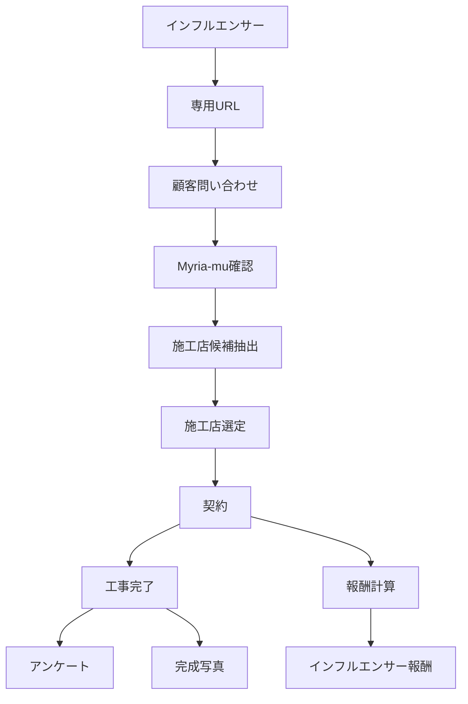

# Myria-mu 外構紹介管理プラットフォーム 要件定義書

**作成:** 2026-06-14 21:26 JST  
**更新:** 2026-06-14 21:39 JST  
**位置づけ:** 外構紹介管理プラットフォームの要件定義書  
**対象サービス:** YUINIWA（ユイニワ）  
**参考:** [YUINIWA公式サイト](https://yui-niwa.jp/)  
**根拠:** 西浦雅さん Myria-mu 管理システム相談、ユーザー提供要件メモ  
**想定予算:** 150万円〜180万円

---

## 1. 概要

本システムは、株式会社Myria-muが展開する外構紹介サービス **YUINIWA（ユイニワ）** において、インフルエンサー、顧客、Myria-mu、施工店の4者をつなぐ **外構紹介管理プラットフォーム** である。

顧客管理のみを目的とするシステムではなく、以下の一連の業務を案件単位で管理する。

- インフルエンサー経由の流入元管理
- 顧客問い合わせ管理
- Myria-muによる案件確認・施工店選定
- 施工店への送客
- 契約情報管理
- 工事完了報告管理
- 顧客アンケート管理
- 完成写真管理
- インフルエンサー報酬計算
- 支払状況管理

本システムでは、インフルエンサーを集客パートナー、施工店を施工パートナーとして扱い、Myria-muが運営主体として案件の確認、施工店選定、契約・完了・報酬状況の確認を行う。

---

## 2. ペルソナ

### 2.1 Myria-mu担当者

| 項目 | 内容 |
|------|------|
| 役割 | プラットフォーム運営担当者 |
| 主な責務 | 問い合わせ確認、案件管理、施工店候補確認、施工店選定、顧客対応、案件ステータス更新、契約状況確認、完了報告確認、報酬確認 |
| 利用範囲 | 運営業務に必要な管理画面全般 |

### 2.2 インフルエンサー

| 項目 | 内容 |
|------|------|
| 役割 | 集客パートナー |
| 主な責務 | SNS等を通じた見込み顧客の集客、専用URLの案内 |
| 利用範囲 | マイページ、自身の成果確認、報酬確認 |

### 2.3 施工店

| 項目 | 内容 |
|------|------|
| 役割 | 施工パートナー |
| 主な責務 | 案件確認、見積、契約登録、契約書PDFアップロード、工事完了報告、完成写真アップロード |
| 利用範囲 | 自社が担当する案件のみ |

### 2.4 顧客

| 項目 | 内容 |
|------|------|
| 役割 | 外構工事希望者 |
| 主な責務 | 問い合わせフォーム入力、工事完了後アンケート回答 |
| 利用範囲 | 問い合わせフォーム、顧客アンケートフォーム |

---

## 3. 業務フロー

### 3.1 基本業務フロー

### 3.2 業務フロー詳細

| No. | 業務 | 主担当 | 内容 |
|-----|------|--------|------|
| 1 | 専用URL発行 | Myria-mu | インフルエンサーごとに専用URLを発行する |
| 2 | 顧客問い合わせ | 顧客 | 専用URL経由で問い合わせフォームを送信する |
| 3 | 流入元記録 | システム | 専用URLから流入元インフルエンサーを自動判定する |
| 4 | 案件確認 | Myria-mu | 問い合わせ内容を確認し、案件として管理する |
| 5 | 施工店候補抽出 | システム | 顧客住所を元に対応可能施工店を最大3社表示する |
| 6 | 施工店選定 | Myria-mu | 候補施工店から送客先を手動選択する |
| 7 | 契約登録 | 施工店 | 契約日、契約金額、契約書PDF、支払予定日を登録する |
| 8 | 完了報告 | 施工店 | 完了日、完成写真、報告内容を登録する |
| 9 | アンケート回答 | 顧客 | 満足度、コメント、公開可否を回答する |
| 10 | 報酬計算 | システム | 契約金額と報酬率からインフルエンサー報酬を計算する |
| 11 | 支払管理 | Myria-mu | 支払予定、支払済を管理する |

---

## 4. 機能要件

### 4.1 インフルエンサー管理

インフルエンサーを集客パートナーとして管理する。

管理項目:

- 氏名
- SNS
- 区分
- 報酬率
- 振込先
- ステータス
- 専用URL

区分と報酬率:

| 区分 | 報酬率 |
|------|--------|
| アンバサダー | 4% |
| 通常 | 3% |

要件:

- インフルエンサーごとに専用URLを発行できること
- 専用URL経由の問い合わせを当該インフルエンサーに紐付けること
- 区分に応じた報酬率を保持できること
- 報酬率は管理者またはMyria-mu担当者が確認・変更できること

### 4.2 インフルエンサーマイページ

インフルエンサーは、自身に紐付く成果のみ閲覧できる。

閲覧可能項目:

- 問い合わせ件数
- 契約件数
- 契約金額
- 報酬額
- 支払状況

要件:

- 他インフルエンサーの案件・成果・報酬は閲覧できないこと
- 案件ごとの詳細表示は、個人情報の表示範囲を制限できること
- 報酬額は契約金額と報酬率から算出された値を表示すること

### 4.3 顧客問い合わせ管理

顧客は専用URL経由で問い合わせフォームを送信する。

管理項目:

- 氏名
- 電話番号
- メールアドレス
- 郵便番号
- 住所
- 問い合わせ内容
- 流入元インフルエンサー
- 問い合わせ日時

要件:

- 問い合わせ送信時に案件を作成すること
- 専用URL経由の場合、流入元インフルエンサーを自動記録すること
- 住所情報は施工店候補抽出に利用できること

### 4.4 施工店管理

施工店を施工パートナーとして管理する。

管理項目:

- 会社名
- 担当者名
- メールアドレス
- 電話番号
- 対応都道府県
- 対応市区町村
- 対応郵便番号
- ステータス

施工店ステータス:

- 審査中
- 有効
- 一時停止
- 解約

要件:

- 施工店ごとにステータスを登録できること
- 施工店ステータスが「有効」の施工店のみ、候補施工店として表示対象にすること
- 「審査中」「一時停止」「解約」の施工店は、原則として新規送客候補から除外すること
- 施工店ごとに対応エリアを登録できること
- 対応エリアは、施工店本体ではなく対応エリアデータ（`contractor_service_areas` 相当）として複数登録できること
- 顧客住所の都道府県、市区町村、郵便番号を元に候補施工店を抽出できること
- 案件登録時に候補施工店を最大3社表示すること
- 送客は自動ではなく、Myria-muが手動選択すること
- 施工店は自社担当案件のみ閲覧・更新できること

### 4.5 案件管理

問い合わせから支払完了までを案件単位で管理する。

案件ステータス:

- 新規問い合わせ
- 施工店選定中
- 送客済
- 見積中
- 契約
- 施工中
- 完了
- 報酬確定
- 支払済

イラスト制作ステータス:

- 未依頼
- 制作待ち
- 制作中
- 送付済

要件:

- 顧客、流入元インフルエンサー、担当施工店を案件に紐付けること
- 案件ステータスを更新できること
- 案件ステータス変更時は、案件履歴を記録できること
- イラスト制作ステータスを案件に保持できること
- 契約、完了報告、アンケート、報酬情報を案件に紐付けること

### 4.5.1 案件履歴

案件の重要な状態変更を履歴として記録する。

記録対象:

- 案件ステータス変更
- 担当施工店の選定・変更
- 契約登録
- 完了報告登録
- 報酬確定
- 支払状況変更
- イラスト制作ステータス変更

管理項目:

- 案件
- 変更前ステータス
- 変更後ステータス
- 変更種別
- 変更者
- 変更日時
- 備考

要件:

- 「誰が」「いつ」「何を変更したか」を後から確認できること
- 案件履歴は削除せず、監査用の記録として保持すること
- 案件詳細画面で履歴を時系列に確認できること

### 4.6 施工店候補抽出

顧客住所を元に施工店候補を抽出する。

抽出条件:

- 都道府県
- 市区町村
- 郵便番号

要件:

- 条件に一致する施工店候補を最大3社表示すること
- 施工店候補抽出は、施工店の対応エリアデータ（`contractor_service_areas` 相当）を参照すること
- 候補表示後、Myria-mu担当者が施工店を選択すること
- 初期開発では自動送客は行わないこと

### 4.7 契約管理

契約情報は施工店が登録する。

登録者:

- 施工店

管理項目:

- 契約日
- 契約金額
- 契約書PDF
- 支払予定日
- 登録者
- 登録日時

要件:

- 契約書PDFを案件に紐付けて保管できること
- 契約金額を報酬計算に利用できること
- 支払予定日を案件に紐付けて管理できること
- 電子サイン連携は初期開発では対象外とすること

### 4.8 完了報告

施工店は工事完了後に完了報告を登録する。

管理項目:

- 完了日
- 完成写真
- 報告内容
- 登録者
- 登録日時

要件:

- 完成写真は複数登録可能とすること
- 完了報告は案件に紐付けること
- Myria-mu担当者が完了報告を確認できること

### 4.9 顧客アンケート

工事完了後、顧客向けアンケートを案件に紐付けて管理する。

管理項目:

- 満足度
- 施工店を知人に勧めたいか
- コメント
- 公開可否
- 回答日時

要件:

- アンケート回答を案件に紐付けること
- 「施工店を知人に勧めたいですか？」をNPS相当の指標として保持できること
- NPS相当項目は、施工店評価に利用できること
- 公開可否を保持し、将来的な施工事例活用時に参照できること
- 公開不可のコメント・写真は外部公開用途に利用しないこと

### 4.10 報酬管理

インフルエンサー報酬を契約金額と報酬率から計算する。

管理項目:

- インフルエンサー
- 案件
- 契約金額
- 報酬率
- 報酬額
- 支払予定日
- 支払状況

支払状況:

- 支払予定
- 支払済

要件:

- 契約金額と報酬率から報酬額を算出すること
- 報酬率は案件に紐付くインフルエンサーの区分を元に参照すること
- 報酬額、支払予定日、支払状況を確認できること
- インフルエンサーは自身の報酬のみ閲覧できること

### 4.11 イラスト制作管理

工事完了後、アンケートと完成写真を元に、顧客向けオリジナルイラスト制作の進捗を管理する。

イラスト制作ステータス:

- 未依頼
- 制作待ち
- 制作中
- 送付済

要件:

- イラスト制作ステータスを案件単位で管理できること
- 工事完了後、アンケート回答と完成写真回収状況を確認できること
- イラスト制作ステータス変更時は案件履歴に記録できること
- 初期開発では、外部制作ツールとの自動連携は対象外とすること

### 4.12 施工店評価指標

施工店を施工パートナーとして評価するための指標を保持・集計できる設計とする。

集計可能にする指標:

- 送客件数
- 契約件数
- 契約率
- 平均満足度
- NPS相当スコア

要件:

- 施工店評価専用の固定テーブルを初期段階で必須とはしないこと
- 案件、契約、アンケートのデータから施工店ごとの評価指標を集計できる構造にすること
- 契約件数は、施工店に紐付く契約済案件数から集計できること
- 契約率は、施工店へ送客された案件数と契約件数から算出できること
- 平均満足度は、顧客アンケートの満足度から集計できること
- NPS相当スコアは、顧客アンケートの「施工店を知人に勧めたいですか？」から集計できること
- 初期開発では高度な評価ダッシュボードやランキング表示は対象外とすること

### 4.13 通知

初期開発ではメール通知を対象とする。

通知候補:

- 顧客問い合わせ受付通知
- 施工店への送客通知
- 契約登録通知
- 完了報告通知
- アンケート依頼通知

公式LINE通知、自動LINE通知、LINEログインは初期開発の対象外とする。

---

## 5. データ要件

### 5.1 インフルエンサー

| 項目 | 内容 |
|------|------|
| influencer_id | インフルエンサーID |
| name | 氏名 |
| sns | SNS情報 |
| category | 区分（アンバサダー / 通常） |
| reward_rate | 報酬率 |
| bank_account | 振込先 |
| status | ステータス |
| referral_url_code | 専用URL識別子 |

### 5.2 顧客

| 項目 | 内容 |
|------|------|
| customer_id | 顧客ID |
| name | 氏名 |
| phone | 電話番号 |
| email | メールアドレス |
| postal_code | 郵便番号 |
| address | 住所 |
| inquiry_body | 問い合わせ内容 |

### 5.3 施工店

| 項目 | 内容 |
|------|------|
| contractor_id | 施工店ID |
| company_name | 会社名 |
| contact_name | 担当者名 |
| email | メールアドレス |
| phone | 電話番号 |
| status | ステータス（審査中 / 有効 / 一時停止 / 解約） |

### 5.4 施工店対応エリア

施工店の対応エリアは、施工店本体とは別に `contractor_service_areas` 相当のデータとして管理する。

| 項目 | 内容 |
|------|------|
| contractor_service_area_id | 施工店対応エリアID |
| contractor_id | 施工店ID |
| prefecture | 対応都道府県 |
| city | 対応市区町村 |
| postal_code | 対応郵便番号 |
| status | ステータス |

例:

| 施工店 | 都道府県 | 市区町村 |
|--------|----------|----------|
| A社 | 静岡県 | 藤枝市 |
| A社 | 静岡県 | 焼津市 |
| B社 | 東京都 | 世田谷区 |

### 5.5 案件

| 項目 | 内容 |
|------|------|
| case_id | 案件ID |
| customer_id | 顧客ID |
| influencer_id | 流入元インフルエンサーID |
| contractor_id | 担当施工店ID |
| status | 案件ステータス |
| illustration_status | イラスト制作ステータス（未依頼 / 制作待ち / 制作中 / 送付済） |
| inquiry_at | 問い合わせ日時 |
| referred_at | 送客日時 |

### 5.6 案件履歴

| 項目 | 内容 |
|------|------|
| case_history_id | 案件履歴ID |
| case_id | 案件ID |
| event_type | 変更種別 |
| from_status | 変更前ステータス |
| to_status | 変更後ステータス |
| changed_by | 変更者 |
| changed_at | 変更日時 |
| note | 備考 |

### 5.7 契約

| 項目 | 内容 |
|------|------|
| contract_id | 契約ID |
| case_id | 案件ID |
| contractor_id | 登録施工店ID |
| contract_date | 契約日 |
| contract_amount | 契約金額 |
| contract_pdf | 契約書PDF |
| payment_due_date | 支払予定日 |
| created_by | 登録者 |
| created_at | 登録日時 |

### 5.8 完了報告

| 項目 | 内容 |
|------|------|
| completion_report_id | 完了報告ID |
| case_id | 案件ID |
| completion_date | 完了日 |
| report_body | 報告内容 |
| created_by | 登録者 |
| created_at | 登録日時 |

完成写真は、完了報告に対して複数紐付けられること。

### 5.9 完成写真

| 項目 | 内容 |
|------|------|
| photo_id | 写真ID |
| completion_report_id | 完了報告ID |
| file_path | 写真ファイル |
| caption | 補足説明 |
| uploaded_at | アップロード日時 |

### 5.10 アンケート

| 項目 | 内容 |
|------|------|
| survey_id | アンケートID |
| case_id | 案件ID |
| satisfaction_score | 満足度 |
| recommendation_score | 施工店を知人に勧めたいか（NPS相当） |
| comment | コメント |
| public_allowed | 公開可否 |
| answered_at | 回答日時 |

### 5.11 報酬

| 項目 | 内容 |
|------|------|
| reward_id | 報酬ID |
| case_id | 案件ID |
| influencer_id | インフルエンサーID |
| contract_amount | 契約金額 |
| reward_rate | 報酬率 |
| reward_amount | 報酬額 |
| payment_due_date | 支払予定日 |
| payment_status | 支払状況 |

### 5.12 施工店評価の集計元

施工店評価指標は、初期段階では専用テーブルとして固定せず、以下の既存データから集計可能な構造とする。

| 指標 | 集計元 |
|------|--------|
| 送客件数 | 案件の担当施工店 |
| 契約件数 | 契約済み案件 |
| 契約率 | 送客件数と契約件数 |
| 平均満足度 | 顧客アンケートの満足度 |
| 平均NPS相当スコア | 顧客アンケートのNPS相当項目 |

補足:

- 初期開発では、施工店評価指標専用の固定テーブルは必須としない
- 将来的に集計負荷や表示要件が明確になった段階で、集計結果保存用テーブルの追加を検討する

---

## 6. 権限要件

| 権限 | 対象 | 利用可能範囲 |
|------|------|--------------|
| 管理者 | システム管理者 | 全権限 |
| Myria-mu担当者 | 運営者 | 運営権限 |
| 施工店 | 施工パートナー | 担当案件のみ |
| インフルエンサー | 集客パートナー | 自身の成果のみ |

### 6.1 管理者

- 全データを閲覧・登録・編集・削除できる
- ユーザー、権限、マスタ、案件、契約、報酬を管理できる

### 6.2 Myria-mu担当者

- 案件全体を閲覧・更新できる
- 施工店候補を確認し、施工店を手動選択できる
- 契約、完了報告、アンケート、報酬状況を確認できる
- インフルエンサー、施工店、顧客情報を運営業務範囲で管理できる

### 6.3 施工店

- 自社が担当する案件のみ閲覧できる
- 担当案件の契約情報を登録できる
- 担当案件の契約書PDFをアップロードできる
- 担当案件の完了報告と完成写真を登録できる
- 他施工店の案件は閲覧できない

### 6.4 インフルエンサー

- 自身に紐付く成果のみ閲覧できる
- 問い合わせ件数、契約件数、契約金額、報酬額、支払状況を確認できる
- 他インフルエンサーの成果は閲覧できない
- 契約書PDF、施工店内部情報、他顧客の個人情報は閲覧できない

---

## 7. 非機能要件

### 7.1 認証・認可

- 管理者、Myria-mu担当者、施工店、インフルエンサーを区別してログインできること
- 権限ごとに閲覧・登録・編集可能範囲を制御すること
- 施工店とインフルエンサーは、自身に関係する情報のみ閲覧できること

### 7.2 ファイル管理

- 契約書PDFを案件に紐付けて保管できること
- 完成写真を複数ファイルとして保管できること
- ファイルは権限に応じて閲覧制御できること

### 7.3 データ整合性

- 案件には顧客、流入元インフルエンサー、担当施工店を紐付けられること
- 施工店候補抽出は、施工店本体ではなく施工店対応エリアデータを参照すること
- 施工店ステータスが「有効」でない場合、新規送客候補から除外できること
- 契約金額、報酬率、報酬額の計算根拠を追跡できること
- 報酬額は契約金額と報酬率から算出されること
- 顧客アンケートの満足度およびNPS相当項目は施工店評価指標として集計できること

### 7.4 監査・履歴

- 契約登録、完了報告、支払状況変更について、登録者と登録日時を保持すること
- 案件ステータス変更、担当施工店変更、イラスト制作ステータス変更について、案件履歴を保持すること
- 重要データの更新履歴を後から確認できる設計とすること

### 7.5 可用性・バックアップ

- 業務時間中に案件、契約、報酬状況を確認できること
- データ消失に備え、定期バックアップを行える構成とすること

### 7.6 拡張性

- 将来的なLINE通知、施工事例活用、売上分析、ランキング表示に拡張できるデータ構造とすること
- アンケートの公開可否を保持し、施工事例活用時に参照できること
- 施工店評価指標は、案件・契約・アンケートから将来的に集計できるデータ構造とすること

---

## 8. スコープ

初期開発の対象範囲は以下とする。

### 8.1 提案時の必須範囲

150〜180万円規模の初期提案では、以下を必須範囲とする。

- インフルエンサー専用URL発行
- 顧客問い合わせ管理
- 施工店管理
- 案件管理
- 契約管理
- 報酬管理

### 8.2 提案時のできれば範囲

以下は、予算・納期・優先度に応じて初期範囲に含めるか判断する。

- イラスト制作ステータス管理
- 顧客アンケートのNPS相当項目
- 施工店評価指標の集計可能構造

### 8.3 初期開発の詳細範囲

- 管理者 / Myria-mu担当者 / 施工店 / インフルエンサーのログイン
- インフルエンサー管理
- インフルエンサー専用URL発行
- 顧客問い合わせフォーム
- 流入元インフルエンサー自動記録
- 顧客問い合わせ管理
- 施工店管理
- 施工店ステータス管理
- 施工店対応エリア管理
- 対応エリアによる施工店候補抽出
- 候補施工店の最大3社表示
- Myria-muによる施工店手動選択
- 案件ステータス管理
- 案件履歴管理
- イラスト制作ステータス管理
- 契約情報登録
- 契約書PDFアップロード
- 支払予定日管理
- 完了報告登録
- 複数完成写真アップロード
- 顧客アンケート管理
- 顧客アンケートのNPS相当項目管理
- 報酬自動計算
- 支払状況管理
- 施工店評価指標を将来集計するためのデータ保持
- インフルエンサーマイページ
- 施工店向け担当案件画面
- メール通知

---

## 9. スコープ外

初期開発では以下を対象外とする。

- 電子サイン連携
- LINEログイン
- LINE自動通知
- GoogleMap距離計算
- 会計ソフト連携
- スマホアプリ
- 施工店への完全自動送客
- 高度な売上分析ダッシュボード
- ランキング表示
- 高度な施工店評価ダッシュボード
- 外部公開用の施工事例ページ

---

## 10. 確認事項

要件確定前に以下を確認する。

- インフルエンサー報酬率は、アンバサダー4%、通常3%で確定するか
- 支払予定日は施工店が登録するか、Myria-mu担当者が登録するか
- 顧客アンケート送信方法はメールのみで開始するか
- 完成写真の公開可否はアンケート内で取得するか、別途同意項目を設けるか
- 施工店候補抽出は、都道府県、市区町村、郵便番号のどの優先順位で判定するか
- 施工店ステータスが一時停止または解約になった場合、既存担当案件をどう扱うか
- NPS相当項目は0〜10点形式で取得するか、段階式で取得するか
- イラスト制作ステータスはMyria-mu担当者が手動更新する前提でよいか
- イラスト制作に担当者、納期、外注先、送付日を持たせる場合、将来的に `illustrations` 相当の独立データとして管理するか
- インフルエンサー退会時に、過去案件、報酬履歴、未払い報酬をどのように扱うか
- 施工店評価指標は初期段階では画面表示せず、案件・契約・アンケートから集計可能な状態に留める方針でよいか
