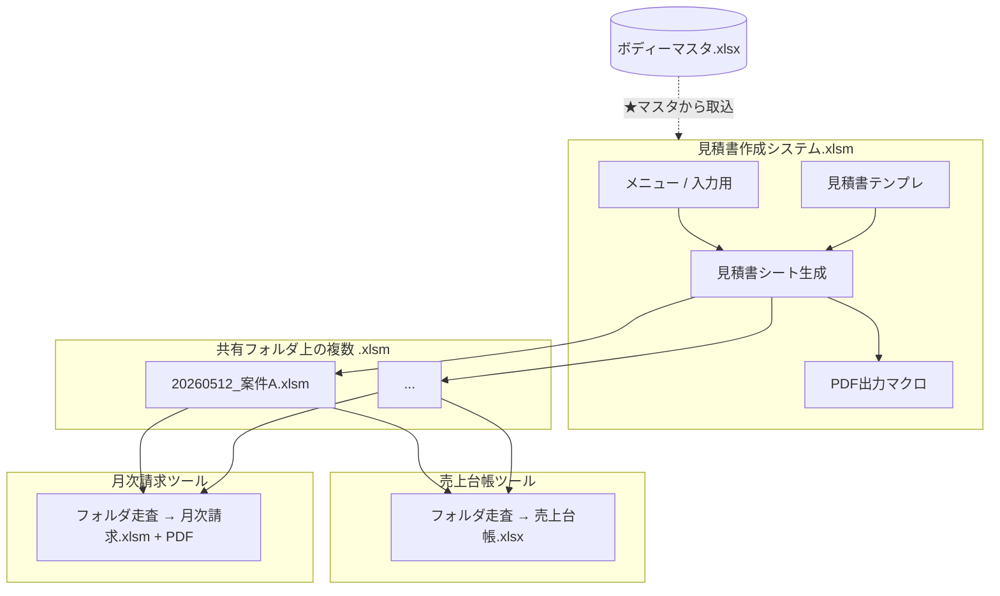

# 印刷業向け 既存 Excel/VBA システム調査・Fit & Gap レポート

**調査日時:** 2026-05-12 08:47 JST（ファイル実体の静的解析）  
**調査方法:** `oletools.olevba` による VBA 抽出、OpenXML（`workbook.xml`・シート一覧）および `ボディーマスタ.xlsx` の `openpyxl` 参照  
**位置づけ:** [`printing_order_management_system_requirements.md`](printing_order_management_system_requirements.md) の **事実補強** と、提案書・Fit & Gap・基本設計のたたき台。

> **本文中の区分**  
> **【事実】** … ファイルから直接確認できた内容  
> **【推測】** … シート名・処理フローからの合理的推定（要ヒアリングで確定）

---

## 1. 調査目的

- 既存 4 ブックが **単なる表計算ではなく、VBA による業務システム** としてどのように連携しているかを可視化する。
- Web 統合システム化における **置き換え対象・継続利用・廃止候補** を整理する。
- **Fit / Gap・優先度（P0〜P3）** と **DB 化候補** を、後続の概算（例: 120 万円規模）と整合する形で示す。

---

## 2. 対象ファイル一覧

| ファイル名（【事実】） | 形式 | ツール名（VBA 定数・【事実】） | バージョン（【事実】） |
|------------------------|------|-------------------------------|-------------------------|
| `見積書作成システム_ver4.1.0.xlsm` | xlsm | 見積書作成システム | ver4.1.0 |
| `売上台帳作成ツール_ver4.0.0.xlsm` | xlsm | 売上台帳作成ツール | ver4.0.0 |
| `月次請求書作成ツール_ver4.1.0.xlsm` | xlsm | 月次請求書作成ツール | ver4.1.0 |
| `ボディーマスタ.xlsx` | xlsx | （外部マスタ） | ファイル名のみ確認 |

---

## 3. 現行業務フロー

利用者ヒアリングベースの流れ（**【推測】含む**）と、**【事実】** なシステム上の依存関係を併記する。

```text
Web注文フォーム → メール受付 → PDF受付票確認 【運用・ヒアリング】
        ↓
見積書作成システム.xlsm（入力・見積/請求/納品/領収テンプレ・PDF） 【事実: 中核ブック】
        ↓
同一フォルダ内の個別見積ブック（yyyymmdd_案件名.xlsm 形式で保存） 【事実: コードより】
        ↓
売上台帳作成ツール：フォルダ内 *.xls* を走査し「見積書」シートから集計 【事実】
        ↓
月次請求書作成ツール：同一フォルダ内ブックから「見積書」シートを集約し月次請求 【事実】
        ↑
ボディーマスタ.xlsx：見積ブック内の「ボディーマスタ」シートへコピー取込 【事実: VBA】
```



---

## 4. 各 Excel ファイルの役割

### 4.1 `見積書作成システム_ver4.1.0.xlsm`（【事実】＋一部【推測】）

| 観点 | 内容 |
|------|------|
| **目的** | 案件単位の見積ブック生成。入力・マスタ参照・見積（および請求・納品・領収）帳票シート生成、PDF 出力。 |
| **主なシート** | メニュー、見積書テンプレ、領収書テンプレ、**見積書**（生成後）、入力用、**料金表マスタ**、**ボディーマスタ**、リスト集 |
| **入力** | メニュー: 案件名・見積書作成日・送料・税率。入力用: 顧客情報、版代／プリント／オプション／ボディー明細など（名前付き範囲多数）。 |
| **出力** | `yyyymmdd_案件名.xlsm` として保存（【事実】）。見積書シート（コピー生成）、各種 PDF（【事実】）。 |
| **他ファイル** | **ボディーマスタ.xlsx** を読み取り専用で開き、`ボディーマスタ` シートへ値コピー＋テーブル化（【事実】）。 |
| **Web 化で置換** | 案件・明細・税率・帳票種別・PDF 生成、マスタ取込、ファイル命名規則のサーバ側再現。 |
| **残してよい** | 【推測】移行期間の検算用に Excel エクスポート／帳票体裁確認用テンプレは残価あり。 |
| **廃止候補** | メニューシート中心の「名前を付けて保存」フロー、ローカルパス前提のマスタ取込（環境依存）。 |

### 4.2 `売上台帳作成ツール_ver4.0.0.xlsm`（【事実】）

| 観点 | 内容 |
|------|------|
| **目的** | 指定フォルダ内の見積ブックを走査し、**売上台帳**シートを生成。 |
| **主なシート** | メイン、売上台帳テンプレ、**設定**（`tbセル設定` テーブルでセルマッピング） |
| **入力** | フォルダパス、対象年・月（名前付き範囲）。 |
| **出力** | `売上台帳_yyyymm_日時.xlsx`（【事実】）、取込済リスト。 |
| **他ファイル** | 各 `.xlsm` を開き、シート `見積書` または `月次請求書` を判定（【事実】）。`BA1`＝ファイル種類、`BB1`＝バージョン文字列。 |
| **Web 化で置換** | バッチ集計 → **案件テーブルからの期間クエリ** とダッシュボード／CSV 出力。 |
| **残してよい** | 移行直後の監査・比較用に「同ロジックの Excel 再出力」オプション（【推測】）。 |
| **廃止候補** | フォルダ走査・ブック毎 `Workbooks.Open`（遅く・壊れやすい）を主運用から外す。 |

### 4.3 `月次請求書作成ツール_ver4.1.0.xlsm`（【事実】）

| 観点 | 内容 |
|------|------|
| **目的** | 指定フォルダ内の単体見積ブックから **月次請求書** をまとめ、Excel＋PDF 保存。 |
| **主なシート** | メイン、`請求書（テンプレ）` → 処理後 `月次請求書`（モジュール内定数 `月次シート名`） |
| **入力** | フォルダパス、対象年・月、**請求日**（名前付き範囲 `請求日`）。 |
| **出力** | `yyyymmdd月次請求分_{お客様名}.xlsm` と同名 PDF（【事実】）。 |
| **他ファイル** | 各ブックの **見積書** シートから金額・備考（案件名）等を抽出（【事実】）。 |
| **Web 化で置換** | 締め・顧客単位の請求ヘッダ／明細生成、登録番号付与、PDF 一括。 |
| **残してよい** | 【推測】会計への渡し用に PDF の体裁を既存に寄せる要件ならテンプレ比較用。 |
| **廃止候補** | ブック単位の集計（データが散在）。 |

### 4.4 `ボディーマスタ.xlsx`（【事実】）

| 観点 | 内容 |
|------|------|
| **目的** | ボディー（衣料・ノベルティベース）の SKU オプション・価格マスタ。 |
| **主なシート** | `ボディーマスタ`（1 シート、**約 8,102 行 × 16 列** を確認） |
| **列（1 行目）** | 検索用、メーカー名、商品コード、商品名、カラーコード、カラー名、サイズコード、サイズ名、上代、下代、イレギュラー、下代の1.2倍、販売価格 … |
| **他ファイル** | 見積ブックへ VBA で全件コピー（【事実】）。列は `Module_99_Setting` の `CNoボディーTB` と整合。 |
| **Web 化** | RDB + 検索 API／CSV 一括更新。 |
| **廃止** | 直リンクの固定パス取込は廃止し、**アップロードまたは API** に。 |

---

## 5. シート構成一覧

| ブック | シート名（【事実】） | 役割の要約 |
|--------|----------------------|------------|
| 見積 ver4.1.0 | メニュー | 新規時の必須項目・日付・税率・送料。非表示化も実装。 |
| 見積 | 見積書テンプレ | 転記先テンプレ。PDF 用ボタン含む。 |
| 見積 | 領収書テンプレ | 領収 PDF 用。 |
| 見積 | 見積書 | 完成シート（コピー生成）。売上・請求ツールが参照。 |
| 見積 | 入力用 | 版代・プリント・オプション・ボディー入力エリア。 |
| 見積 | 料金表マスタ | DTF／インクジェット等の価格グリッド（名前付き範囲あり）。 |
| 見積 | ボディーマスタ | 外部 xlsx からの複製先テーブル `ボディーマスタTB`。 |
| 見積 | リスト集 | 【推測】プルダウン・一覧用。 |
| 売上 ver4.0.0 | メイン | パス・年月入力。 |
| 売上 | 売上台帳テンプレ | 印刷範囲・当月表示。 |
| 売上 | 設定 | セルマッピングの Single Source。 |
| 請求 ver4.1.0 | メイン | パス・年月・請求日。 |
| 請求 | 請求書（テンプレ） | 月次請求レイアウト・名前付き範囲多数。 |
| マスタ | ボディーマスタ | 1 シート・大容量。 |

---

## 6. VBA / マクロ構成

### 6.1 見積書作成システム（【事実】）

| 種別 | 名前 |
|------|------|
| 標準モジュール | `Module_00_Reset`, `Module_01_Menu`, `Module_02_Main`, `Module_03_DocPDF`, `Module_04_ReceiptPDF`, `Module_05_Master`, `Module_99_Setting`, `Module_Function`, `Module_Function2` |
| クラス（シート） | `ThisWorkbook`, `shMenu`, `shInput`, `shBody`, `shPriceList`, `shList`, `shTmp01`, `shTmp02`, `shTmp03` |
| フォーム | `UF_ボディーマスタ` |
| リボン | `customUI.xml`：QAT に「ボディーマスタのフォーム起動」ボタン |

### 6.2 売上台帳作成ツール（【事実】）

| 種別 | 名前 |
|------|------|
| 標準 | `M0_設定モジュール`, `M1_売上台帳の作成`, `P0_汎用関数` |
| クラス | `ThisWorkbook`, `wsメイン`, `ws売上台帳テンプレ`, `ws設定` |

### 6.3 月次請求書作成ツール（【事実】）

| 種別 | 名前 |
|------|------|
| 標準 | `M0_設定モジュール`, `M1_月次まとめ請求成書作`（※ファイル名上の表記）, `M2_請求書PDF出力`, `P0_汎用関数` |
| クラス | `ThisWorkbook`, `wsメイン`, `sh月次請求書` |

### 6.4 主要 Sub / Function と Web 化への含意（【事実】要約）

| 処理 | モジュール | Web 化への含意 |
|------|------------|----------------|
| `★見積書作成` | `Module_02_Main` | 入力 → テンプレ転記 → 行グループ化 → シートコピー。**サーバ側トランザクション＋帳票 PDF** に分解する。 |
| `sb見積書/請求書/納品書/領収書 PDF 出力` | `Module_03_DocPDF` / `Module_04_ReceiptPDF` | `ExportAsFixedFormat` / OS 別パス。**PDF はサーバレンダリング（例: HTML→PDF またはテンプレ PDF）**へ。 |
| `★マスタから取込` | `Module_05_Master` | 外部 xlsx を開き **全レンジ貼付**。**環境依存の固定パスがコード内に存在**するため運用上のリスク（後述）。 |
| `UF_ボディーマスタ` | フォーム | リスト検索・選択 UI。**Web のマスタ検索モーダル**に相当。 |
| `単価を税込みにする` | `Module_02_Main` | `Round(単価 * (1 + z税率), 0)`。**税率は入力パーセント÷100**（【事実】）。 |
| `★売上台帳の作成` | `M1_売上台帳` | `Dir` で `*.xls*` ループ、`設定シートの内容から転記` でセル解決。**DB クエリに置換**。 |
| `★月次請求書の作成` | `M1_月次…` | リストへ集約後、テンプレに行展開、`ExportAsFixedFormat`。**締処理 API** に。 |
| `★請求書PDF出力` | `M2_請求後PDF` | 月次ブック完成後の PDF。 |

**CSV 入出力:** 3 ブックの VBA から **CSV 操作は検出されず**（【事実】）。Web 要件の CSV は **新規機能** として位置づける。

---

## 7. 主要業務ロジック

| 論点 | 内容 | 根拠 |
|------|------|------|
| **価格計算** | 版代・プリント・色変え（**単価 400 × 色変え数合算**）、オプション、ボディー単価×数量。明細金額列には転記後に数式 `=AA*X` 相当を一括投入。 | `Module_02_Main` 【事実】 |
| **消費税** | 入力シートの **税率（%）** を利用。税込単価関数あり。帳票上の税額は **シート数式に依存**【推測：テンプレ側で集計】。 | 【事実】税率チェック・税込関数 |
| **インボイス番号** | VBA 文字列として **「インボイス」「登録番号」等は未検出**。帳票テンプレセルに静的文字がある可能性は **要確認**（シート XML の目視は本調査範囲外）。 | olevba 全文検索 【事実】 |
| **締日・請求月** | 売上: `DateSerial(年,月,1)` で当月。請求: **請求日セル**を `date当月` に使用。ファイル名先頭 **8 桁 yyyymmdd** を日付として解釈。 | 【事実】 |
| **顧客情報** | 郵便番号・住所・名前・敬称・電話・送料・代引き等を入力用からテンプレへ転記。 | 【事実】 |
| **商品マスタ参照** | `ボディーマスタTB` 列は Enum で厳密定義（メーカー・コード・色・サイズ・上代下代・販売価格等）。 | `Module_99_Setting` 【事実】 |
| **サイズ・色・品番・メーカー** | ボディー行: メーカー／商品名／品番／カラー／サイズ。見積明細の品名は `【メーカー】商品名（カラー）` 形式。 | 【事実】 |
| **PDF レイアウト** | Excel の印刷レイアウト（Print Area／Print Titles 定義あり）＋ `ExportAsFixedFormat`。 | OpenXML 名前付け＋VBA 【事実】 |
| **売上台帳転記条件** | `見積書`＋単体＋`BA1` 種別＋`BB1` バージョン **≥4**、または `月次請求書`＋月次まとめ＋ver4 以上。**それ以外は NG スキップ**。 | 【事実】 |
| **月次請求集計条件** | 各ファイルの `見積書` シート必須。`お買上額・送料・WEB割引額・消費税額・請求金額・粗利・備考の案件名` を抽出。ver4 未満は「非対応」カウント。 | 【事実】 |

---

## 8. データ連携・転記構造

| 連携 | 仕組み（【事実】） | Web 化での置き換え |
|------|-------------------|---------------------|
| 見積ブック間 | ファイルシステム上の **同一フォルダ＋命名規則** | 案件 ID・ストレージキー |
| 売上 ← 見積 | `Workbooks.Open` → `設定` の `tbセル設定` で **項目名×版種別** のセル座標を引く | JOIN クエリまたは ETL |
| 請求 ← 見積 | 列番号 Enum `e単体見積書` で **行15/14 等に固定参照** | 正規化された **明細・ヘッダ** |
| マスタ ← xlsx | パス固定＋ `PasteSpecial xlPasteValues` | DB マスタ＋差分 import |
| 粗利 | `B1` セル文字列から `弊社管理No.WB` と末尾 `-000` を除去 | **マスタ番号・原価** を DB で管理する方が安全【推測】 |

**セキュリティ・保守備考（【事実】）:** `Module_05_Master` に **第三者開発環境を思わせるローカル絶対パス** がハードコードされており、配布先ではフォールバックパスで動いている可能性がある。**Web 化時は設定外部化が必須**。

---

## 9. Web 化対象機能

| 領域 | 現行 | Web 優先 |
|------|------|----------|
| 案件ライフサイクル | ファイル単位 | 案件レコード＋ステータス |
| 入力 UI | Excel + UserForm | ブラウザフォーム（バリデーション） |
| 帳票 | Excel テンプレ | テンプレートエンジン＋PDF |
| 集計 | フォルダ走査マクロ | DB 集計・締めバッチ |
| マスタ | コピー＆テーブル | RDB + 検索 + CSV アップロード |
| PDF 四种 | マクロボタン | 単一データソースから複数帳票 |

---

## 10. Fit & Gap

| 現行 Excel 機能 | Web 化後の対応 | Fit / Gap | 優先度 | 備考 |
|-----------------|----------------|-----------|--------|------|
| メニュー→新規保存（案件名・税率・送料） | 新規案件 API・必須項目 | Fit | P0 |  |
| 入力用シート全項目（顧客・版代・プリント・オプション・ボディー） | フォーム＋バックエンド検証 | Fit | P0 | 項目数多→工数要 |
| 見積書シート生成（グループ化・改ページ） | PDF レイアウトで再現 | **Gap**（体裁） | P1 | ピクセル完全一致は要比較 |
| 請求・納品・領収 PDF（書類種別セル切替） | 帳票テンプレ切替 | Fit | P0 |  |
| 税率・税込計算 | 税率マスタ＋丸めルール明示化 | **Gap**（監査） | P0 | 現状は所々**数式依存** |
| ボディーマスタ取込 | DB + 管理画面 | Fit | P0 | 8k 行規模 |
| 料金表マスタ（DTF／IJ） | 価格マスタ表 or 設定 JSON | Fit | P1 |  |
| UserForm 検索 | オートコンプリート UI | Fit | P1 |  |
| フォルダ走査・売上台帳 | レポート SQL / CSV | Fit | P0 |  |
| 設定シートによる可変セルマッピング | **不要**（スキーマ固定化） | **Gap**（移行） | P1 | 既存ファイル互換読込は別途 |
| ファイル名 8 桁日付規則 | 明示的な `order_date` | Fit | P0 |  |
| ver4 未満ブックのスキップ | 移行後は存在しない | **Gap** | P2 | データ移行時のみ |
| インボイス登録番号・適格請求書要件 | マスタ＋帳票フィールド | **Gap** | P0 | **VBA 未実装・テンプレ要確認** |
| CSV 出力・取込 | 新規実装 | **Gap** | P1 | 補助金・外部連携に有効 |
| Google Drive 判定ヘルパ | クラウド保存挙動 | **Gap** | P3 | Mac/Win 差異の廃止 |

---

## 11. DB 化候補

| テーブル候補 | 元 Excel / シート | 主なカラム候補 | 備考 |
|-------------|-------------------|----------------|------|
| `customers` | 入力用・見積テンプレ | 名前、敬称、郵便、住所、電話、支払方法 | 請求先・納品先分割は要ヒアリング |
| `customer_contacts` | 【推測】 | 担当者名、メール | Web フォーム連携 |
| `orders` / `quotes` | 1 ファイル＝1 案件 | 案件名、見積日、税率、送料、代引、ファイル種別、バージョン、管理 No | `BA1` `BB1` 相当をカラム化 |
| `quote_lines` | 見積明細 | 行種別（版代/プリント/ボディー/オプション）、商品名、型番、サイズ、数量、単価、金額 | Enum `CNo明細書` 参照 |
| `invoices` | 月次請求テンプレ | 請求日、顧客、合計、消費税、請求書番号 | 番号採番ルール要定義 |
| `invoice_lines` | 月次明細ブロック | 日付、名称、金額内訳 | 現状は見積一行サマリに近い |
| `products` / `body_items` | ボディーマスタ | search_key, maker, product_code, name, color_code, color_name, size_code, size_name, retail, cost, irregular, sale_price | 実列と一致 |
| `makers` | ボディー列より正規化 | code, name |  |
| `colors` | 同上 | code, name |  |
| `sizes` | 同上 | code, name |  |
| `process_types` | 版代の加工方法 | 刺繍、プリント... |  |
| `print_positions` | 版代「位置」 | 文字列 |  |
| `price_matrix_dtf` 等 | 料金表マスタ | サイズ×数量セル | 正規化は CSV か行列テーブル |
| `attachments` / `design_files` | 【運用】 | storage_url, version | 現 Excel 外【推測】 |
| `pdf_documents` | 各 PDF 出力 | kind（見積/請求/納品/領収）, file_ref, generated_at |  |

---

## 12. 初期開発スコープ案（MVP）

**P0 で揃える範囲（120 万円規模の説明用文字数・複雑性の目安）**

1. **案件＋見積明細のデータモデル**（版代／プリント／オプション／ボディーの行タイプ）— Excel Enum 相当の複雑性。
2. **消費税・金額計算の仕様書化**（現状の数式を洗い出し、サーバで再現）。
3. **ボディーマスタのインポート**（8k 行クラス）と検索 UI。
4. **見積・請求 PDF 1 系統**（体裁は既存 PDF と並べて Gap 記録）。
5. **月次売上相当の一覧**（フォルダ走査の代替）。
6. **インボイス対応項目**（登録番号・要件フィールド）— テンプレに無ければ **新規フィールド**。

このボリュームは「**複数ブックに分散した業務ロジックの統合＋帳票＋マスタ**」として **120 万円前後の初期提案** に載りやすい粒度（詳細は工数表で内訳）。

---

## 13. 後続開発・将来拡張

- CSV の定期入出力、メーカー価格改定ワークフロー（P1）。
- 既存 `.xlsm` の **読込移民**（設定シートマッピングのエミュレーション）（P2）。
- AI による PDF 受付票の解析補助（P3）。
- 在庫 API（当初はオフ）、会計ソフト連携（P3）。

---

## 14. 提案書へ反映すべき要点

1. **現行 Excel は「表」ではなく、見積生成・マスタ同期・フォルバッチ・PDF まで含む業務システム**である（【事実】）。
2. **業務が複数ブックに分散**し、売上・請求は **ファイル走査に依存**するため、運用スケールと保守リスクが比例する。
3. **VBA・セル座標・バージョン分岐**により、変更の影響範囲が追いにくい (**ブラックボックス化**)。加えて **環境依存パス** がコードに残っている。
4. **Web 化により**、「案件を一意に特定する DB」を中心に **受注〜見積〜集計〜請求〜PDF** を一気通貫にできる。
5. **120 万円規模**は、上記 **データモデル＋計算仕様確定＋マスタ移行＋帳票再現＋売上／請求相当のレポート** を MVP に含める説明として妥当。
6. **補助金（IT 導入・インボイス枠等）**では、「受発注・請求の電子化」「登録番号を含む請求データ管理」を **新システムの明示機能**として説明しやすい。**現行 VBA にインボイス語が無い点**は「制度対応で Gap を埋める」ストーリーになる。

---

## 15. 残課題・追加ヒアリング事項

| # | 項目 | 理由 |
|---|------|------|
| 1 | 見積／請求テンプレ上の **インボイス表記の有無** | VBA にキーワードなし【事実】。セル側要確認。 |
| 2 | **`お買上額` と `請求金額` の厳密な定義** | 月次ツールは行 14/15 を混在参照【事実】。税抜税込の説明責任。 |
| 3 | **粗利 `B1` の生成元** | 文字列加工で売上ツールが利用【事実】。原価管理の所在。 |
| 4 | **Web 注文・PDF 受付票**との **項目マッピング** | 本調査は Excel のみ。 |
| 5 | **本番のボディーマスタ配置パス**と更新頻度 | コードは開発パス痕跡【事実】。 |
| 6 | **Mac / Windows** 利用比率 | PDF 出力分岐あり【事実】。 |
| 7 | `月次まとめ` ブックの実運用割合 | 売上ツールは分岐対応【事実】。 |

---

## 改訂履歴

| 版 | 日時 | 内容 |
|----|------|------|
| 0.1 | 2026-05-12 08:47 JST | 初版（4 ファイル静的解析）。 |

---

## 付録: 調査コマンド例（再現用）

調査担当者・将来の差分確認用。実行環境はローカルに依存する。

```bash
python3 -m pip install oletools openpyxl
python3 -m oletools.olevba "/path/to/workbook.xlsm" > vba_dump.txt
```

関連: [印刷業向け受発注・見積・請求 要件整理（ドラフト）](printing_order_management_system_requirements.md)
