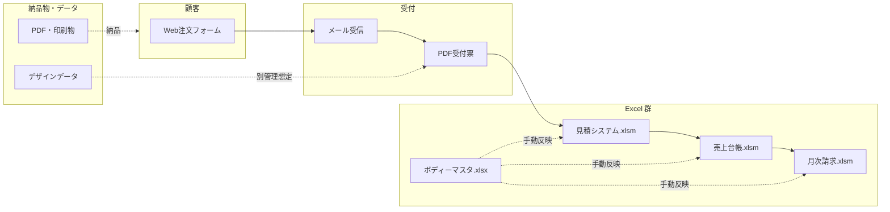
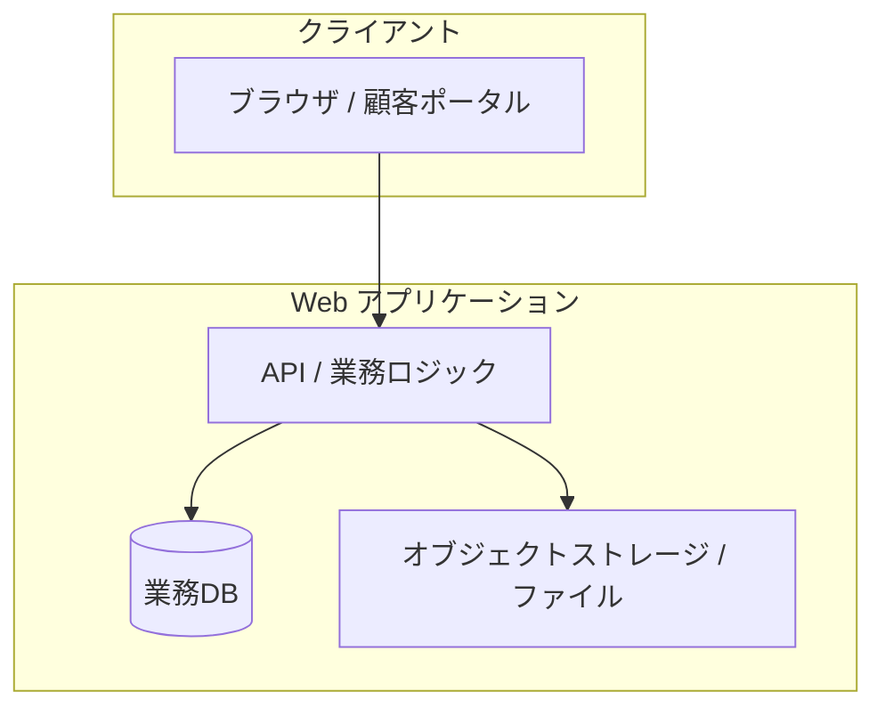

# 印刷業向け 受発注・見積・請求 統合システム — 要件整理（ドラフト）

**文書の位置づけ:** 提案書・補助金資料・概算見積・Fit & Gap・基本設計の共通ベースとなる **As-Is / To-Be / 必須機能 / 優先順位** の整理。  
**読者:** 現場担当者・経営・管理者・開発・補助金申請担当。  
**作成:** tugilo 式 AI 駆動開発に向けた **業務起点** の要件整理（機能だけの一覧にはしない）。

> **TODO（確定待ち）:** 初回正式ヒアリングの日時・場所・参加者をカレンダー等で確認し、§1「相談経緯」に **JST で時刻まで** 追記する。

---

## 1. プロジェクト概要

### 1.1 背景

印刷事業会社では、受注から請求までが **複数の Excel ブックとメール・PDF** に分散しており、担当者が **人力でデータをつなぐ** 運用になっている。

- Web 注文フォームから受注が入る
- メールで注文内容を受信する
- PDF の受付票を目視確認する
- **Excel マクロ**で見積を作成する
- **別 Excel** で売上台帳を管理する
- **別 Excel** で月次請求書を作成する
- **ボディーマスタ** Excel を手動更新する

加えて、既存 Excel 群は第三者プラットフォーム経由で外部に開発依頼されたが、**現在は開発者と連絡が取れない** 状態であり、改修・障害対応・仕様確認が **ブラックボックス化** しつつある。

### 1.2 現状（確認済み資産の整理）

| 種別 | 名称・URL | 役割（想定） |
|------|-----------|--------------|
| Web | [注文フォーム（workerbros.jp）](https://workerbros.jp/order.php) | 顧客からの受注入口 |
| Excel (.xlsm) | `見積書作成システム_ver4.1.0.xlsm` | 見積書生成（マクロ依存） |
| Excel (.xlsm) | `売上台帳作成ツール_ver4.0.0.xlsm` | 売上・台帳管理 |
| Excel (.xlsm) | `月次請求書作成ツール_ver4.1.0.xlsm` | 月次請求処理 |
| Excel (.xlsx) | `ボディーマスタ.xlsx` | 商品（ボディー）マスタの手動管理 |

> **注意:** 上記 Excel の **内部ロジック・シート構成は未開示** のため、本稿ではファイル名と運用文脈に基づく要件を整理する。詳細 Fit & Gap は **実ファイルの技術レビュー** 後に更新する。

### 1.3 相談経緯

- **きっかけ:** Excel 分散運用の限界、および **保守不能リスク** の顕在化。
- **期待:** Web ベースの **一元管理** により、入力の一度完結・帳票自動化・将来拡張可能な基盤を得たい。
- **TODO:** 初回相談日時（JST）、紹介経路（BNI 等）、担当者名はヒアリング記録で確定後に追記。

### 1.4 目的（プロジェクトで実現したいこと）

1. **現場・管理者双方**から見て、受注〜見積〜売上〜請求までが **同一データ系** で追えるようにする。
2. **人が増える前に構造を整え**、層の薄い「つなぎ役」依存を減らす。
3. **インボイス制度** 等の法務要件を踏まえた請求・証憑の運用に耐える形にする。
4. 補助金・社内稟議で説明可能な **段階投資（MVP → 拡張）** を定義する。

---

## 2. 現状業務フロー（As-Is）

### 2.1 視点の分け方

| 視点 | 主な関心事 |
|------|------------|
| **現場（オペレーション）** | 今どのファイルを開いているか、誰が転記しているか、ミスが出やすい箇所、忙しい時の順番 |
| **管理者（経営・業務管理）** | 数字の正しさ、滞留の可視化、顧客別粗利、請求漏れ・インボイス運用、保守コスト |

### 2.2 業務フロー（矢印イメージ）

### 2.3 フロー説明（箇条書き）

1. **顧客注文:** Web フォーム → メール通知・依頼内容のテキスト化。
2. **PDF 受付:** 受付票 PDF を開き、注文条件・品目・数量などを **目視で** 見積 Excel に取り込む（コピペ／手入力の可能性）。
3. **見積作成:** 見積 Excel（マクロ）で価格・明細を確定し、見積書を出力。
4. **売上台帳:** 受注確定後、別 Excel に **再度** 入力または転記。
5. **請求処理:** 月次タイミングで請求 Excel に集計・調整し、請求書発行。
6. **商品管理:** ボディーマスタ Excel を更新し、各ブック側に **都度反映**（手作業）。
7. **デザインデータ管理:** フォルダ・メール添付等、**系統だった保管ルールが Excel 外** に置かれがち。

---

## 3. 現状課題

### 3.1 なぜ「今のまま」が限界に近いか（要約）

Excel は **単一部門の灵巧なツール** としては優秀だが、**受注〜見積〜売上〜請求** という **業務チェーン全体のシステム** として運用すると、以下が同時に悪化する。

- データが **同一真理（single source of truth）** を失う
- 変更（価格改定・マスタ更新）が **全ブックに波及しにくい**
- **誰が・いつ・何を正としたか** がログに残らない
- 開発者不在により **内部がブラックボックス** — 法令・商習慣の変化に追従できない

### 3.2 分散管理

- 見積・台帳・請求・マスタが **物理的に別ファイル** のため、版ズレ・参照ミスが構造的に発生しうる。
- 「どの Excel が最新か」は **運用規律と個人の記憶** に依存しやすい。

### 3.3 Excel 依存

- `.xlsm`（マクロ）依存は、**PC 環境・Excel バージョン・セキュリティポリシー** に縛られる。
- クラウド化・リモートワーク・権限分離（閲覧だけの役職）への展開が難しい。

### 3.4 属人化

- メール・PDF・Excel をつなぐ **暗黙知** が特定の担当に集中しやすい。
- 休暇・退職時に **引き継ぎコストと事故リスク** が跳ね上がる。

### 3.5 二重入力

- 見積に一度入力し、台帳に **再入力**、請求で **また整形** — 同じファクト（受注・受領）が複数回タイプされる。
- 二重入力は **差異の温床**（数量・単価・品目表記ゆれなど）。

### 3.6 PDF 管理問題

- PDF は **人間が読むには良いが、機械が集計するには弱い**。全文検索・突合・自動仕訳がしづらい。
- メール添付のままだと、**紐付け（どの案件のどの版か）** が曖昧になりやすい。

### 3.7 保守不能リスク

- 外部開発者と連絡不能 → **仕様・VBA の意図が文書化されていない** と強い障害になる。
- 将来のインボイス要件追加、税率変更、明細ルール変更に **時間単位で反応できない**。

### 3.8 商品管理負荷

- ボディーマスタの更新が **全工程に手動で伝播** するなら、SKU 増加・価格改定のたびに現場が止まる。
- メーカー・色・サイズ・価格の **組み合わせ爆発** を Excel の列設計だけで吸収するのは限界がある。

---

## 4. To-Be（あるべき姿）

### 4.1 ゴールイメージ

**一回の受注事実を中心に**、見積・受注・売上・請求・帳票が **自動的に連なる** Web 基盤。Excel は **最終的に不要** または **インポート／一時編集のみ** に退く。

### 4.2 Before / After（業務レベル）

| 観点 | Before（As-Is） | After（To-Be） |
|------|-----------------|----------------|
| データの置き場所 | 複数 Excel + メール + PDF | アプリDB（商品・顧客・案件・明細が関連） |
| 入力回数 | 見積／台帳／請求で反復 | **原則1回**（例外は承認・修正のみ） |
| 履歴 | ファイル名・フォルダ運用 | **顧客別・案件別の時系列** |
| 再注文 | 過去 Excel を探してコピー | **ワンクリック再注文**（明細・条件の再利用） |
| 帳票 | マクロ・手作業の組合せ | **テンプレートから自動生成**（PDF） |
| インボイス | 各ツールの整合に依存 | **登録番号・要件項目をデータモデルで担保** |
| マスタ | 手動コピー | **正規化された商品DB** + **CSV 一括更新** |
| 保守 | 開発者不可達 | **仕様・コードが社内／パートナー管理** |

### 4.3 現場視点・管理者視点での「良くなること」

| 視点 | To-Be でのメリット |
|------|---------------------|
| 現場 | どの画面を見ればよいかが **一本化**。「探す時間」「転記ミス」が減る。 |
| 管理者 | 売上・請求・滞留が **ダッシュボードまたは一覧** で見える。補助金・融資・税務の説明資料を **エクスポートで作りやすい**。 |

---

## 5. 必須機能一覧

> 以下は **MVP に含めるべき論理塊**。**画面数＝機能数** ではなく、業務上の塊で示す。

### 5.1 顧客管理

| 機能領域 | 内容 | 備考 |
|----------|------|------|
| ログイン | 顧客ポータル／社内ユーザー認証 | 権限（顧客／社内）分離 |
| 顧客別履歴 | 見積・受注・請求の時系列 | 再注文・問い合わせ対応の核 |
| アカウント管理 | 担当者・請求先・インボイス登録情報 | 取引先マスタと請求先の分離も検討 |

### 5.2 商品管理

| 機能領域 | 内容 | 備考 |
|----------|------|------|
| ボディーマスタ DB 化 | メーカー・品番・属性のテーブル管理 | 現 `ボディーマスタ.xlsx` の置換 |
| CSV 更新 | 一括インポート・差分更新 | メーカーからの価格表取り込み想定 |
| 色・サイズ | バリエーション・在庫ではなく **属性** として管理 | 在庫 API 無し前提（§6.1） |
| メーカー管理 | メーカー別カタログ・契約条件メモ等 | 将来の拡張用フィールド |

### 5.3 受発注管理

| 機能領域 | 内容 | 備考 |
|----------|------|------|
| Web 注文 | 既存フォームの **置換または連携** | 既存 URL からの移行計画 |
| 注文履歴 | ステータス（受付・見積中・確定・制作・納品・請求） | 現場の「今どこ？」の可視化 |
| 再注文 | 過去案件の複製 | B 案の核（§7.3） |
| ステータス管理 | 内部ワークフロー | MVP ではシンプルな状態機械で可 |

### 5.4 見積・請求

| 機能領域 | 内容 | 備考 |
|----------|------|------|
| 見積生成 | 明細・消費税・備考・有効期限 | 既存見積書体裁の **テンプレ合わせ** |
| 請求書生成 | 締日・入金条件・合計 | 月次バッチまたは手動確定 |
| インボイス番号対応 | 適格請求書発行事業者の登録番号、要件項目 | 要件は法令・顧客規程に合わせ詳細設計 |

### 5.5 ファイル管理

| 機能領域 | 内容 | 備考 |
|----------|------|------|
| PDF 保存 | 受付票・見積・請求 PDF の **案件紐付け保管** | メール依存からの脱却 |
| デザインデータ管理 | アップロード・版管理（版番号・日付） | 容量・ウイルス対策はインフラ設計で |

### 5.6 機能一覧表（サマリー）

| # | モジュール | MVP | B 案 | C 案 |
|---|------------|-----|------|------|
| 1 | 認証・顧客ポータル | ○ | 強化 | SSO 等 |
| 2 | 商品マスタ（正規化） | 最小 | ○ | 外部PIM連携 |
| 3 | 受注・ステータス | ○ | ○ | 自動ルーティング |
| 4 | 見積・PDF | ○ | ○ | AI 文案支援 |
| 5 | 売上・請求・インボイス | ○ | ○ | 会計連携 |
| 6 | ファイル・版管理 | 基本 | ○ | AI 仕分け補助 |

---

## 6. 技術的検討事項

### 6.1 在庫 API 連携

- **現時点は困難** と整理。To-Be では **受注後確認フロー** を基本とする。
- 画面上は「在庫回答待ち」ステータス、メール／社内チャットでの **人による確認** を前提にしても、**データの置き場所は一元** のままにできる（＝構造には効く）。

### 6.2 商品マスタ正規化

- **メーカー × 品番 × 色 × サイズ × 価格** の組み合わせを、Excel 列の固定幅ではなく **関連テーブル** で表現する。
- 既存 Excel の列名・シートを **マッピング表** 化し、移行時の変換ルールを作る（Fit & Gap の主戦場）。

### 6.3 AI 活用余地（C 案で本格化）

| 用途 | 期待効果 | 注意 |
|------|----------|------|
| CSV / PDF の取り込み補助 | メーカー資料の取り込み工数削減 | **人の承認** を必ず挟む |
| 過去見積からの類推 | 再見積のたたき台 | 誤価格のリスク → ルールベースと併用 |
| チャットボット（社内） | マスタ検索・手順案内 | 学習データの境界を設計 |

---

## 7. 段階的開発案

### 7.1 システム構成イメージ（論理）

### 7.2 A 案（最低限）

- **スコープ:** 受注データの一元化、見積生成、請求書生成、インボイス項目の保持、PDF 保存。
- **狙い:** Excel 連鎖を **最短で断ち切る**。顧客履歴・再注文は **最小**（検索はできるがワンクリック再注文は後回しでも可 — 要合意）。

### 7.3 B 案（推奨）

- **スコープ:** A に加え **商品 DB 本格運用**、**顧客別履歴・再注文**、CSV 更新、ステータス運用の成熟。
- **狙い:** 現場体験と再現性が一段上がり、**「誰がやっても回る」** に近づく。補助金説明でも **投資対効果** を語りやすい。

### 7.4 C 案（拡張）

- **スコープ:** AI による取込補助、分析ダッシュボード、高度な自動化、外部会計・在庫との API 連携（取得可能になった段階で）。
- **狙い:** 利益管理・需要予測・業務速度のさらなる伸長。**ブラックボックスにしない** ため、AI はあくまで補助と明記する。

### 7.5 MVP 範囲（推奨定義）

**MVP = A 案コア + 一部 B 案**（合意形成用の初期提案）

- 必須: 受注〜見積〜請求の **データ連続性**、PDF、インボイス項目、商品マスタの **DB 最小**（CSV で更新可能）。
- 次点: 再注文・顧客ポータル強化（B に含め、予算次第で MVP 直後スプリントへ）。

### 7.6 実装優先順位（ロードマップ）

| 順位 | 内容 | 理由 |
|------|------|------|
| P0 | 案件・明細・顧客の **コアデータモデル** | 全機能の土台 |
| P0 | 見積 PDF・請求 PDF・登録番号項目 | 法令・取引実務の必須 |
| P1 | Web 注文の **置換/取込** | 現入口との整合 |
| P1 | ボディーマスタ DB 化 + CSV | 価格改定耐性 |
| P2 | ステータス・社内ワークフロー | 滞留可視化 |
| P2 | 再注文 | 現場効率に直結 |
| P3 | AI 取込・分析 | C 案 |

---

## 8. 補助金適用観点

### 8.1 IT 導入補助金（インボイス枠を想定した整理）

**なお:** 「請求書の電子化」「適格請求書の発行に資する仕組み」等、**制度要件は申請時点の公募要領で確定** すること。本稿は **システム要件の方向性** を示す。

| 整理項目 | 本システムでの該当 |
|----------|-------------------|
| 受発注の電子化 | Web 受注・案件管理・履歴 |
| 請求の電子化 | 請求書 PDF・データ管理 |
| インボイス対応 | 登録番号・法定記載項目のデータ化・帳票反映 |

### 8.2 申請資料で言える「効果」（例文の骨子）

- 入力工数削減・誤請求リスク低減・監査対応の容易化
- 取引データの **検索可能性** 向上（税務・業務の両面）

> **TODO:** 利用予定の補助金区分・年度の **正式名称とリンク** を経理／申請支援先で確認し追記。

---

## 9. パッケージ化可能性

### 9.1 共通化できる「ドメイン」

印刷オリジナル品に限らず、以下は **要件の芯** が似る。

| 業種・形態 | 共通する構造 |
|------------|----------------|
| 印刷業 | 見積ドリブン・色・サイズ・納期・PDF 証憑 |
| ノベルティ | 組み合わせ商品・ロット・版（刷版）概念 |
| 制服 | サイズバリエーション・計測・季節変動 |
| 建材 | 重いファイル（図面）・長期案件・段階請求 |
| オーダー製造 | 受注後生産・仕様変更・追加工 |

### 9.2 パッケージ化の条件

- **マスタと帳票テンプレートを差し替え可能** にする（業種ごとの設定レイヤ）。
- **在庫・会計はプラグイン** と捉え、初期は「無し」でも回る **コアスコープ** を細く保つ。

---

## 10. tugilo として重視すること

- **人を増やす前に構造を整える:** 増員は「データが増えた結果」の対処であり、先に **データとプロセスの一貫性** を作る。
- **人依存を減らす:** 「この人しか分からない Excel」より、「**手順どおりに進めば誰でも** 次の画面が開く」設計。
- **一回の入力でつながる:** 同一ファクトの再入力を減らし、差異とストレスを減らす。
- **誰がやっても回る:** ドキュメント・権限・ステータスで属人性を薄める。
- **将来拡張可能:** 在庫 API・会計・AI は **後から足せる** 境界で設計（最初から全部入れない）。
- **ブラックボックス化しない:** 仕様・マスタ・帳票ルールが **文章とデータ** で説明できる状態を維持する。

---

## 改訂履歴

| 版 | 日付 | 内容 |
|----|------|------|
| 0.1 | 2026-05-12 | 初版ドラフト（公開情報・ユーザー提示情報ベース）。相談日時・Excel 詳細は TODO。 |

---

## 付録: 用語

| 用語 | 説明 |
|------|------|
| ボディー | 印刷の着せ替え対象となる器（マスタの中心概念）。 |
| インボイス | 適格請求書等保存方式における求められる記載・発行体制。詳細は税制専門家確認。 |
| MVP | 実用最小限のプロダクト。ここでは Excel 連鎖を断ち、請求・見積が通る最初のリリースイメージ。 |
